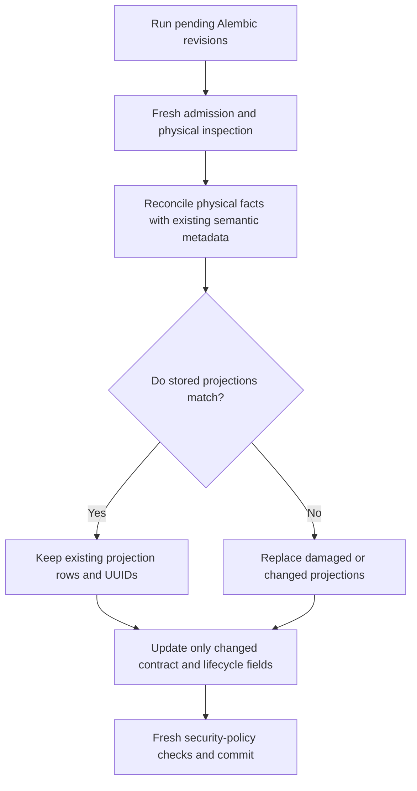

# ADR 0013: Application-owned migrations through the client

> Amendment (2026-10-09, [MetaTables #50](https://github.com/mainsequence-projects/MetaTables/issues/50)
> and [#51](https://github.com/mainsequence-projects/MetaTables/issues/51)): The configured login is
> named `metatables`, so its default `"$user", public` search path starts in the catalog schema.
>
> - The migration connection carries `search_path=public`, the only default schema hosted
>   PostgreSQL accepts. The client refuses a session whose effective path is anything else
>   before it reads Alembic state. On PostgreSQL the version table is always qualified:
>   `public` when the provider declares no schema.
> - Before issuing the connection, the API refuses a provider whose tables are in the
>   `metatables` schema or belong to a role the login can't use. Nothing is stamped or
>   replayed.
> - Lifecycle step 5 never infers removal from absence. Finalization deletes a catalog binding
>   only for a table the client names as removed (dropped from its models, or dropped by this
>   run, as on downgrade) and that is confirmed absent. Any other missing or unreadable table
>   keeps its binding and fails. Older clients name nothing, so their removal and downgrade
>   cleanup fails safe until they upgrade.

Date: 2026-10-01

Status: Accepted and implemented.

Owners: MetaTables client and consuming applications; API owns catalog integration.

Supersedes [ADR 0004](0004-approved-application-migrations.md), the direct-connection
blocking amendment in [ADR 0002](0002-application-administration-and-table-ownership.md),
and the application-migration execution portions of API ADRs 0001, 0007, 0008,
0009 and [client ADR 0011](../client/0011-cli-local-development-with-managed-admin.md).
Their other decisions remain in force.

## Context

Application revisions are independent of MetaTables' internal schema. Requiring
application providers to be installed and allowlisted in the API made every new
application or revision depend on a central API deployment. It also disabled
current, autogeneration, revision targeting and downgrade in the client.

The environment supplies a database login with the DDL permissions needed by its
applications. Provisioning and limiting that login is the environment operator's
responsibility. Catalog table grants do not define the privileges of that login.

## Decision

Applications own their provider code, model registry, revision files, version
tables and execution. The client imports the provider from the application's
Python environment and runs Alembic there. The API does not import application
providers or execute their Python revisions. No application code installation,
provider alias, deployment allowlist or API redeployment is required.

The client supports scaffold, handwritten/offline revision, autogeneration,
current, upgrade and downgrade, including explicit revision targets. A shared
client runner supports Python setup code and CLI commands. Alembic commands are
serialized within that client process because Alembic uses global proxies.
Applications/deployment tooling must serialize concurrent migration processes for
the same provider/database; there is no distributed application migration queue.

The selected API runtime determines the environment/DataSource. The existing
migration-connection endpoint authenticates the caller, checks Writer access to
the provider's catalog entries, validates provider identity and source access,
and returns the configured runtime connection with its dialect and TLS settings.
The credential resolver remains responsible for Secret retrieval. It does not
mint per-user or per-provider database roles. The response is not cacheable and
credentials are not written to configuration, printed, or retained after use;
TLS files are private and temporary. Local SQLite returns the selected file.
A supervised runtime is held until the client releases its migration connection.

**Direct migrations execute with the environment login's database privileges.**
They do not run through the API's governed-SQL identities or SQLite authorizer.
Writer checks authorize catalog participation and connection admission; they do
not sandbox DDL or make one provider's database access exclusive. Environment
operators are responsible for database login privileges (including CREATE, ALTER,
DROP and ownership requirements), credential distribution and rotation. Catalog
grant revocation cannot revoke a database connection or a credential already
received. TTL fields retained for request compatibility do not expire the configured
login. Runtime holds coordinate switching, not credential revocation; a crashed
client may require restarting the supervised runtime to clear an orphaned hold.

## Lifecycle and failures

1. Load the application provider and resolve the selected runtime.
2. Reserve the Alembic registry and application catalog bindings.
3. Obtain the configured connection and run the application's Alembic command.
4. Read actual applied revisions; close the database transaction/connection.
5. Finalize catalog contracts through the API, including previously registered
   provider tables removed from the current model registry. Reconcile physical
   columns, indexes, foreign keys and governed-SQL permission projections.
6. Release the runtime hold, including on failure.

Existing compatible catalog identities are reused. Existing unversioned physical
application tables are not silently adopted or stamped. Failed DDL is not finalized.
A committed migration followed by failed finalization can be retried: Alembic reads
its version table and the API retries reconciliation. Partial/nontransactional DDL
requires inspection and application-owned recovery. No server executor journal is
claimed for client DDL. Downgrade to base clears the recorded revision and reconciles
dropped tables. Revision files already applied remain immutable.

### Batched inspection (2026-10-09 amendment)

This is an implementation refinement of the lifecycle above, not a change to
execution ownership, authorization or the migration API.

- The client reads one table inventory per schema before Alembic and a fresh one
  afterwards. Missing inventory entries still use `has_table` so views and temporary
  tables retain their previous behavior. The first pass also rejects unversioned
  application storage; it is not repeated for that check.
- The API authorizes every requested binding before physical inspection. It resolves
  the admitted DataSource once per finalization request and shares a read connection
  across its tables. PostgreSQL/TimescaleDB use four metadata queries per schema
  (plus a diagnostic query for missing tables). SQLite/MySQL/SQL Server use SQLAlchemy
  bulk reflection with dialect fallbacks and preserve their existing projections.
- Reflection caches last only for that inspection. No snapshot is reused across DDL
  or requests. An unchanged Alembic revision still finalizes physical contracts and
  refreshes semantic metadata; it is not evidence that the database has no drift.
- Missing, inaccessible and foreign-owned tables keep their existing failure
  semantics. A bulk database error falls back to independent table inspections after
  closing the failed transaction, so an unrelated table can still finalize. Only
  explicitly removed, physically absent application tables lose their binding.
- Client phase timings and API inspection/total timings report where time is spent.
  They do not include platform job scheduling or workflow coordination.

The client still sends bounded finalization requests (ten tables per batch); the
HTTP request/response contract is unchanged. Client inventory improvements require
a package update and application rebuild. API batching benefits existing clients
after the shared API is deployed, with larger gains for clients sending batches.

### Conditional catalog reconciliation (2026-10-10 amendment)

Reconciliation means making the catalog describe the freshly observed physical
table while preserving declared semantic metadata. It is additional MetaTables
behavior around Alembic, not an instruction to reapply migration scripts or rebuild
identical catalog rows. An unchanged Alembic revision does not prove absence of
physical drift or completion of an earlier catalog finalization.



- Finalization retains the catalog lock, per-table Writer/provider/source checks,
  fresh physical inspection, owner reachability, foreign-key target validation,
  missing-table/removal handling, and Timescale hypertable checks. No physical
  snapshot or authorization result is cached across requests.
- The API reads existing column, index and foreign-key projections in three batch
  queries. Comparison includes their scalar fields, full contract fragments and
  resolved FK target UIDs, and detects missing, extra or damaged rows. Projection
  row UUIDs and reflection ordering of independent objects are not differences;
  column ordinals and the order of columns inside keys/indexes remain meaningful.
- Matching projections are kept, even if only the recorded Alembic revision or
  lifecycle metadata changes. Changed projections are replaced inside the existing
  per-table savepoint. Equal-valued contract, snapshot and lifecycle fields are not
  assigned, avoiding unnecessary ORM dirtiness and metadata/search writes.
- Hosted/local runtime security-policy checks are explicitly retained at commit
  even when table metadata is unchanged. Existing policy reconciliation repairs
  policy differences; equal policies and their JSON permission manifest do not
  require metadata writes. A failed physical check or conversion still fails
  rather than being hidden by equality.
- A healthy unchanged finalization issues no table/projection metadata DML. A
  matching contract with damaged projections still repairs them. A previously
  committed migration with failed finalization can retry at the same revision;
  physical drift is freshly observed and catalog reconciliation completes without
  replaying already-applied DDL. The response contract and client calls stay the
  same; no consuming-application opt-in is required.

### Authored metadata and SQLite policy reflection (2026-10-10 amendment)

The public migration runner sends current authored table descriptions, labels and
column descriptions, labels and logical names in each finalization batch, including
when Alembic is already at the requested revision. Reusing an existing binding at
reservation time must not suppress metadata refresh ([#57](https://github.com/mainsequence-projects/MetaTables/issues/57)).
The runner compares authored values with the fresh reservation lookup and sends
only changed, non-empty metadata; it never caches equality across deployments.

The optional `authored_metadata` map is keyed only by UIDs in that request. The API
applies it after Writer/provider/source admission and fresh physical inspection,
inside the table's savepoint. The physical snapshot remains authoritative for
types, nullability, indexes, keys and binding identity. As with registration,
empty/absent metadata preserves existing descriptions and labels. Equal metadata
does not dirty rows or replace label links; the next unchanged upgrade still
performs no catalog DML. Failed reconciliation rolls back metadata and can retry.
Older clients may omit the map; clients that send it require an API supporting it.

Security dependency reflection uses the backend's physical schema normalization.
SQLite maps logical provider schemas and physical `main` cascade targets to the
same physical namespace, rather than querying `PRAGMA public.foreign_key_list`.
This keeps per-batch checks scoped when a downgrade has dropped tables belonging
to later batches ([#58](https://github.com/mainsequence-projects/MetaTables/issues/58)).
The conservative full policy sweep on a genuine reflection failure remains, and
unexpected missing tables still fail without losing their catalog bindings. Only
explicitly removed, freshly confirmed absent tables may lose bindings.

Regression coverage runs the public client against a real disposable SQLite API:
metadata changes at an unchanged revision, zero-write reruns, a provider larger
than a finalization batch with later-batch drops, and a subsequent normal upgrade.
Route coverage additionally checks physical-shape rejection, Writer admission,
unrequested metadata UIDs, and failed metadata finalization/retry.

## MetaTables system migrations

Hosted system upgrades also run as a deployment prerequisite Job
([ADR 0014](0014-main-sequence-release-jobs-and-production-migrations.md)). Application providers keep their own histories and are not
part of that Job.

The API continues to own `metatables.api.backend.migrations`, `metatables_catalog_version`
and the explicit admin bootstrap/upgrade operation in Settings. Application
migration commands do not invoke that operation. Applications must keep their
physical names and version tables separate from reserved system objects.

## Removal and upgrade instructions

Remove `/application-migrations/upgrade/`, `application_migration_providers`,
`init --provider` approval and the allowlist-derived runtime availability field.
Existing deployments must remove `application_migration_providers` from their
configuration; it is no longer an accepted setting. Replace execution aliases
with local Python provider references, for example:

```bash
metatables migrations upgrade --provider ledger.migrations:migration
```

`upgrade_application()` remains a client convenience function and now takes a
local provider reference and optional revision. The API needs only MetaTables;
the application process needs its own package, revisions and selected database
driver. Existing application Alembic histories and catalog UIDs are reused.

## Verification

Focused tests cover independent application providers, client-only provider loading,
autogeneration and additive revisions, current/upgrade/downgrade/base, repeated
execution, failed DDL and reconciliation recovery, preserved system revision,
connection dialect/TLS options, catalog authorization and runtime hold release.
SQLite integration tests use disposable files. Hosted driver configuration is
checked without starting databases. Container/database-matrix tests are on demand;
backend/runtime tests are not added to required CI checks.

The batching amendment adds non-container checks for query/connection counts,
fresh reflection after DDL, unchanged-revision reconciliation, authorization before
inspection, independent failures and dialect fallbacks. PostgreSQL query grouping is
checked with a recording driver; SQLite executes real local DDL. Hosted performance
and live MySQL/SQL Server/PostgreSQL verification remain pending.

The conditional-reconciliation amendment adds SQL-recording checks for zero
metadata writes and stable projection UUIDs on unchanged finalization, damaged
scalar/fragment and missing/extra projection repair, revision-only updates,
semantic changes at the same revision, drift plus failed-finalization retry, and
fresh permission/missing/inaccessible/owner checks, including self-referencing key
projection repair. A real local-runtime check verifies zero catalog DML on an
unchanged upgrade while still refreshing physical security policies, and detects
a newly added trigger that changes write safety without changing the contract.
Existing local SQLite application-provider tests verify actual physical drift and recovery without
reapplying DDL. These are focused non-container checks, not new required CI jobs.
