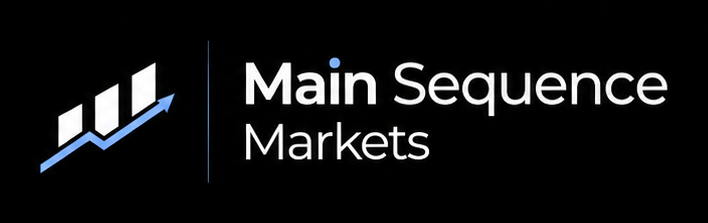

<p align="center">
  
</p>

# MainSequence Markets

[](https://mainsequence-projects.github.io/MainSequenceMarkets/)
[](https://github.com/mainsequence-projects/MainSequenceMarkets/blob/main/LICENSE)
[](pyproject.toml)
[](pyproject.toml)
[](https://github.com/mainsequence-projects/MainSequenceMarkets/issues)
[](https://github.com/mainsequence-projects/MainSequenceMarkets/commits/main/)
[](https://github.com/mainsequence-projects/MainSequenceMarkets/commits/main/)

`ms-markets` is the financial markets extension layer for the Main Sequence
platform. It provides reusable market-domain ORM models, market DataNodes,
portfolio construction utilities, repository operations, and application-facing
helpers for building financial systems on top of Main Sequence. Portfolio and
QuantLib-backed pricing capabilities are packaged as separate import surfaces so
core `msm` stays focused on shared markets primitives.

The Python distribution is named `ms-markets`. The core import package is
intentionally short:

```python
import msm
```

Portfolio workflows import from `msm_portfolios`. Optional QuantLib-backed
pricing imports from `msm_pricing`.

## Project Status

- Status: initial scaffold and SDK extraction
- Current package version: `0.0.18`
- Documentation: [Documentation Site](https://mainsequence-projects.github.io/MainSequenceMarkets/)
- Open issues: [GitHub Issues](https://github.com/mainsequence-projects/MainSequenceMarkets/issues)
- Release history: [CHANGELOG.md](https://github.com/mainsequence-projects/MainSequenceMarkets/blob/main/CHANGELOG.md)
- License: [Apache License 2.0](https://github.com/mainsequence-projects/MainSequenceMarkets/blob/main/LICENSE)

The initial core package was migrated from
`mainsequence-sdk/mainsequence/markets` into this repository under `src/msm`.
Architecture and implementation decisions are tracked in
[Architecture Decision Records](https://mainsequence-projects.github.io/MainSequenceMarkets/ADR/).

## What This Repository Contains

Main package areas:

- `msm.api.accounts`: account identity and account target assignment row APIs
- `msm.api.calendars`: calendar identity, date, session, and event row APIs
- `msm.api`: user-facing Pydantic row objects and typed class methods for
  markets MetaTable records
- `msm.constants`: static built-in keys such as asset type constants used across
  applications and examples
- `msm.client`: client-facing Main Sequence market models and API wrappers
- `msm.data_nodes`: market DataNode contracts, including account holdings,
  execution events, asset snapshots, and asset pricing details
- `msm.api.execution`: order managers, target quantities, orders, events,
  trades, and execution error row APIs
- `msm.models`: SQLAlchemy market-domain `*Table` declarations and MetaTable
  registration order
- `msm_portfolios`: portfolio configuration, signal weights, rebalance
  strategies, virtual funds, and portfolio construction workflows
- `msm_pricing`: optional QuantLib-backed instruments, curves, fixings, and
  pricing helpers installed with the `pricing` extra
- `msm.repositories`: compiled persistence operations over market-domain models
- `msm.services`: application-level orchestration over repositories, including
  asset lookup and OpenFIGI service helpers
- `msm` CLI: package maintenance helpers such as explicit agent-skill copying
  and SDK-managed MetaTable migration commands

Repository areas:

- `docs/`: MkDocs documentation, tutorials, knowledge guides, ADRs, and API
  reference scaffold
- `examples/msm/`: core assets, accounts, calendars, platform, and row-workflow examples
- `examples/msm_portfolios/`: single portfolio construction example with
  index linkage and canonical portfolio DataNodes
- `examples/msm_pricing/`: optional pricing and QuantLib-backed examples
- `.agents/skills/ms_markets/`: source agent skills for market-domain workflows
- `tests/`: automated tests

## Documentation Map

The documentation is organized into four reading modes:

1. **Tutorial**: guided learning material
2. **Knowledge**: concept-oriented guides for each `msm` package area
3. **Architecture**: ADRs that record implementation decisions
4. **Reference**: generated API reference scaffold

Recommended entry points:

- [Getting Started](https://mainsequence-projects.github.io/MainSequenceMarkets/getting-started/)
- [Tutorial](https://mainsequence-projects.github.io/MainSequenceMarkets/tutorial/)
- [FastAPI v1](https://mainsequence-projects.github.io/MainSequenceMarkets/fast_api/v1/)
- [Knowledge Base](https://mainsequence-projects.github.io/MainSequenceMarkets/knowledge/)
- [Architecture Decision Records](https://mainsequence-projects.github.io/MainSequenceMarkets/ADR/)
- [Changelog](https://mainsequence-projects.github.io/MainSequenceMarkets/changelog/)
- [API Reference](https://mainsequence-projects.github.io/MainSequenceMarkets/reference/)

## Quick Start

Install the package from this repository in editable mode:

```bash
python -m pip install -e ".[dev]"
```

Or with `uv`:

```bash
uv sync --extra dev
```

Install pricing support only when needed:

```bash
uv sync --extra pricing
```

Install portfolio workflow support only when needed:

```bash
uv sync --extra portfolios
```

Install the project-level FastAPI surface only when needed:

```bash
uv sync --extra public_api
```

Verify the core import:

```bash
python -c "import msm; print(msm.__version__)"
```

After installing the pricing extra, verify the optional pricing import:

```bash
python -c "import msm_pricing; print(msm_pricing.FixedRateBond)"
```

Copy the packaged ms-markets skills into a host Main Sequence project only when
you explicitly want them available to agents in that project:

```bash
msm copy-msm-skills --path /path/to/project
```

Importing `msm` never mutates the current directory or auto-copies skills. The
command writes only to `<project>/.agents/skills/ms_markets/` and leaves
unrelated `.agents` content alone. Use `--dry-run` or `--json` to inspect the
copy plan.

## Common Development Commands

Run tests:

```bash
pytest
```

Run focused linting for optional pricing:

```bash
ruff check src/msm_pricing
```

Serve the docs locally:

```bash
mkdocs serve
```

Build the docs:

```bash
mkdocs build --strict
```

Build the package:

```bash
uv build
```

Publish a tagged release to PyPI:

```bash
git tag v0.0.2
git push origin v0.0.2
```

Pushing a `v*` tag triggers
`.github/workflows/publish-to-pypi.yml`, which builds the distribution and
publishes it to PyPI through GitHub Actions using trusted publishing for the
repository `pypi` environment.

## Core Dependencies

Runtime dependencies are declared in
[pyproject.toml](https://github.com/mainsequence-projects/MainSequenceMarkets/blob/main/pyproject.toml).
The core stack starts with:

- `mainsequence` for platform integration
- `SQLAlchemy` for market-domain ORM models
- `pydantic` for typed configuration and serialized row contracts
- `pandas` and `numpy` for tabular market data

Optional extras provide documentation, development, portfolio, public API,
pricing, and Streamlit UI tooling. The `portfolios` extra installs
portfolio-only helpers such as `pandas-market-calendars`. The `public_api` extra
installs FastAPI and Uvicorn for the project-level `apps/v1` surface. The
`pricing` and `pricing-streamlit` extras install QuantLib and the optional
pricing runtime exposed as `msm_pricing`.

## Package Metadata

- Distribution name: `ms-markets`
- Import packages: `msm`, `msm_portfolios`, and optional `msm_pricing`
- Python: `>=3.11`
- License: Apache-2.0
- Repository: <https://github.com/mainsequence-projects/MainSequenceMarkets>

Project metadata is defined in
[pyproject.toml](https://github.com/mainsequence-projects/MainSequenceMarkets/blob/main/pyproject.toml).

## License

This project is open source under the
[Apache License 2.0](https://github.com/mainsequence-projects/MainSequenceMarkets/blob/main/LICENSE).
