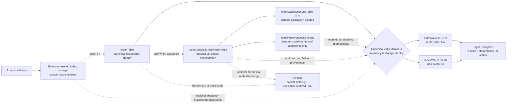
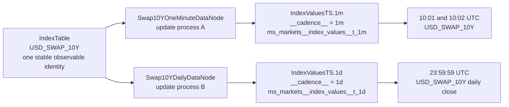
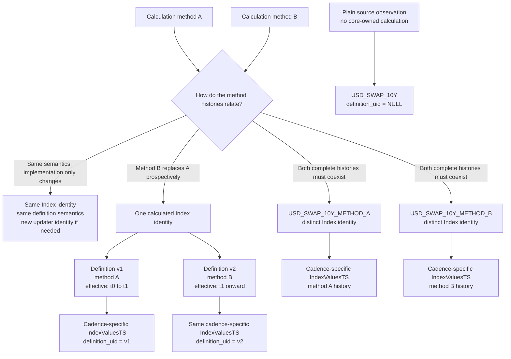

# 0037. Core Index Value, Definition, And Calculation Framework

## Status

Accepted - general Index-value implementation and migration verified;
operational publication and release pending.

This ADR is not considered implemented merely because the SQLAlchemy models or
calculation functions exist. The complete definition in this document includes
the public API, migrations, storage contracts, DataNodes, tests, examples,
concept documentation, tutorial coverage, changelog, and packaged agent skill.

As of 2026-07-18, the derived-index implementation, SDK-managed migration,
shared catalog binding, runtime attachment, focused tests, executable examples,
documentation, changelog, and packaged skill are complete.

This ADR was revised and implemented on 2026-07-19 to make the canonical value
contract apply to every Index, not only to an Index with an
`IndexCalculationDefinitionTable` row. Revision `0012` is applied at the
verified shared migration head; it preserves the table and existing rows while
making `definition_uid` nullable and renaming the nullable generic status field
to `observation_status`. Cadence-configured storage generation, rejection of
cadence-less publication, separate 1-minute/daily DataNodes and tables, and the
selected migration-provider contract are verified locally. The original
operational gates remain: migration/registration of selected cadence tables,
the first real shared-backend DataNode publication under an explicit hash
namespace, and publication of a library release containing the work.

## Decision Summary

`msm` core owns canonical Index identity, a domain-neutral canonical Index
value contract, and the optional generic derived-index methodology domain.

An Index is first a stable observable identity with values over time. A
calculation definition is optional. It is attached only when `msm` owns a
versioned methodology that calculates the observable.

The core model separates stable Index identity from cadence-specific datasets:



The implementation must not introduce a parallel `SignalIndex` identity, must
not model an Index as a `PortfolioTable`, and must not place the generic
definition or calculation engine in `msm_pricing` or an application project.

Data connectors, extension libraries, and project code may create Index rows
and publish Index-indexed source-native observations. They are not forced to
write directly into a core concrete storage table or inherit one concrete
DataNode implementation. When they need cross-library interoperability, they
may normalize a selected value into the cadence-matched storage returned by
`configured_index_values_storage(cadence=...)`.

Providers may also produce observations used by calculation legs, but they do
not own the core derived-index definition, calculation, resolution, or
canonical derived-value semantics.

## Context

`IndexTable` already provides canonical identity for market indexes. It has a
stable `unique_identifier`, registered `index_type`, display metadata, provider,
and extension metadata. `IndexTimestampedDataNode` already provides a reusable
base for time-varying facts keyed by `IndexTable.unique_identifier`.

An Index does not need to be calculated from other observations. For example,
`USD_SWAP_10Y` is the observable 10-year swap rate. It is not an Asset or a
Portfolio, and it does not need to be represented as a spread. It may have
intraday and daily histories, but each stable observation frequency is a
separate timestamped dataset, storage table, and DataNode update process.

Two gaps are addressed by this ADR:

1. a domain-neutral canonical value contract for plain and calculated Indexes;
2. a generic persisted methodology for the subset of Indexes calculated from
   other observations.

The canonical contract is an interoperability surface, not the only permitted
Index storage. An extension library may own a richer source-native Index-indexed
storage contract while reusing canonical `IndexTable` identity.

Applications currently tend to hardcode derived observables such as:

- government-bond 2s5s, 2s10s, 5s10s, and 10s30s yield spreads;
- fixed and rolling commodity calendar spreads;
- crack spreads and other weighted multi-leg commodity structures;
- equity pairs with fixed, beta-neutral, or regression-estimated coefficients;
- curve butterflies such as 2Y - 2 x 5Y + 10Y;
- option-over-underlying marks with delta-resolved coefficients;
- self-financing delta-hedged or beta-hedged strategy indexes.

Those formulas are general market-index methodologies. They are not specific
to one dashboard, one connector, fixed income, pricing, or portfolios.

The current cross-asset spread helpers under
`msm_pricing.analytics.spreads` demonstrate that a provider-neutral
calculation can accept caller-supplied observations without resolving assets,
portfolios, or backend rows. However, placing a cross-asset spread engine under
`msm_pricing` creates the wrong ownership boundary. It also leaves no canonical
relational definition, no definition versioning, no generic published value
storage, and no audit trail for dynamically resolved legs.

### Why hardcoded spreads are insufficient

A hardcoded tuple such as:

```python
SPREAD_DEFINITIONS = (
    ("2s5s", "2Y", "5Y"),
    ("2s10s", "2Y", "10Y"),
    ("5s10s", "5Y", "10Y"),
    ("10s30s", "10Y", "30Y"),
)
```

cannot express or govern:

- more than two legs;
- price, yield, rate, return, Greek, or index inputs with explicit units;
- ratios, rebased series, chained returns, or self-financing methodologies;
- fixed, estimated, risk-neutral, or Greek-resolved coefficients;
- fixed instruments versus rule-selected or rebalanced components;
- data alignment and missing-observation policies;
- methodology effective dates and immutable versions;
- which instruments and coefficients were actually used historically;
- a reusable published index history consumed by other DataNodes and APIs.

### Why a single JSON payload is insufficient

`IndexTable.metadata_json` is appropriate for provider and workflow extension
metadata. It is not the canonical home for calculation semantics.

Putting the whole methodology in one JSON payload would hide business keys,
foreign keys, uniqueness constraints, leg ordering, coefficient validation,
effective dates, and queryable fields. Core calculation meaning must remain in
typed relational columns. JSON is allowed only for operator-, selector-, or
coefficient-method parameters that are not shared core fields.

## Terminology

### Index identity

The stable market observable represented by one `IndexTable` row.

Example:

```text
MX_MBONOS_2S5S_YIELD_SPREAD
```

### Calculation definition

One immutable, effective-dated methodology version for calculating an index.

### Calculation leg

One semantic input into a definition. A leg describes its subject, observable,
transformation, unit, and coefficient policy.

### Resolved leg

The concrete component and coefficient selected for one calculation time when
a leg uses a selector or dynamic coefficient method.

### Index value

The canonical observation published for one Index and timestamp. It may be a
plain observed value or the output of a versioned calculation definition.

### Calculation coefficient

An algebraic multiplier in an index formula. It is not automatically a
portfolio allocation weight, quantity, market value, or position.

## Core Ownership Rule

The shared Index contracts belong to `msm` core under the Index domain:

- canonical identity and index-type registration;
- the domain-neutral canonical Index-value storage contract;
- the reusable Index-stamped DataNode behavior;
- calculation definition and leg MetaTables;
- typed public definition and leg APIs;
- operator and unit semantics;
- observation alignment and missing-data policies;
- fixed and dynamic coefficient contracts;
- selector and resolver protocols;
- resolved-leg audit storage;
- derived-index DataNode configuration and update process;
- validation and error contracts;
- examples, documentation, tutorials, and packaged skills.

Extension libraries own their source-native Index storage and production logic.
They may reuse the core `IndexTimestampedDataNode` convenience base, use another
DataNode base while satisfying the same storage invariants, or normalize their
output into the canonical core value contract. Core ownership of the canonical
contract does not imply exclusive ownership of every Index observation table.

The source tree may remain layer-oriented, as the current repository is, while
keeping ownership inside the Index domain:

```text
src/msm/models/indices.py or src/msm/models/indices/
src/msm/api/indices.py or src/msm/api/indices/
src/msm/analytics/indices/
src/msm/data_nodes/indices/
src/msm/repositories/indices.py
```

Public imports must be available from stable `msm` paths. Applications must
not need to import `msm_pricing` to define or calculate a derived index.

## Canonical Index Identity

`IndexTable` remains deliberately small. It must not be widened with every
calculation field or with repeated leg columns.

The existing identity fields remain responsible for:

```text
uid
unique_identifier
index_type
display_name
description
provider
metadata_json
```

Add a built-in registered index type such as:

```text
derived
```

with a public constant and definition payload following the existing index-type
constant pattern.

`index_type="derived"` identifies that the index has an owned calculation
methodology. More specific classification such as `yield_spread`,
`calendar_spread`, `ratio`, or `strategy_index` belongs on the calculation
definition rather than multiplying top-level index types.

An Index without an owned calculation uses the type that describes the
observable. For example, `USD_SWAP_10Y` uses `index_type="interest_rate"` and
does not require a calculation definition merely because it has historical
values.

## Plain Index Example: 10-Year Swap Rate

`USD_SWAP_10Y` represents the value of the 10-year swap rate through time:

```text
IndexTable
  unique_identifier = USD_SWAP_10Y
  index_type         = interest_rate
  display_name       = USD 10-Year Swap Rate
```

Its canonical observations reuse the same Index row but live in separate
frequency-defined datasets:

```text
IndexValuesTS.1m / ms_markets__index_values__t_1m
  2026-07-19T10:01:00Z  USD_SWAP_10Y  0.04217  decimal  NULL
  2026-07-19T10:02:00Z  USD_SWAP_10Y  0.04219  decimal  NULL

IndexValuesTS.1d / ms_markets__index_values__t_1d
  2026-07-19T23:59:59Z  USD_SWAP_10Y  0.04205  decimal  NULL
```

### Diagram 1 - One Index At Different Observation Frequencies



The two DataNodes have different update identities, schedules, storage
contracts, and incremental progress. Their storage tables have different
logical identifiers, `__cadence__` metadata, storage hash components, and
physical names. They still publish observations for the same
`IndexTable.unique_identifier`: frequency changes dataset identity, not the
meaning of `USD_SWAP_10Y` itself.

Frequency must never be only a runtime field or an extra column in one mixed
table. It is a storage-defining input to
`configured_index_values_storage(cadence=...)`.

If an official daily close and an intraday indicative rate have materially
different meanings, they must not collide at one canonical coordinate. Model
them as distinct stable Index identities or retain the source-native dimensions
in an extension-owned storage contract and normalize only the selected
canonical series.

### Diagram 2 - Different Calculation Methods

Different calculation methods require an explicit historical-meaning decision.
They must never be hidden as frequency settings or untracked DataNode changes.



The rules are:

1. If only the producer implementation changes and the observable methodology
   is unchanged, keep the same Index identity and definition semantics. The
   DataNode update identity may change.
2. If an output-affecting method replaces another method prospectively, keep
   one stable calculated Index identity and create non-overlapping definition
   versions.
3. If two method histories must be available for the same timestamps, give
   each method a distinct Index identity. The canonical
   `(time_index, index_identifier)` grain cannot contain both values under one
   identity.
4. If the Index is source-observed and has no core-owned calculation, publish
   it with `definition_uid = NULL`; do not invent a calculation definition.
5. Apply the frequency-storage decision independently from the methodology
   decision. Every method history still publishes through a storage table whose
   cadence is explicit in its logical and physical identity.

## Relational Definition Model

### IndexCalculationDefinitionTable

`IndexCalculationDefinitionTable` stores one immutable methodology version for
one `IndexTable` row.

Target fields:

| Field | Meaning |
| --- | --- |
| `uid` | UUID identity for this exact definition version. |
| `index_uid` | FK to `IndexTable.uid`. |
| `definition_version` | Monotonically increasing integer within the index. |
| `status` | Lifecycle state such as `draft`, `active`, or `retired`. |
| `effective_from` | Inclusive UTC time at which this version becomes applicable. |
| `effective_to` | Exclusive UTC time at which this version stops applying, nullable for the current version. |
| `calculation_kind` | Registered operator such as `linear_combination`, `ratio`, `rebased_basket`, `chained_return`, or `self_financing`. |
| `calculation_family` | Searchable business classification such as `yield_spread`, `calendar_spread`, `relative_value`, `butterfly`, or `hedged_strategy`. |
| `output_unit` | Canonical unit for published values, such as `basis_points`, `decimal`, `percent`, `ratio`, `index_points`, or a currency/physical unit code. |
| `alignment_policy` | Rule for matching leg observations across timestamps. |
| `missing_data_policy` | Rule for incomplete required observations after alignment. |
| `composition_mode` | `fixed`, `rule_selected`, or `rebalanced`. |
| `rebalance_policy` | Registered schedule or trigger code, nullable for fixed definitions. |
| `rebalance_parameters_json` | Parameters for the registered rebalance policy. |
| `definition_hash` | Deterministic digest of all output-affecting definition and leg fields. |
| `source` | Optional organization, methodology owner, or source namespace. |
| `metadata_json` | Non-core descriptive or extension metadata. |

Required relational constraints:

- unique `(index_uid, definition_version)`;
- indexed `index_uid`, `status`, `effective_from`, and `calculation_family`;
- `definition_version > 0`;
- `effective_to IS NULL OR effective_to > effective_from`;
- no overlapping active effective intervals for the same index, enforced by a
  database constraint where portable or by strict repository validation;
- `definition_hash` must include ordered leg semantics and must not include
  display-only metadata.

Definitions are immutable after activation. A material change creates a new
version. Cosmetic changes to `IndexTable` display metadata do not create a new
definition version.

### Field rationale

`definition_version` and the effective interval prevent a methodology change
from silently rewriting historical meaning.

`calculation_kind` selects mathematical execution. `calculation_family` is
search and business classification. They must not be conflated: two yield
spreads can use different mathematical operators, and a linear combination can
represent a yield spread, commodity conversion, or curve butterfly.

`output_unit` makes the index result self-describing and prevents provider
conventions such as percent versus decimal from leaking into ad hoc multipliers.

`alignment_policy` and `missing_data_policy` are part of methodology because
they can change the resulting history.

`composition_mode` and `rebalance_policy` distinguish a fixed pair from a
rolling benchmark or rebalanced basket.

### IndexCalculationLegTable

`IndexCalculationLegTable` stores ordered, typed inputs for one definition.

Target fields:

| Field | Meaning |
| --- | --- |
| `uid` | UUID identity for the leg row. |
| `definition_uid` | FK to `IndexCalculationDefinitionTable.uid`. |
| `leg_key` | Stable key within the definition, such as `short`, `long`, `front`, `back`, or `hedge`. |
| `leg_order` | Deterministic display and calculation order. |
| `leg_role` | Optional semantic role separate from ordering. |
| `component_kind` | `asset`, `index`, or `selector`. |
| `asset_uid` | Nullable FK to `AssetTable.uid` for a fixed asset leg. |
| `component_index_uid` | Nullable FK to `IndexTable.uid` for a fixed index leg. |
| `selector_code` | Registered selector for a rule-resolved leg. |
| `selector_parameters_json` | Typed-by-selector parameters such as target tenor or futures rank. |
| `observable_code` | Semantic input such as `price`, `settlement`, `yield`, `rate`, `simple_return`, `total_return`, `delta`, `dv01`, or `z_spread`. |
| `input_unit` | Unit expected from the resolved observation before normalization. |
| `transform_code` | `identity`, `rebase`, `log`, `simple_return`, `log_return`, or another registered transform. |
| `transform_parameters_json` | Parameters for the registered transform. |
| `coefficient_method` | `fixed`, `equal_weight`, `price_ols`, `return_ols`, `beta_neutral`, `dv01_neutral`, `delta`, or another registered method. |
| `coefficient` | Fixed algebraic multiplier; required only for `coefficient_method="fixed"`. |
| `coefficient_parameters_json` | Window, lag, bounds, neutralization target, or other method-specific parameters. |
| `metadata_json` | Non-core descriptive or extension metadata. |

Required relational constraints:

- unique `(definition_uid, leg_key)`;
- unique `(definition_uid, leg_order)`;
- exactly one component source must be configured: `asset_uid`,
  `component_index_uid`, or `selector_code`;
- a fixed coefficient requires a finite `coefficient`;
- a non-fixed coefficient must not smuggle the resolved runtime coefficient
  into the definition row;
- a component index cannot recursively produce a cycle in the definition DAG;
- deleting an index referenced as a component must be restricted unless the
  dependent definition is removed or retired explicitly.

Core fields must remain relational. Selector-, transform-, and
coefficient-specific parameters may use JSON, but each registered implementation
must own a strict Pydantic validation model for its payload.

## Formula Coefficients Are Not Portfolio Weights

The field is named `coefficient`, not `weight`, because its semantics depend on
the observable and formula.

For a yield spread:

```text
5Y yield x +1
2Y yield x -1
```

The coefficients are algebra on yields. A user cannot own one unit of yield.

For a crack spread:

```text
2 x gasoline price
1 x heating-oil price
-3 x crude-oil price
```

The coefficients include an economic conversion recipe and require explicit
physical-unit normalization.

For a delta hedge, the underlying coefficient may be the resolved option delta
at the previous rebalance time. It is dynamic methodology state, not an
executed share quantity by itself.

An implementation may later link a derived index to a replication portfolio,
but it must not reuse `PortfolioWeightsStorage` as index methodology or resolved
leg storage.

## Input Resolution Boundary

Definitions describe semantic inputs. They do not hardcode one provider table
UID into each leg row.

`DerivedIndexDataNodeConfiguration` must explicitly declare the source storage
classes or resolver bindings used by that update process. Those dependencies
are update-scoped and participate in the DataNode `update_hash` because changing
them changes the dependency graph and potentially the produced observations.

The generic resolution contract is conceptually:

```python
resolve_leg(
    *,
    definition,
    leg,
    calculation_times,
    source_bindings,
) -> ResolvedLegFrame
```

The resolver must return canonical observations and provenance. It may consume:

- asset-indexed market-data storage;
- index-indexed market-data storage;
- pricing-produced analytics such as yield, DV01, or delta;
- connector-produced settlement or reference observations;
- another derived index through `component_index_uid`.

The provider or pricing package owns production of the source facts. `msm`
Index owns interpretation of those facts as index legs.

Definitions must remain reusable across providers when the methodology is the
same. A source/provider distinction that materially changes the published index
belongs in index identity, definition metadata, or the published storage
contract rather than an untracked runtime override.

## Calculation Engine

The calculation engine lives in `msm` core, for example under
`msm.analytics.indices`.

It must operate on typed, caller-supplied observations and resolved
coefficients. It must not require platform access for pure calculations.
Platform-backed leg resolution and DataNode execution wrap the pure engine.

### Initial calculation kinds

#### linear_combination

```text
value[t] = sum(coefficient_i[t] x normalized_observation_i[t])
```

Supports two-leg spreads, multi-leg butterflies, weighted baskets, and
commodity conversion structures.

#### ratio

```text
value[t] = numerator[t] / denominator[t]
```

Requires explicit zero-denominator handling and unit validation.

#### rebased_basket

Normalizes each configured leg to a common base value before applying the
formula. This is appropriate for relative price-level comparisons where raw
prices are not directly comparable.

#### chained_return

Constructs a cumulative index level from periodic leg returns and resolved
coefficients.

#### self_financing

Constructs a strategy index from lagged positions, rebalance rules, financing,
and optional transaction-cost policy. This method is required for a valid
delta-hedged or dynamically hedged performance series. A naive series such as
`option_price[t] - delta[t] x underlying_price[t]` is not a self-financing
historical strategy and must not be presented as one.

### Alignment policies

The initial registered set is:

- `inner`: exact timestamps available for every required leg;
- `asof`: latest observation at or before the calculation timestamp within an
  explicit maximum staleness;
- `calendar_aligned`: calculation against a declared calendar and timestamp
  policy.

Alignment occurs before the mathematical operator. The engine must not perform
implicit forward filling.

### Missing-data policies

The initial registered set is:

- `drop`: omit a calculation time with incomplete required inputs;
- `fail`: raise a structured completeness error;
- `forward_fill`: allowed only with an explicit maximum age and only when the
  definition selects it.

The result must expose calculation status rather than converting missing input
to zero.

### Unit normalization

Every observable must have an explicit input unit and every definition an
explicit output unit.

Examples:

```text
decimal yield difference 0.0117 -> 117 basis points
percent yield difference 1.17   -> 117 basis points
gasoline USD/gallon             -> USD/barrel before crack-spread weighting
```

Unit conversion must use a registered conversion layer. Provider-specific
multipliers such as `x 100` or `x 10,000` must not be embedded anonymously in
application code.

Incompatible units must fail before publishing values.

### Coefficient methods

The initial contract recognizes:

- `fixed`;
- `equal_weight`;
- `price_ols`;
- `return_ols`;
- `beta_neutral`;
- `dv01_neutral`;
- `delta`.

Methods that estimate or resolve coefficients must define:

- the observation window;
- minimum observations;
- timestamp and effective lag;
- fallback or failure policy;
- coefficient bounds when applicable;
- deterministic behavior for equal timestamps.

The engine must prevent look-ahead. A coefficient estimated or observed at
time `t` cannot be applied to a period that begins before the coefficient was
available unless the methodology explicitly defines a lagged publication
policy.

## Time-Series Storage Contracts

### Cadence-configured IndexValuesStorage family

`IndexValuesStorage` owns the reusable SQLAlchemy column schema. Canonical
publication targets the concrete storage class returned by
`configured_index_values_storage(cadence=...)`, not one mixed-frequency table.
Each cadence produces a distinct dataset identity:

```text
cadence  logical identifier  physical table
1m       IndexValuesTS.1m    ms_markets__index_values__t_1m
1d       IndexValuesTS.1d    ms_markets__index_values__t_1d
```

The configured class carries `__cadence__`, includes cadence in
`__metatable_extra_hash_components__`, and uses cadence as the bounded physical
table-name suffix. A second core `IndexObservationsStorage` with the same value
semantics must not be introduced.

Target row grain:

```text
(time_index, index_identifier)
```

Target fields:

| Field | Meaning |
| --- | --- |
| `time_index` | UTC observation timestamp. |
| `index_identifier` | FK to `IndexTable.unique_identifier`. |
| `value` | Canonical Index value at the observation timestamp. |
| `unit` | Canonical unit code for the published value. |
| `definition_uid` | Nullable definition version used when the value is calculated by the core methodology framework. |
| `observation_status` | Optional state such as `ready`, `preliminary`, `partial`, `stale`, or `corrected`. |
| `source_as_of` | Latest source timestamp contributing to the observation, when meaningful. |
| `metadata_json` | Bounded observation or calculation provenance not represented by core fields. |

`definition_uid` is conditionally required:

- it is `NULL` for a plain Index observation such as `USD_SWAP_10Y`;
- it is required when a value is published from an
  `IndexCalculationDefinitionTable` methodology;
- a derived publisher must reject a row that omits the exact effective
  definition version.

The database column is nullable because the table serves both cases. The
derived publication API and `DerivedIndexDataNode` enforce the stronger
calculated-value rule.

`observation_status` is deliberately not named `calculation_status`. Status
describes the published observation whether it was externally observed,
normalized from an extension table, or calculated by the core engine.

Every concrete table must inherit the normal markets time-index MetaTable
contract, declare the canonical Index foreign key, document every column, and
declare exactly one stable `__cadence__`. Different frequencies must not share
a physical table even when they contain the same Index identifiers and value
columns. Update scope and scheduling remain producer concerns, but frequency is
dataset meaning and therefore storage identity—not an arbitrary runtime label.

The canonical value grain intentionally allows one value per index and time.
A methodology change applies through non-overlapping effective definition
intervals. A material retroactive restatement that must coexist with the old
history requires a new index identity rather than duplicate canonical values at
the same coordinate.

### Extension-Owned Index Observation Storage

The cadence-configured core family is canonical, but it is not mandatory as
the only storage for every connector, provider, or extension package. Extension libraries may
need richer source-native contracts containing fields such as bid, ask, mid,
publication code, valuation basis, quality flags, or provider revision data.

Extension is contract-based, not forced concrete-class inheritance:

- an extension must reuse `IndexTable` as the canonical observable identity;
- its time-indexed storage must use a UTC `time_index` and an
  `index_identifier` foreign key to `IndexTable.unique_identifier`;
- its declared grain must prevent duplicate facts at the same full coordinate;
- it may add stable identity dimensions and source-native value columns when
  those dimensions are part of the dataset meaning;
- it may inherit `IndexTimestampedDataNode` as a convenience, but inheritance
  from that DataNode base is not an interoperability requirement;
- it must not subclass the concrete `IndexValuesStorage` merely to obtain a new
  physical schema; it should declare its own registered
  `PlatformTimeIndexMetaTable` storage contract;
- it must declare one cadence per stable-frequency table and include that
  cadence in the table's identity and physical name;
- it may publish or normalize one selected canonical value into the matching
  `configured_index_values_storage(cadence=...)` table when generic downstream
  consumption is required.

For example, an extension library may register provider-owned Index identities
and publish a source-native contract:

```text
ExtensionIndexObservationsTS.1m
  time_index
  index_identifier -> IndexTable.unique_identifier
  bid
  ask
  mid
  valuation_basis
  publication_code
  quality_status
  provider_revision
```

An extension-owned DataNode may use `IndexTimestampedDataNode`, or another valid
DataNode implementation, to write this table. An optional normalization
DataNode can select the field that represents the canonical value and publish:

```text
ExtensionIndexObservationsTS.1m
    -> optional normalization policy
    -> IndexValuesTS.1m
```

The extension therefore owns its source-native schema and production lifecycle
while the core Index registry preserves shared identity and the
cadence-configured `IndexValuesTS.<cadence>` family provides an optional
cross-library consumption surface.

### IndexResolvedLegsStorage

`IndexResolvedLegsStorage` records dynamic methodology provenance. It replaces
the earlier ambiguous term `IndexCompositionStorage` because it covers both
changing membership and changing coefficients.

It is required when any of these vary through time:

- selector-resolved component identity;
- basket membership;
- roll selection;
- fixed-income hedge ratio;
- beta or regression coefficient;
- option delta or another Greek-derived coefficient.

It is not required for definitions whose fixed legs and coefficients are fully
described by `IndexCalculationLegTable`.

Target row grain:

```text
(time_index, index_identifier, leg_key, resolved_component_key)
```

Target fields:

| Field | Meaning |
| --- | --- |
| `time_index` | UTC time at which this resolution becomes effective. |
| `index_identifier` | Canonical derived-index identifier. |
| `definition_uid` | Definition version that produced the resolution. |
| `leg_key` | Stable leg key from the definition. |
| `resolved_component_key` | Stable identifier for the concrete asset or component index. |
| `component_kind` | `asset` or `index`. |
| `resolved_coefficient` | Effective algebraic coefficient. |
| `coefficient_method` | Method used to produce the coefficient. |
| `observable_code` | Observable requested from the resolved component. |
| `source_observation_time` | Timestamp of the source fact used for resolution. |
| `resolution_status` | Structured resolution state. |
| `metadata_json` | Selector or estimator diagnostics. |

Polymorphic component identity cannot use one SQL foreign key for both assets
and indexes. The storage contract must retain `component_kind`, validate the
identifier against the appropriate registered identity during resolution, and
expose structured failures when the referenced identity is unavailable.

Resolved-leg rows are methodology audit facts. They are not orders, holdings,
or executed portfolio weights.

## DerivedIndexDataNode

`DerivedIndexDataNode` belongs under `msm.data_nodes.indices` and extends the
existing index timestamped DataNode behavior.

Its responsibilities are:

1. Resolve the requested `IndexTable` identities.
2. Load the effective active definitions and ordered legs.
3. Construct deterministic source dependencies from explicit configuration.
4. Incrementally read required source observations.
5. Resolve dynamic components and coefficients without look-ahead.
6. Persist resolved-leg audit rows when the definition requires them.
7. Execute the pure core calculation engine.
8. Return a `datetime64[ns, UTC]` indexed frame matching
   the explicitly selected cadence-configured Index value storage, including
   the exact non-null `definition_uid` and an observation status for every
   calculated row.

The output storage contract is passed explicitly as
`storage_table: type[PlatformTimeIndexMetaTable]`; it is not hidden in the
DataNode configuration. Dependency storage classes belong in configuration and
therefore affect `update_hash`.

`dependencies()` must be deterministic. The node must not discover new source
DataNodes inside `update()`.

Updates are incremental by default. Backfills and repairs use the normal
DataNode update statistics and scoped `delete_after_date(...)` contract.

The first shared-backend validation must use an explicit `hash_namespace`.

If the implementation uses a separate resolved-leg producer, the value
DataNode must declare it as a deterministic dependency. If one update process
publishes both contracts, the implementation must still preserve the two
storage meanings and transactional failure semantics. A partially published
value without its required dynamic provenance is invalid.

## Definition Versioning And Historical Meaning

The canonical rules are:

1. Activated definitions are immutable.
2. A material output-affecting change creates a new definition version.
3. Effective intervals for one index do not overlap.
4. `definition_hash` includes all ordered leg and operator semantics.
5. A calculated observation records the exact `definition_uid` used; a plain
   observation has no calculation definition and stores `NULL`.
6. Historical values before a new version's `effective_from` retain their old
   definition.
7. A retroactive methodology rewrite that must coexist with existing history
   creates a new `IndexTable.unique_identifier`.
8. Corrections under the same methodology use an explicit scoped repair or
   tail recomputation and preserve provenance.

Examples of changes requiring a new version:

- changing nearest-tenor selection to most-liquid-near-tenor selection;
- changing exact-date alignment to as-of alignment;
- changing percent input interpretation to decimal;
- changing fixed coefficient `-1` to DV01-neutral;
- changing roll dates or rebalance frequency;
- changing an OLS window from 60 to 120 observations.

Examples not requiring a new version:

- changing display name;
- correcting a description typo;
- adding non-semantic search tags.

## Index And Portfolio Boundary

An Index describes a market observable or a theoretical methodology.

`USD_SWAP_10Y` is an Index because it is a named observable with a value
through time. A particular swap contract may be represented by the appropriate
instrument model, and an account holding swap positions belongs to Portfolio
or account state. Neither fact turns the observable itself into an Asset or a
Portfolio.

A Portfolio describes capital allocation and execution-aware state:

- positions or quantities;
- market values and cash;
- orders and fills;
- transaction costs;
- realized and unrealized P&L;
- actual rebalance execution;
- financing and collateral where relevant.

The following is an index definition:

```text
5Y yield x +1 - 2Y yield x 1 = 117 basis points
```

The following is a portfolio implementation:

```text
long MXN 10 million face of the 5Y bond
short MXN 14.23 million face of the 2Y bond
rebalance after fills to keep net DV01 inside tolerance
```

The portfolio quantities are determined by price, DV01, capital, and execution
constraints. They are not the same as the index's `+1/-1` yield coefficients.

A portfolio may reference a derived index as benchmark, signal input, or
published observable. The derived index must not require a Portfolio row or
`PortfolioWeightsStorage` to exist.

## Index And Signal Boundary

The spread level is an index observation. A statistical interpretation or
trading action is a downstream analytic or signal.

```text
MX_MBONOS_2S5S_YIELD_SPREAD      -> derived index
MX_MBONOS_2S5S_1Y_ZSCORE        -> optionally another derived analytic index
LONG / SHORT / OBSERVE decision -> signal or strategy policy
```

Do not create `SignalIndexTable` and do not embed entry thresholds, stop rules,
conviction, or action labels in the spread index definition unless those values
are themselves the explicitly published index methodology.

## Required Examples

### Plain 10-year swap-rate Index

Identity:

```text
unique_identifier = USD_SWAP_10Y
index_type         = interest_rate
```

The example uses two distinct DataNodes and two distinct storage tables:

```text
Swap10YOneMinuteDataNode -> IndexValuesTS.1m -> ...__index_values__t_1m
Swap10YDailyDataNode     -> IndexValuesTS.1d -> ...__index_values__t_1d
```

Neither creates an `IndexCalculationDefinitionTable` row. Every row has a
canonical `value` and `unit`; `definition_uid` is `NULL`. The example must
demonstrate that frequency changes DataNode and storage identity while both
datasets retain the same `USD_SWAP_10Y` Index identity.

### Extension-owned Index observations

The example registers provider-owned identities in `IndexTable`, publishes an
extension-owned Index-indexed storage schema with provider-specific fields, and
does not require that source-native table to inherit the core Index value
schema anchor.

It must show both valid consumption paths:

1. consumers read the extension-specific storage directly when they need its
   richer fields;
2. an optional normalization producer publishes the selected canonical value
   into the cadence-matched configured Index value storage for generic Index
   consumers.

The example may reuse `IndexTimestampedDataNode`, but it must state that the
interoperability requirement is the storage/identity contract rather than one
mandatory DataNode inheritance hierarchy.

### M-Bond 2s5s yield spread

Identity:

```text
unique_identifier = MX_MBONOS_2S5S_YIELD_SPREAD
index_type         = derived
```

Definition:

```text
calculation_kind   = linear_combination
calculation_family = yield_spread
output_unit        = basis_points
alignment_policy   = inner
missing_policy     = drop
composition_mode   = rule_selected
rebalance_policy   = monthly
```

Legs:

```text
long:
  selector = nearest_tenor(government_bond, MX, security_type=M, tenor=5Y)
  observable = yield
  input_unit = decimal
  coefficient = +1

short:
  selector = nearest_tenor(government_bond, MX, security_type=M, tenor=2Y)
  observable = yield
  input_unit = decimal
  coefficient = -1
```

If the resolved yields are `0.0841` and `0.0724`, the published value is
`117 basis_points`. Monthly constituent changes are recorded in
`IndexResolvedLegsStorage`.

The example must make the difference between these two methodologies explicit:

- current selected bonds applied to their available history;
- a genuinely rolling historical index that resolves constituents at each
  effective rebalance date.

They must not share one identifier because they do not have the same historical
meaning.

### Commodity calendar spread

Fixed example:

```text
CL_DEC_SETTLEMENT x +1 - CL_MAR_SETTLEMENT x 1
```

Rolling example:

```text
front eligible future settlement x +1
second eligible future settlement x -1
roll according to declared policy
```

The fixed example requires no resolved-leg storage. The rolling example records
contract changes and roll-effective timestamps.

### Weighted multi-leg spread

Curve butterfly:

```text
2Y yield x +1
5Y yield x -2
10Y yield x +1
```

Commodity crack spread:

```text
gasoline x +2
heating oil x +1
crude oil x -3
```

The crack-spread example must demonstrate explicit physical-unit conversion
before applying coefficients.

### Equity relative-value spread

```text
WALMEX return x +1
FEMSA return x resolved beta-neutral coefficient
```

The example must record the estimation window, effective lag, minimum
observations, and resolved coefficient history. It must prove that coefficients
do not use future observations.

### Delta-hedged option index

Current-mark example:

```text
option price x +1
underlying price x resolved negative delta
```

Historical performance example:

```text
period P&L = option price change
             - prior effective delta x underlying price change
             + financing
             - configured transaction costs
```

The performance example must use `self_financing`, persist effective deltas,
and demonstrate that a same-time delta is not applied before it was available.

An example that merely charts `option_price[t] - delta[t] x spot[t]` must not be
described as delta-hedged strategy performance.

## Public API Direction

The final public API must allow typed creation, inspection, and execution
without direct SQLAlchemy model mutation.

Illustrative shape:

```python
from msm.api.indices import (
    DerivedIndex,
    IndexCalculationDefinition,
    IndexCalculationLeg,
)

spread = DerivedIndex.upsert(
    unique_identifier="MX_MBONOS_2S5S_YIELD_SPREAD",
    display_name="M-Bonos 2s5s Yield Spread",
    definition=IndexCalculationDefinition(...),
    legs=[
        IndexCalculationLeg(...),
        IndexCalculationLeg(...),
    ],
)
```

The exact convenience method may change during implementation. The public
contract must provide:

- typed validation for definitions and legs;
- transactional creation or explicit rollback when identity, definition, and
  leg persistence do not all succeed;
- retrieval by index UID or identifier;
- active-definition lookup for a timestamp;
- definition history inspection;
- ordered leg retrieval;
- structured validation errors;
- pure in-memory calculation entry points;
- DataNode-backed publication entry points.

Every public type must be re-exported from the normal `msm` Index public
surface and documented in the generated API reference where applicable.

## Migration And Registration

The relational definition, leg, schema-anchor, and resolved-leg models are
built-in `msm` models. Cadence-specific Index-value models are generated for
the frequencies selected by the publishing library or project.

The 2026-07-19 generalization changes the existing `IndexValuesStorage`
contract through SDK-managed Alembic revision `0012`, on top of `0011`.
Revision `0012` does not edit the applied predecessor or recreate the table. It
preserves existing rows, renames `calculation_status` to
`observation_status`, makes that status nullable, and makes `definition_uid`
nullable. Its downgrade refuses to impose the old non-null contract while
incompatible plain rows exist.

Cadence-specific Index value tables are distinct platform-managed storage
models. Build each class before constructing the selected SDK migration
provider, include it in that provider's `metatable_models`, and use the normal
`mainsequence migrations revision/upgrade` lifecycle. Do not add frequency as
a column, a DataNode runtime-only option, or a hash namespace. The frequency
drives `__cadence__`, MetaTable identifier, storage hash components, and the
physical table-name suffix.

Implementation must:

1. Add static models to the built-in markets model registry in dependency
   order and configured frequency models to the selected migration provider.
2. Author all foreign keys, indexes, checks, and descriptions in SQLAlchemy
   metadata.
3. Use the SDK-managed Alembic MetaTable migration provider and CLI lifecycle.
4. Create a new migration revision; never edit an applied revision.
5. Include the definition and leg tables plus both storage contracts in the
   provider model set.
6. Verify runtime attachment can request the minimal Index-derived model set
   without resolving unrelated portfolios or pricing tables.

Required registration order is conceptually:

```text
IndexTypeTable
IndexTable
IndexCalculationDefinitionTable
IndexCalculationLegTable
IndexValuesStorage schema anchor
configured IndexValuesTS.<cadence> storage models
IndexResolvedLegsStorage
```

All models require intention-rich table descriptions and column-level labels
and descriptions.

## Compatibility With Existing Spread Helpers

The cross-asset spread primitives currently under
`msm_pricing.analytics.spreads` must not remain the canonical owner.

Implementation must move or rebuild the generic operator behavior under
`msm.analytics.indices`. Existing `msm_pricing` import paths may temporarily
delegate to the core engine for a documented deprecation period if compatibility
is required, but no duplicate calculation implementation is allowed.

Pricing-specific computations such as producing an option delta, bond DV01, or
z-spread remain pricing inputs. Once produced, their use as a leg observable or
coefficient belongs to the core Index engine.

## Consequences

### Positive

- Plain observables such as `USD_SWAP_10Y` use the same canonical Index-value
  consumption contract as calculated Indexes without inventing a methodology.
- Applications register new spreads and derived indexes as data instead of
  changing Python constants.
- The same model supports fixed income, equities, commodities, options, rates,
  and cross-asset structures.
- Formula coefficients are no longer confused with portfolio allocations.
- Dynamic component and coefficient history becomes reproducible.
- Index histories become reusable DataNode products instead of repeated
  request-time calculations.
- Unit, alignment, missing-data, and look-ahead policies become explicit and
  testable.
- Methodology versions can evolve without silently changing old meaning.
- Connectors and pricing remain input providers instead of owning index
  semantics.
- Extension libraries retain source-native schemas while sharing canonical
  Index identity and optionally publishing normalized values for generic
  consumers.

### Costs

- The core Index domain gains multiple relational and time-index contracts.
- Generic publication requires conditional validation: calculated values must
  carry a definition while plain values must not invent one.
- Consumers that need provider-specific fields may need to read an
  extension-owned table instead of assuming every fact is flattened into the
  canonical value table.
- Dynamic indexes require explicit provenance storage.
- Operator, selector, transform, and coefficient registries need strict
  validation and documentation.
- Self-financing strategy indexes require careful timing, cash, financing, and
  cost semantics.
- Existing spread helper imports need a deliberate compatibility plan.

## Rejected Alternatives

### Project-local spread tables

Rejected because the semantics are cross-asset and reusable. Project-local
tables would create incompatible definitions and force later migration.

### Add a second core IndexObservationsStorage

Rejected because it would duplicate the `(time_index, index_identifier)`,
`value`, and `unit` semantics of the Index value storage family and force
consumers to choose between two equivalent canonical contracts. The existing
schema is generalized and configured by cadence instead.

### Force every extension into the core Index value storage family

Rejected because provider and domain libraries may need source-native columns,
additional stable dimensions, independent cadence, and their own publication
lifecycle. The cadence-configured core family is an optional canonical
interoperability surface, not the only allowed Index-indexed table.

### Require every extension producer to inherit IndexTimestampedDataNode

Rejected because interoperability is defined by canonical Index identity and
the registered time-indexed storage contract, not by one Python inheritance
tree. `IndexTimestampedDataNode` remains the recommended convenience base for
the common `(time_index, index_identifier)` frame behavior.

### SignalIndexTable

Rejected because a spread level is an observable, while long/short/observe is a
signal or policy. A second index identity would duplicate `IndexTable`.

### PortfolioTable plus PortfolioWeightsStorage

Rejected because portfolio weights represent capital allocation and execution
state. Yield, beta, delta, and conversion coefficients are calculation algebra.
Portfolios remain optional downstream implementations.

### Ownership by msm_pricing

Rejected because commodity, equity, rate, and statistical derived indexes are
not inherently pricing objects. Pricing may produce leg facts but does not own
the Index definition or engine.

### Store the methodology entirely in metadata_json

Rejected because it removes relational integrity, queryability, field-level
documentation, version constraints, and safe leg lifecycle management.

### Calculate every value on request and publish nothing

Rejected as the canonical workflow because repeated consumers would duplicate
resolution, alignment, and calculation. Request-time preview remains useful,
but production histories belong in cadence-specific Index value storage.

### Use portfolio weights as dynamic composition history

Rejected because resolved legs can represent selectors and algebraic or risk
coefficients without any invested capital or executed position.

## Non-Goals

This ADR does not require:

- every Index to have a calculation definition;
- every derived index to be tradable;
- every index to have dynamic resolved-leg storage;
- the Index engine to calculate option Greeks or bond DV01 itself;
- connector-specific provider tables to move into `msm`;
- execution, orders, holdings, cash, or realized P&L to move out of portfolios;
- signal entry/exit rules to become part of index methodology;
- one universal data source for every observable;
- one universal physical observation table for every extension library;
- extension-owned Index producers to inherit one mandatory DataNode base;
- implicit forward filling or silent unit coercion.

## Implementation Plan

### Revision phase 0 - General Index values and extension boundary

- Generalize `IndexValuesStorage` from calculated-only output to canonical
  values for every Index.
- Make `definition_uid` nullable at the storage level and conditionally
  required by derived publication APIs.
- Replace `calculation_status` with the generic `observation_status` contract.
- Add a new SDK-managed Alembic revision; do not modify the existing applied
  revision.
- Add `configured_index_values_storage(cadence=...)` so each stable frequency
  owns a distinct MetaTable identifier, cadence, storage hash, and physical
  table suffix.
- Require plain and derived publishers to bind a cadence-specific output
  storage instead of defaulting to the schema anchor.
- Add a plain `USD_SWAP_10Y` publication example with separate 1-minute and
  daily DataNodes/storage tables and no calculation definition.
- Document and test a provider-neutral extension-owned Index storage contract.
- Keep `IndexTimestampedDataNode` as a reusable convenience base without making
  Python inheritance from it mandatory for interoperability.
- Add an optional normalization path from an extension-owned storage table to
  the matching cadence-configured canonical storage.
- Update the Index concept docs, derived-index docs, tutorial, changelog, public
  API documentation, examples, tests, and packaged Index skill together with
  the implementation.

### Phase 1 - Core identity extensions and fixed calculations

- Add the `derived` index type constant and definition.
- Add definition and leg SQLAlchemy models and typed APIs.
- Add registered operator, transform, unit, alignment, and missing-policy
  contracts.
- Implement fixed-leg linear combinations and ratios in the pure core engine.
- Add the Index value storage schema and a fixed-leg `DerivedIndexDataNode`
  path with explicit cadence-specific output storage.
- Migrate generic pair-spread calculation ownership from `msm_pricing` to
  `msm` core.

### Phase 2 - Dynamic resolution

- Add selector and coefficient resolver registries.
- Add `IndexResolvedLegsStorage`.
- Implement rule-selected and rebalanced component workflows.
- Implement OLS, beta-neutral, DV01-neutral, and delta coefficient contracts.
- Add look-ahead and effective-time validation.

### Phase 3 - Strategy indexes

- Implement chained-return and self-financing calculation kinds.
- Add financing, rebalance, and transaction-cost policy contracts.
- Validate delta-hedged and other dynamically hedged performance examples.

### Phase 4 - Consumer migration

- Replace application hardcoded spread tuples with persisted index definitions.
- Publish canonical histories through cadence-specific Index value tables.
- Keep statistical signals and application display logic downstream.
- Remove application-owned duplicate calculation code after parity validation.

## Definition Of Complete

This ADR may change to `Accepted - implemented` only when every mandatory item
below is complete.

### General Index-value revision

- [x] Generalize `IndexValuesStorage` and its MetaTable description from
  calculated derived values to canonical values for every Index.
- [x] Make `definition_uid` nullable in SQLAlchemy and conditionally required
  by the derived publication API and DataNode.
- [x] Replace `calculation_status` with the generic `observation_status`
  contract and migrate existing rows through a new revision.
- [x] Add and export a cadence-configured Index value storage factory whose
  `__cadence__`, MetaTable identifier, storage hash, and physical table name are
  frequency-specific.
- [x] Reject direct plain or derived publication into an unspecified-cadence
  storage target.
- [x] Add plain-Index API/DataNode tests proving that a value can publish
  without a calculation definition.
- [x] Add storage-contract tests proving that a calculated value still requires
  the exact effective `definition_uid`.
- [x] Add extension-contract tests proving that a library-owned Index storage
  may use its own schema and DataNode implementation while retaining the
  `IndexTable` foreign key.
- [x] Add optional normalization tests from an extension-owned storage contract
  into the matching cadence-configured canonical storage.
- [x] Add and smoke-test the `USD_SWAP_10Y` and provider-neutral extension
  examples.
- [x] Prove the `USD_SWAP_10Y` example uses two DataNode classes and two
  different storage tables for `1m` and `1d`, while retaining one Index
  identity.
- [x] Align the Index concept docs, derived-index docs, tutorial, changelog,
  public API documentation, and packaged Index skill with this revision.
- [x] Run focused and full relevant tests, `git diff --check`, and strict MkDocs
  validation for the revision.

### Models and migrations

- [x] Add `INDEX_TYPE_DERIVED` and its public type definition.
- [x] Add `IndexCalculationDefinitionTable` with documented fields,
  constraints, indexes, effective dating, and immutable activation rules.
- [x] Add `IndexCalculationLegTable` with ordered legs, component exclusivity,
  coefficient validation, and cycle prevention.
- [x] Add the initial calculated-value `IndexValuesStorage` with canonical index
  FK and documented grain; generalization is tracked above.
- [x] Add `IndexResolvedLegsStorage` with documented dynamic provenance grain.
- [x] Add all models to the built-in model registry and minimal attachment
  dependency graph.
- [x] Create and validate a new SDK-managed Alembic migration revision.
- [x] Verify migration upgrade and catalog binding for every new model.

### Public API and engine

- [x] Add typed public definition, leg, and derived-index APIs under `msm`.
- [x] Add transactional creation and version activation behavior.
- [x] Add pure core operators for linear combination, ratio, rebased basket,
  chained return, and self-financing strategy calculations.
- [x] Add registered units and strict conversion validation.
- [x] Add registered alignment and missing-data policies.
- [x] Add fixed and dynamic coefficient contracts.
- [x] Add selector and resolved-leg contracts.
- [x] Add cycle detection for index-on-index definitions.
- [x] Move canonical generic spread ownership out of `msm_pricing`; retain only
  explicit compatibility delegates if required.

### DataNodes and publication

- [x] Add `DerivedIndexDataNodeConfiguration` with explicit, hashed source
  storage dependencies.
- [x] Add an incremental `DerivedIndexDataNode` publication workflow.
- [x] Guarantee `datetime64[ns, UTC]` time-first output matching storage.
- [x] Persist dynamic resolved legs atomically with, or as a declared
  dependency of, canonical index values.
- [x] Add scoped repair and backfill behavior through normal DataNode APIs.
- [ ] Validate the first shared-backend run under an explicit namespace.

### Tests

- [x] Add SQLAlchemy model, constraint, FK, index, registry, and migration tests.
- [x] Add definition versioning and non-overlap tests.
- [x] Add definition-hash stability and output-affecting change tests.
- [x] Add unit-conversion and incompatible-unit failure tests.
- [x] Add exact, as-of, calendar, missing-data, and staleness tests.
- [x] Add fixed and dynamic coefficient tests.
- [x] Add selector determinism and resolved-leg provenance tests.
- [x] Add index dependency DAG and cycle rejection tests.
- [x] Add incremental update, backfill, and scoped repair tests.
- [x] Add explicit no-look-ahead tests for OLS, beta, DV01, and delta methods.
- [x] Add parity tests for existing two-leg spread helpers.
- [x] Add end-to-end tests for all required examples below.

### Examples

- [x] Add `examples/msm/indices/plain_index_values.py` covering one
  `USD_SWAP_10Y` identity through separate 1-minute and daily DataNodes/storage
  tables and the calculation-method identity rules.
- [x] Add `examples/msm/indices/index_values_frequency_migration.py` proving
  both cadence-configured models are built before and included in the selected
  migration provider.
- [x] Add `examples/msm/indices/extension_owned_index_storage.py` covering an
  extension-owned bid/ask/mid contract, its independent producer base, and
  optional normalization into the cadence-matched canonical value table.
- [x] Add `examples/msm/indices/m_bond_2s5s_yield_spread.py` covering rolling
  benchmark selection, basis-point output, resolved legs, and published values.
- [x] Add `examples/msm/indices/commodity_calendar_spread.py` covering fixed
  and rolling contracts.
- [x] Add `examples/msm/indices/weighted_multi_leg_spreads.py` covering a curve
  butterfly and unit-normalized crack spread.
- [x] Add `examples/msm/indices/equity_beta_spread.py` covering estimated
  coefficients and effective lag.
- [x] Add `examples/msm/indices/delta_hedged_option_index.py` covering current
  mark and valid self-financing performance semantics.
- [x] Smoke-test every example through public imports.

### Documentation

- [x] Expand `docs/knowledge/msm/indices/index.md` with the full derived-index
  concept, identity, definition, leg, storage, and portfolio boundaries.
- [x] Add a dedicated derived-index workflow page if the index overview would
  become too large.
- [x] Add a tutorial chapter showing registration, definition, migration,
  source binding, backfill, and consumption in the correct order.
- [x] Wire every new page into `mkdocs.yml` and relevant documentation indexes.
- [x] Document the public API and every registered calculation, selector,
  transform, coefficient, unit, alignment, missing-data, and rebalance policy.
- [x] Document migration and compatibility behavior for the existing
  `msm_pricing.analytics.spreads` import surface.
- [x] Update `CHANGELOG.md` with the new public models, APIs, storage contracts,
  examples, documentation, and any deprecations.

### Packaged agent skills

- [x] Add
  `.agents/skills/ms_markets/indices/derived_index_workflow/SKILL.md` as the
  owning skill for creating, extending, reviewing, and publishing derived
  indexes.
- [x] The skill must cover identity versus definition, leg modeling, fixed and
  dynamic coefficients, units, selectors, resolved-leg provenance, DataNode
  publication, versioning, no-look-ahead rules, and the Index/Portfolio/Signal
  boundaries.
- [x] Update adjacent asset, portfolio, and pricing skills with routing rules so
  they send derived-index work to the new Index skill instead of duplicating
  its contract.
- [x] Verify the new skill is included in the packaged `.agents/skills/ms_markets`
  bundle.
- [x] Update skill-copy tests so `msm copy-msm-skills --path <host-project>`
  installs the new skill and records the correct package pin.
- [x] Do not run `msm copy-msm-skills` inside the ms-markets source checkout.

### Library maintenance and release

- [x] Add the implementation to the library changelog.
- [x] Run focused model, API, analytics, DataNode, migration, example, and
  packaged-skill tests.
- [x] Run the complete relevant test suites.
- [x] Run `git diff --check`.
- [x] Run `mkdocs build --strict`.
- [x] Verify public import surfaces in a clean installed environment.
- [ ] Publish a release containing implementation, migrations, examples,
  documentation, tutorial, changelog, and skills together.

## Acceptance Scenarios

The implementation is not complete until all of these scenarios work without
application-specific calculation code:

1. Register `USD_SWAP_10Y` as `index_type="interest_rate"`; publish 1-minute
   and daily values without a calculation definition through two DataNodes and
   two physical tables whose names and MetaTable identities include cadence.
2. Publish provider-specific Index observations into an extension-owned storage
   contract while reusing canonical `IndexTable` identities and without
   inheriting the concrete core storage table.
3. Optionally normalize a selected extension value into the matching
   cadence-configured Index value storage and consume it through the generic
   Index-value contract.
4. Add a new M-Bond 5s30s spread by persisting an Index, definition, and legs;
   no Python spread constant changes.
5. Publish a rolling front/second commodity spread with reproducible contract
   rolls.
6. Publish a three-leg curve butterfly with explicit coefficients.
7. Publish a crack spread with correct physical-unit normalization.
8. Publish a beta-neutral equity spread with lagged estimated coefficients and
   no look-ahead.
9. Publish a delta-hedged option mark with resolved delta provenance.
10. Publish a self-financing delta-hedged performance index whose rebalance
   timing, financing, and costs are explicit.
11. Consume each canonical published series through the generic Index value
   contract.
12. Build an optional portfolio that references one derived index without the
   index depending on portfolio identity or portfolio weights.
13. Install the packaged ms-markets skills into a separate host project and use
    the derived-index skill to reproduce the documented workflow.
