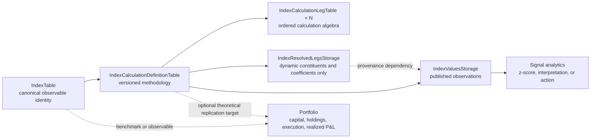

# 0037. Core Derived Index Definition And Calculation Framework

## Status

Accepted - library implementation verified; operational publication pending.

This ADR is not considered implemented merely because the SQLAlchemy models or
calculation functions exist. The complete definition in this document includes
the public API, migrations, storage contracts, DataNodes, tests, examples,
concept documentation, tutorial coverage, changelog, and packaged agent skill.

As of 2026-07-18, the library implementation, SDK-managed migration, shared
catalog binding, runtime attachment, focused tests, executable examples,
documentation, changelog, and packaged skill are complete. The two unchecked
operational gates below remain: the first real shared-backend DataNode
publication under an explicit hash namespace, and publication of a library
release containing the work.

## Decision Summary

`msm` core owns the complete generic derived-index domain under the existing
Index abstraction.

The core model is:



The implementation must not introduce a parallel `SignalIndex` identity, must
not model a derived index as a `PortfolioTable`, and must not place the generic
definition or calculation engine in `msm_pricing` or an application project.

`msm_pricing`, data connectors, and project code may produce observations used
by index legs, but they are input providers and consumers. They do not own the
derived-index definition, calculation, resolution, or published-value model.

## Context

`IndexTable` already provides canonical identity for market indexes. It has a
stable `unique_identifier`, registered `index_type`, display metadata, provider,
and extension metadata. `IndexTimestampedDataNode` already provides the shared
base for time-varying facts keyed by `IndexTable.unique_identifier`.

What is missing is a generic persisted methodology for indexes calculated from
other observations.

Applications currently tend to hardcode derived observables such as:

- government-bond 2s5s, 2s10s, 5s10s, and 10s30s yield spreads;
- fixed and rolling commodity calendar spreads;
- crack spreads and other weighted multi-leg commodity structures;
- equity pairs with fixed, beta-neutral, or regression-estimated coefficients;
- curve butterflies such as 2Y - 2 x 5Y + 10Y;
- option-over-underlying marks with delta-resolved coefficients;
- self-financing delta-hedged or beta-hedged strategy indexes.

Those formulas are general market-index methodologies. They are not specific
to one dashboard, one connector, fixed income, pricing, or portfolios.

The current cross-asset spread helpers under
`msm_pricing.analytics.spreads` demonstrate that a provider-neutral
calculation can accept caller-supplied observations without resolving assets,
portfolios, or backend rows. However, placing a cross-asset spread engine under
`msm_pricing` creates the wrong ownership boundary. It also leaves no canonical
relational definition, no definition versioning, no generic published value
storage, and no audit trail for dynamically resolved legs.

### Why hardcoded spreads are insufficient

A hardcoded tuple such as:

```python
SPREAD_DEFINITIONS = (
    ("2s5s", "2Y", "5Y"),
    ("2s10s", "2Y", "10Y"),
    ("5s10s", "5Y", "10Y"),
    ("10s30s", "10Y", "30Y"),
)
```

cannot express or govern:

- more than two legs;
- price, yield, rate, return, Greek, or index inputs with explicit units;
- ratios, rebased series, chained returns, or self-financing methodologies;
- fixed, estimated, risk-neutral, or Greek-resolved coefficients;
- fixed instruments versus rule-selected or rebalanced components;
- data alignment and missing-observation policies;
- methodology effective dates and immutable versions;
- which instruments and coefficients were actually used historically;
- a reusable published index history consumed by other DataNodes and APIs.

### Why a single JSON payload is insufficient

`IndexTable.metadata_json` is appropriate for provider and workflow extension
metadata. It is not the canonical home for calculation semantics.

Putting the whole methodology in one JSON payload would hide business keys,
foreign keys, uniqueness constraints, leg ordering, coefficient validation,
effective dates, and queryable fields. Core calculation meaning must remain in
typed relational columns. JSON is allowed only for operator-, selector-, or
coefficient-method parameters that are not shared core fields.

## Terminology

### Index identity

The stable market observable represented by one `IndexTable` row.

Example:

```text
MX_MBONOS_2S5S_YIELD_SPREAD
```

### Calculation definition

One immutable, effective-dated methodology version for calculating an index.

### Calculation leg

One semantic input into a definition. A leg describes its subject, observable,
transformation, unit, and coefficient policy.

### Resolved leg

The concrete component and coefficient selected for one calculation time when
a leg uses a selector or dynamic coefficient method.

### Index value

The canonical calculated observation published for one index and timestamp.

### Calculation coefficient

An algebraic multiplier in an index formula. It is not automatically a
portfolio allocation weight, quantity, market value, or position.

## Core Ownership Rule

All generic derived-index behavior belongs to `msm` core under the Index
domain:

- canonical identity and index-type registration;
- calculation definition and leg MetaTables;
- typed public definition and leg APIs;
- operator and unit semantics;
- observation alignment and missing-data policies;
- fixed and dynamic coefficient contracts;
- selector and resolver protocols;
- resolved-leg audit storage;
- canonical index-value storage;
- derived-index DataNode configuration and update process;
- validation and error contracts;
- examples, documentation, tutorials, and packaged skills.

The source tree may remain layer-oriented, as the current repository is, while
keeping ownership inside the Index domain:

```text
src/msm/models/indices.py or src/msm/models/indices/
src/msm/api/indices.py or src/msm/api/indices/
src/msm/analytics/indices/
src/msm/data_nodes/indices/
src/msm/repositories/indices.py
```

Public imports must be available from stable `msm` paths. Applications must
not need to import `msm_pricing` to define or calculate a derived index.

## Canonical Index Identity

`IndexTable` remains deliberately small. It must not be widened with every
calculation field or with repeated leg columns.

The existing identity fields remain responsible for:

```text
uid
unique_identifier
index_type
display_name
description
provider
metadata_json
```

Add a built-in registered index type such as:

```text
derived
```

with a public constant and definition payload following the existing index-type
constant pattern.

`index_type="derived"` identifies that the index has an owned calculation
methodology. More specific classification such as `yield_spread`,
`calendar_spread`, `ratio`, or `strategy_index` belongs on the calculation
definition rather than multiplying top-level index types.

## Relational Definition Model

### IndexCalculationDefinitionTable

`IndexCalculationDefinitionTable` stores one immutable methodology version for
one `IndexTable` row.

Target fields:

| Field | Meaning |
| --- | --- |
| `uid` | UUID identity for this exact definition version. |
| `index_uid` | FK to `IndexTable.uid`. |
| `definition_version` | Monotonically increasing integer within the index. |
| `status` | Lifecycle state such as `draft`, `active`, or `retired`. |
| `effective_from` | Inclusive UTC time at which this version becomes applicable. |
| `effective_to` | Exclusive UTC time at which this version stops applying, nullable for the current version. |
| `calculation_kind` | Registered operator such as `linear_combination`, `ratio`, `rebased_basket`, `chained_return`, or `self_financing`. |
| `calculation_family` | Searchable business classification such as `yield_spread`, `calendar_spread`, `relative_value`, `butterfly`, or `hedged_strategy`. |
| `output_unit` | Canonical unit for published values, such as `basis_points`, `decimal`, `percent`, `ratio`, `index_points`, or a currency/physical unit code. |
| `alignment_policy` | Rule for matching leg observations across timestamps. |
| `missing_data_policy` | Rule for incomplete required observations after alignment. |
| `composition_mode` | `fixed`, `rule_selected`, or `rebalanced`. |
| `rebalance_policy` | Registered schedule or trigger code, nullable for fixed definitions. |
| `rebalance_parameters_json` | Parameters for the registered rebalance policy. |
| `definition_hash` | Deterministic digest of all output-affecting definition and leg fields. |
| `source` | Optional organization, methodology owner, or source namespace. |
| `metadata_json` | Non-core descriptive or extension metadata. |

Required relational constraints:

- unique `(index_uid, definition_version)`;
- indexed `index_uid`, `status`, `effective_from`, and `calculation_family`;
- `definition_version > 0`;
- `effective_to IS NULL OR effective_to > effective_from`;
- no overlapping active effective intervals for the same index, enforced by a
  database constraint where portable or by strict repository validation;
- `definition_hash` must include ordered leg semantics and must not include
  display-only metadata.

Definitions are immutable after activation. A material change creates a new
version. Cosmetic changes to `IndexTable` display metadata do not create a new
definition version.

### Field rationale

`definition_version` and the effective interval prevent a methodology change
from silently rewriting historical meaning.

`calculation_kind` selects mathematical execution. `calculation_family` is
search and business classification. They must not be conflated: two yield
spreads can use different mathematical operators, and a linear combination can
represent a yield spread, commodity conversion, or curve butterfly.

`output_unit` makes the index result self-describing and prevents provider
conventions such as percent versus decimal from leaking into ad hoc multipliers.

`alignment_policy` and `missing_data_policy` are part of methodology because
they can change the resulting history.

`composition_mode` and `rebalance_policy` distinguish a fixed pair from a
rolling benchmark or rebalanced basket.

### IndexCalculationLegTable

`IndexCalculationLegTable` stores ordered, typed inputs for one definition.

Target fields:

| Field | Meaning |
| --- | --- |
| `uid` | UUID identity for the leg row. |
| `definition_uid` | FK to `IndexCalculationDefinitionTable.uid`. |
| `leg_key` | Stable key within the definition, such as `short`, `long`, `front`, `back`, or `hedge`. |
| `leg_order` | Deterministic display and calculation order. |
| `leg_role` | Optional semantic role separate from ordering. |
| `component_kind` | `asset`, `index`, or `selector`. |
| `asset_uid` | Nullable FK to `AssetTable.uid` for a fixed asset leg. |
| `component_index_uid` | Nullable FK to `IndexTable.uid` for a fixed index leg. |
| `selector_code` | Registered selector for a rule-resolved leg. |
| `selector_parameters_json` | Typed-by-selector parameters such as target tenor or futures rank. |
| `observable_code` | Semantic input such as `price`, `settlement`, `yield`, `rate`, `simple_return`, `total_return`, `delta`, `dv01`, or `z_spread`. |
| `input_unit` | Unit expected from the resolved observation before normalization. |
| `transform_code` | `identity`, `rebase`, `log`, `simple_return`, `log_return`, or another registered transform. |
| `transform_parameters_json` | Parameters for the registered transform. |
| `coefficient_method` | `fixed`, `equal_weight`, `price_ols`, `return_ols`, `beta_neutral`, `dv01_neutral`, `delta`, or another registered method. |
| `coefficient` | Fixed algebraic multiplier; required only for `coefficient_method="fixed"`. |
| `coefficient_parameters_json` | Window, lag, bounds, neutralization target, or other method-specific parameters. |
| `metadata_json` | Non-core descriptive or extension metadata. |

Required relational constraints:

- unique `(definition_uid, leg_key)`;
- unique `(definition_uid, leg_order)`;
- exactly one component source must be configured: `asset_uid`,
  `component_index_uid`, or `selector_code`;
- a fixed coefficient requires a finite `coefficient`;
- a non-fixed coefficient must not smuggle the resolved runtime coefficient
  into the definition row;
- a component index cannot recursively produce a cycle in the definition DAG;
- deleting an index referenced as a component must be restricted unless the
  dependent definition is removed or retired explicitly.

Core fields must remain relational. Selector-, transform-, and
coefficient-specific parameters may use JSON, but each registered implementation
must own a strict Pydantic validation model for its payload.

## Formula Coefficients Are Not Portfolio Weights

The field is named `coefficient`, not `weight`, because its semantics depend on
the observable and formula.

For a yield spread:

```text
5Y yield x +1
2Y yield x -1
```

The coefficients are algebra on yields. A user cannot own one unit of yield.

For a crack spread:

```text
2 x gasoline price
1 x heating-oil price
-3 x crude-oil price
```

The coefficients include an economic conversion recipe and require explicit
physical-unit normalization.

For a delta hedge, the underlying coefficient may be the resolved option delta
at the previous rebalance time. It is dynamic methodology state, not an
executed share quantity by itself.

An implementation may later link a derived index to a replication portfolio,
but it must not reuse `PortfolioWeightsStorage` as index methodology or resolved
leg storage.

## Input Resolution Boundary

Definitions describe semantic inputs. They do not hardcode one provider table
UID into each leg row.

`DerivedIndexDataNodeConfiguration` must explicitly declare the source storage
classes or resolver bindings used by that update process. Those dependencies
are update-scoped and participate in the DataNode `update_hash` because changing
them changes the dependency graph and potentially the produced observations.

The generic resolution contract is conceptually:

```python
resolve_leg(
    *,
    definition,
    leg,
    calculation_times,
    source_bindings,
) -> ResolvedLegFrame
```

The resolver must return canonical observations and provenance. It may consume:

- asset-indexed market-data storage;
- index-indexed market-data storage;
- pricing-produced analytics such as yield, DV01, or delta;
- connector-produced settlement or reference observations;
- another derived index through `component_index_uid`.

The provider or pricing package owns production of the source facts. `msm`
Index owns interpretation of those facts as index legs.

Definitions must remain reusable across providers when the methodology is the
same. A source/provider distinction that materially changes the published index
belongs in index identity, definition metadata, or the published storage
contract rather than an untracked runtime override.

## Calculation Engine

The calculation engine lives in `msm` core, for example under
`msm.analytics.indices`.

It must operate on typed, caller-supplied observations and resolved
coefficients. It must not require platform access for pure calculations.
Platform-backed leg resolution and DataNode execution wrap the pure engine.

### Initial calculation kinds

#### linear_combination

```text
value[t] = sum(coefficient_i[t] x normalized_observation_i[t])
```

Supports two-leg spreads, multi-leg butterflies, weighted baskets, and
commodity conversion structures.

#### ratio

```text
value[t] = numerator[t] / denominator[t]
```

Requires explicit zero-denominator handling and unit validation.

#### rebased_basket

Normalizes each configured leg to a common base value before applying the
formula. This is appropriate for relative price-level comparisons where raw
prices are not directly comparable.

#### chained_return

Constructs a cumulative index level from periodic leg returns and resolved
coefficients.

#### self_financing

Constructs a strategy index from lagged positions, rebalance rules, financing,
and optional transaction-cost policy. This method is required for a valid
delta-hedged or dynamically hedged performance series. A naive series such as
`option_price[t] - delta[t] x underlying_price[t]` is not a self-financing
historical strategy and must not be presented as one.

### Alignment policies

The initial registered set is:

- `inner`: exact timestamps available for every required leg;
- `asof`: latest observation at or before the calculation timestamp within an
  explicit maximum staleness;
- `calendar_aligned`: calculation against a declared calendar and timestamp
  policy.

Alignment occurs before the mathematical operator. The engine must not perform
implicit forward filling.

### Missing-data policies

The initial registered set is:

- `drop`: omit a calculation time with incomplete required inputs;
- `fail`: raise a structured completeness error;
- `forward_fill`: allowed only with an explicit maximum age and only when the
  definition selects it.

The result must expose calculation status rather than converting missing input
to zero.

### Unit normalization

Every observable must have an explicit input unit and every definition an
explicit output unit.

Examples:

```text
decimal yield difference 0.0117 -> 117 basis points
percent yield difference 1.17   -> 117 basis points
gasoline USD/gallon             -> USD/barrel before crack-spread weighting
```

Unit conversion must use a registered conversion layer. Provider-specific
multipliers such as `x 100` or `x 10,000` must not be embedded anonymously in
application code.

Incompatible units must fail before publishing values.

### Coefficient methods

The initial contract recognizes:

- `fixed`;
- `equal_weight`;
- `price_ols`;
- `return_ols`;
- `beta_neutral`;
- `dv01_neutral`;
- `delta`.

Methods that estimate or resolve coefficients must define:

- the observation window;
- minimum observations;
- timestamp and effective lag;
- fallback or failure policy;
- coefficient bounds when applicable;
- deterministic behavior for equal timestamps.

The engine must prevent look-ahead. A coefficient estimated or observed at
time `t` cannot be applied to a period that begins before the coefficient was
available unless the methodology explicitly defines a lagged publication
policy.

## Time-Series Storage Contracts

### IndexValuesStorage

`IndexValuesStorage` is the canonical published history for calculated index
observations.

Target row grain:

```text
(time_index, index_identifier)
```

Target fields:

| Field | Meaning |
| --- | --- |
| `time_index` | UTC observation timestamp. |
| `index_identifier` | FK to `IndexTable.unique_identifier`. |
| `value` | Calculated canonical index value. |
| `unit` | Unit code matching the active definition output unit. |
| `definition_uid` | Definition version used for this observation. |
| `calculation_status` | `ready`, `partial`, `stale`, or another registered status. |
| `source_as_of` | Latest source timestamp contributing to the observation, when meaningful. |
| `metadata_json` | Bounded calculation provenance not represented by core fields. |

The table must inherit the normal markets time-index MetaTable mixin, declare
the canonical index foreign key, and document every column. A generic table may
contain indexes with different cadences, so cadence must not be invented at the
shared table level. Update-process cadence belongs to the individual DataNode
configuration and scheduling surface.

The canonical value grain intentionally allows one value per index and time.
A methodology change applies through non-overlapping effective definition
intervals. A material retroactive restatement that must coexist with the old
history requires a new index identity rather than duplicate canonical values at
the same coordinate.

### IndexResolvedLegsStorage

`IndexResolvedLegsStorage` records dynamic methodology provenance. It replaces
the earlier ambiguous term `IndexCompositionStorage` because it covers both
changing membership and changing coefficients.

It is required when any of these vary through time:

- selector-resolved component identity;
- basket membership;
- roll selection;
- fixed-income hedge ratio;
- beta or regression coefficient;
- option delta or another Greek-derived coefficient.

It is not required for definitions whose fixed legs and coefficients are fully
described by `IndexCalculationLegTable`.

Target row grain:

```text
(time_index, index_identifier, leg_key, resolved_component_key)
```

Target fields:

| Field | Meaning |
| --- | --- |
| `time_index` | UTC time at which this resolution becomes effective. |
| `index_identifier` | Canonical derived-index identifier. |
| `definition_uid` | Definition version that produced the resolution. |
| `leg_key` | Stable leg key from the definition. |
| `resolved_component_key` | Stable identifier for the concrete asset or component index. |
| `component_kind` | `asset` or `index`. |
| `resolved_coefficient` | Effective algebraic coefficient. |
| `coefficient_method` | Method used to produce the coefficient. |
| `observable_code` | Observable requested from the resolved component. |
| `source_observation_time` | Timestamp of the source fact used for resolution. |
| `resolution_status` | Structured resolution state. |
| `metadata_json` | Selector or estimator diagnostics. |

Polymorphic component identity cannot use one SQL foreign key for both assets
and indexes. The storage contract must retain `component_kind`, validate the
identifier against the appropriate registered identity during resolution, and
expose structured failures when the referenced identity is unavailable.

Resolved-leg rows are methodology audit facts. They are not orders, holdings,
or executed portfolio weights.

## DerivedIndexDataNode

`DerivedIndexDataNode` belongs under `msm.data_nodes.indices` and extends the
existing index timestamped DataNode behavior.

Its responsibilities are:

1. Resolve the requested `IndexTable` identities.
2. Load the effective active definitions and ordered legs.
3. Construct deterministic source dependencies from explicit configuration.
4. Incrementally read required source observations.
5. Resolve dynamic components and coefficients without look-ahead.
6. Persist resolved-leg audit rows when the definition requires them.
7. Execute the pure core calculation engine.
8. Return a `datetime64[ns, UTC]` indexed frame matching
   `IndexValuesStorage`.

The output storage contract is passed explicitly as
`storage_table: type[PlatformTimeIndexMetaTable]`; it is not hidden in the
DataNode configuration. Dependency storage classes belong in configuration and
therefore affect `update_hash`.

`dependencies()` must be deterministic. The node must not discover new source
DataNodes inside `update()`.

Updates are incremental by default. Backfills and repairs use the normal
DataNode update statistics and scoped `delete_after_date(...)` contract.

The first shared-backend validation must use an explicit `hash_namespace`.

If the implementation uses a separate resolved-leg producer, the value
DataNode must declare it as a deterministic dependency. If one update process
publishes both contracts, the implementation must still preserve the two
storage meanings and transactional failure semantics. A partially published
value without its required dynamic provenance is invalid.

## Definition Versioning And Historical Meaning

The canonical rules are:

1. Activated definitions are immutable.
2. A material output-affecting change creates a new definition version.
3. Effective intervals for one index do not overlap.
4. `definition_hash` includes all ordered leg and operator semantics.
5. An observation records the exact `definition_uid` used.
6. Historical values before a new version's `effective_from` retain their old
   definition.
7. A retroactive methodology rewrite that must coexist with existing history
   creates a new `IndexTable.unique_identifier`.
8. Corrections under the same methodology use an explicit scoped repair or
   tail recomputation and preserve provenance.

Examples of changes requiring a new version:

- changing nearest-tenor selection to most-liquid-near-tenor selection;
- changing exact-date alignment to as-of alignment;
- changing percent input interpretation to decimal;
- changing fixed coefficient `-1` to DV01-neutral;
- changing roll dates or rebalance frequency;
- changing an OLS window from 60 to 120 observations.

Examples not requiring a new version:

- changing display name;
- correcting a description typo;
- adding non-semantic search tags.

## Index And Portfolio Boundary

An Index describes a market observable or a theoretical methodology.

A Portfolio describes capital allocation and execution-aware state:

- positions or quantities;
- market values and cash;
- orders and fills;
- transaction costs;
- realized and unrealized P&L;
- actual rebalance execution;
- financing and collateral where relevant.

The following is an index definition:

```text
5Y yield x +1 - 2Y yield x 1 = 117 basis points
```

The following is a portfolio implementation:

```text
long MXN 10 million face of the 5Y bond
short MXN 14.23 million face of the 2Y bond
rebalance after fills to keep net DV01 inside tolerance
```

The portfolio quantities are determined by price, DV01, capital, and execution
constraints. They are not the same as the index's `+1/-1` yield coefficients.

A portfolio may reference a derived index as benchmark, signal input, or
published observable. The derived index must not require a Portfolio row or
`PortfolioWeightsStorage` to exist.

## Index And Signal Boundary

The spread level is an index observation. A statistical interpretation or
trading action is a downstream analytic or signal.

```text
MX_MBONOS_2S5S_YIELD_SPREAD      -> derived index
MX_MBONOS_2S5S_1Y_ZSCORE        -> optionally another derived analytic index
LONG / SHORT / OBSERVE decision -> signal or strategy policy
```

Do not create `SignalIndexTable` and do not embed entry thresholds, stop rules,
conviction, or action labels in the spread index definition unless those values
are themselves the explicitly published index methodology.

## Required Examples

### M-Bond 2s5s yield spread

Identity:

```text
unique_identifier = MX_MBONOS_2S5S_YIELD_SPREAD
index_type         = derived
```

Definition:

```text
calculation_kind   = linear_combination
calculation_family = yield_spread
output_unit        = basis_points
alignment_policy   = inner
missing_policy     = drop
composition_mode   = rule_selected
rebalance_policy   = monthly
```

Legs:

```text
long:
  selector = nearest_tenor(government_bond, MX, security_type=M, tenor=5Y)
  observable = yield
  input_unit = decimal
  coefficient = +1

short:
  selector = nearest_tenor(government_bond, MX, security_type=M, tenor=2Y)
  observable = yield
  input_unit = decimal
  coefficient = -1
```

If the resolved yields are `0.0841` and `0.0724`, the published value is
`117 basis_points`. Monthly constituent changes are recorded in
`IndexResolvedLegsStorage`.

The example must make the difference between these two methodologies explicit:

- current selected bonds applied to their available history;
- a genuinely rolling historical index that resolves constituents at each
  effective rebalance date.

They must not share one identifier because they do not have the same historical
meaning.

### Commodity calendar spread

Fixed example:

```text
CL_DEC_SETTLEMENT x +1 - CL_MAR_SETTLEMENT x 1
```

Rolling example:

```text
front eligible future settlement x +1
second eligible future settlement x -1
roll according to declared policy
```

The fixed example requires no resolved-leg storage. The rolling example records
contract changes and roll-effective timestamps.

### Weighted multi-leg spread

Curve butterfly:

```text
2Y yield x +1
5Y yield x -2
10Y yield x +1
```

Commodity crack spread:

```text
gasoline x +2
heating oil x +1
crude oil x -3
```

The crack-spread example must demonstrate explicit physical-unit conversion
before applying coefficients.

### Equity relative-value spread

```text
WALMEX return x +1
FEMSA return x resolved beta-neutral coefficient
```

The example must record the estimation window, effective lag, minimum
observations, and resolved coefficient history. It must prove that coefficients
do not use future observations.

### Delta-hedged option index

Current-mark example:

```text
option price x +1
underlying price x resolved negative delta
```

Historical performance example:

```text
period P&L = option price change
             - prior effective delta x underlying price change
             + financing
             - configured transaction costs
```

The performance example must use `self_financing`, persist effective deltas,
and demonstrate that a same-time delta is not applied before it was available.

An example that merely charts `option_price[t] - delta[t] x spot[t]` must not be
described as delta-hedged strategy performance.

## Public API Direction

The final public API must allow typed creation, inspection, and execution
without direct SQLAlchemy model mutation.

Illustrative shape:

```python
from msm.api.indices import (
    DerivedIndex,
    IndexCalculationDefinition,
    IndexCalculationLeg,
)

spread = DerivedIndex.upsert(
    unique_identifier="MX_MBONOS_2S5S_YIELD_SPREAD",
    display_name="M-Bonos 2s5s Yield Spread",
    definition=IndexCalculationDefinition(...),
    legs=[
        IndexCalculationLeg(...),
        IndexCalculationLeg(...),
    ],
)
```

The exact convenience method may change during implementation. The public
contract must provide:

- typed validation for definitions and legs;
- transactional creation or explicit rollback when identity, definition, and
  leg persistence do not all succeed;
- retrieval by index UID or identifier;
- active-definition lookup for a timestamp;
- definition history inspection;
- ordered leg retrieval;
- structured validation errors;
- pure in-memory calculation entry points;
- DataNode-backed publication entry points.

Every public type must be re-exported from the normal `msm` Index public
surface and documented in the generated API reference where applicable.

## Migration And Registration

The new relational and time-index models are built-in `msm` models.

Implementation must:

1. Add the models to the built-in markets model registry in dependency order.
2. Author all foreign keys, indexes, checks, and descriptions in SQLAlchemy
   metadata.
3. Use the SDK-managed Alembic MetaTable migration provider and CLI lifecycle.
4. Create a new migration revision; never edit an applied revision.
5. Include the definition and leg tables plus both storage contracts in the
   provider model set.
6. Verify runtime attachment can request the minimal Index-derived model set
   without resolving unrelated portfolios or pricing tables.

Required registration order is conceptually:

```text
IndexTypeTable
IndexTable
IndexCalculationDefinitionTable
IndexCalculationLegTable
IndexValuesStorage
IndexResolvedLegsStorage
```

All models require intention-rich table descriptions and column-level labels
and descriptions.

## Compatibility With Existing Spread Helpers

The cross-asset spread primitives currently under
`msm_pricing.analytics.spreads` must not remain the canonical owner.

Implementation must move or rebuild the generic operator behavior under
`msm.analytics.indices`. Existing `msm_pricing` import paths may temporarily
delegate to the core engine for a documented deprecation period if compatibility
is required, but no duplicate calculation implementation is allowed.

Pricing-specific computations such as producing an option delta, bond DV01, or
z-spread remain pricing inputs. Once produced, their use as a leg observable or
coefficient belongs to the core Index engine.

## Consequences

### Positive

- Applications register new spreads and derived indexes as data instead of
  changing Python constants.
- The same model supports fixed income, equities, commodities, options, rates,
  and cross-asset structures.
- Formula coefficients are no longer confused with portfolio allocations.
- Dynamic component and coefficient history becomes reproducible.
- Index histories become reusable DataNode products instead of repeated
  request-time calculations.
- Unit, alignment, missing-data, and look-ahead policies become explicit and
  testable.
- Methodology versions can evolve without silently changing old meaning.
- Connectors and pricing remain input providers instead of owning index
  semantics.

### Costs

- The core Index domain gains multiple relational and time-index contracts.
- Dynamic indexes require explicit provenance storage.
- Operator, selector, transform, and coefficient registries need strict
  validation and documentation.
- Self-financing strategy indexes require careful timing, cash, financing, and
  cost semantics.
- Existing spread helper imports need a deliberate compatibility plan.

## Rejected Alternatives

### Project-local spread tables

Rejected because the semantics are cross-asset and reusable. Project-local
tables would create incompatible definitions and force later migration.

### SignalIndexTable

Rejected because a spread level is an observable, while long/short/observe is a
signal or policy. A second index identity would duplicate `IndexTable`.

### PortfolioTable plus PortfolioWeightsStorage

Rejected because portfolio weights represent capital allocation and execution
state. Yield, beta, delta, and conversion coefficients are calculation algebra.
Portfolios remain optional downstream implementations.

### Ownership by msm_pricing

Rejected because commodity, equity, rate, and statistical derived indexes are
not inherently pricing objects. Pricing may produce leg facts but does not own
the Index definition or engine.

### Store the methodology entirely in metadata_json

Rejected because it removes relational integrity, queryability, field-level
documentation, version constraints, and safe leg lifecycle management.

### Calculate every value on request and publish nothing

Rejected as the canonical workflow because repeated consumers would duplicate
resolution, alignment, and calculation. Request-time preview remains useful,
but production histories belong in `IndexValuesStorage`.

### Use portfolio weights as dynamic composition history

Rejected because resolved legs can represent selectors and algebraic or risk
coefficients without any invested capital or executed position.

## Non-Goals

This ADR does not require:

- every derived index to be tradable;
- every index to have dynamic resolved-leg storage;
- the Index engine to calculate option Greeks or bond DV01 itself;
- connector-specific provider tables to move into `msm`;
- execution, orders, holdings, cash, or realized P&L to move out of portfolios;
- signal entry/exit rules to become part of index methodology;
- one universal data source for every observable;
- implicit forward filling or silent unit coercion.

## Implementation Plan

### Phase 1 - Core identity extensions and fixed calculations

- Add the `derived` index type constant and definition.
- Add definition and leg SQLAlchemy models and typed APIs.
- Add registered operator, transform, unit, alignment, and missing-policy
  contracts.
- Implement fixed-leg linear combinations and ratios in the pure core engine.
- Add `IndexValuesStorage` and a fixed-leg `DerivedIndexDataNode` path.
- Migrate generic pair-spread calculation ownership from `msm_pricing` to
  `msm` core.

### Phase 2 - Dynamic resolution

- Add selector and coefficient resolver registries.
- Add `IndexResolvedLegsStorage`.
- Implement rule-selected and rebalanced component workflows.
- Implement OLS, beta-neutral, DV01-neutral, and delta coefficient contracts.
- Add look-ahead and effective-time validation.

### Phase 3 - Strategy indexes

- Implement chained-return and self-financing calculation kinds.
- Add financing, rebalance, and transaction-cost policy contracts.
- Validate delta-hedged and other dynamically hedged performance examples.

### Phase 4 - Consumer migration

- Replace application hardcoded spread tuples with persisted index definitions.
- Publish canonical histories through `IndexValuesStorage`.
- Keep statistical signals and application display logic downstream.
- Remove application-owned duplicate calculation code after parity validation.

## Definition Of Complete

This ADR may change to `Accepted - implemented` only when every mandatory item
below is complete.

### Models and migrations

- [x] Add `INDEX_TYPE_DERIVED` and its public type definition.
- [x] Add `IndexCalculationDefinitionTable` with documented fields,
  constraints, indexes, effective dating, and immutable activation rules.
- [x] Add `IndexCalculationLegTable` with ordered legs, component exclusivity,
  coefficient validation, and cycle prevention.
- [x] Add `IndexValuesStorage` with canonical index FK and documented grain.
- [x] Add `IndexResolvedLegsStorage` with documented dynamic provenance grain.
- [x] Add all models to the built-in model registry and minimal attachment
  dependency graph.
- [x] Create and validate a new SDK-managed Alembic migration revision.
- [x] Verify migration upgrade and catalog binding for every new model.

### Public API and engine

- [x] Add typed public definition, leg, and derived-index APIs under `msm`.
- [x] Add transactional creation and version activation behavior.
- [x] Add pure core operators for linear combination, ratio, rebased basket,
  chained return, and self-financing strategy calculations.
- [x] Add registered units and strict conversion validation.
- [x] Add registered alignment and missing-data policies.
- [x] Add fixed and dynamic coefficient contracts.
- [x] Add selector and resolved-leg contracts.
- [x] Add cycle detection for index-on-index definitions.
- [x] Move canonical generic spread ownership out of `msm_pricing`; retain only
  explicit compatibility delegates if required.

### DataNodes and publication

- [x] Add `DerivedIndexDataNodeConfiguration` with explicit, hashed source
  storage dependencies.
- [x] Add an incremental `DerivedIndexDataNode` publication workflow.
- [x] Guarantee `datetime64[ns, UTC]` time-first output matching storage.
- [x] Persist dynamic resolved legs atomically with, or as a declared
  dependency of, canonical index values.
- [x] Add scoped repair and backfill behavior through normal DataNode APIs.
- [ ] Validate the first shared-backend run under an explicit namespace.

### Tests

- [x] Add SQLAlchemy model, constraint, FK, index, registry, and migration tests.
- [x] Add definition versioning and non-overlap tests.
- [x] Add definition-hash stability and output-affecting change tests.
- [x] Add unit-conversion and incompatible-unit failure tests.
- [x] Add exact, as-of, calendar, missing-data, and staleness tests.
- [x] Add fixed and dynamic coefficient tests.
- [x] Add selector determinism and resolved-leg provenance tests.
- [x] Add index dependency DAG and cycle rejection tests.
- [x] Add incremental update, backfill, and scoped repair tests.
- [x] Add explicit no-look-ahead tests for OLS, beta, DV01, and delta methods.
- [x] Add parity tests for existing two-leg spread helpers.
- [x] Add end-to-end tests for all required examples below.

### Examples

- [x] Add `examples/msm/indices/m_bond_2s5s_yield_spread.py` covering rolling
  benchmark selection, basis-point output, resolved legs, and published values.
- [x] Add `examples/msm/indices/commodity_calendar_spread.py` covering fixed
  and rolling contracts.
- [x] Add `examples/msm/indices/weighted_multi_leg_spreads.py` covering a curve
  butterfly and unit-normalized crack spread.
- [x] Add `examples/msm/indices/equity_beta_spread.py` covering estimated
  coefficients and effective lag.
- [x] Add `examples/msm/indices/delta_hedged_option_index.py` covering current
  mark and valid self-financing performance semantics.
- [x] Smoke-test every example through public imports.

### Documentation

- [x] Expand `docs/knowledge/msm/indices/index.md` with the full derived-index
  concept, identity, definition, leg, storage, and portfolio boundaries.
- [x] Add a dedicated derived-index workflow page if the index overview would
  become too large.
- [x] Add a tutorial chapter showing registration, definition, migration,
  source binding, backfill, and consumption in the correct order.
- [x] Wire every new page into `mkdocs.yml` and relevant documentation indexes.
- [x] Document the public API and every registered calculation, selector,
  transform, coefficient, unit, alignment, missing-data, and rebalance policy.
- [x] Document migration and compatibility behavior for the existing
  `msm_pricing.analytics.spreads` import surface.
- [x] Update `CHANGELOG.md` with the new public models, APIs, storage contracts,
  examples, documentation, and any deprecations.

### Packaged agent skills

- [x] Add
  `.agents/skills/ms_markets/indices/derived_index_workflow/SKILL.md` as the
  owning skill for creating, extending, reviewing, and publishing derived
  indexes.
- [x] The skill must cover identity versus definition, leg modeling, fixed and
  dynamic coefficients, units, selectors, resolved-leg provenance, DataNode
  publication, versioning, no-look-ahead rules, and the Index/Portfolio/Signal
  boundaries.
- [x] Update adjacent asset, portfolio, and pricing skills with routing rules so
  they send derived-index work to the new Index skill instead of duplicating
  its contract.
- [x] Verify the new skill is included in the packaged `.agents/skills/ms_markets`
  bundle.
- [x] Update skill-copy tests so `msm copy-msm-skills --path <host-project>`
  installs the new skill and records the correct package pin.
- [x] Do not run `msm copy-msm-skills` inside the ms-markets source checkout.

### Library maintenance and release

- [x] Add the implementation to the library changelog.
- [x] Run focused model, API, analytics, DataNode, migration, example, and
  packaged-skill tests.
- [x] Run the complete relevant test suites.
- [x] Run `git diff --check`.
- [x] Run `mkdocs build --strict`.
- [x] Verify public import surfaces in a clean installed environment.
- [ ] Publish a release containing implementation, migrations, examples,
  documentation, tutorial, changelog, and skills together.

## Acceptance Scenarios

The implementation is not complete until all of these scenarios work without
application-specific calculation code:

1. Add a new M-Bond 5s30s spread by persisting an Index, definition, and legs;
   no Python spread constant changes.
2. Publish a rolling front/second commodity spread with reproducible contract
   rolls.
3. Publish a three-leg curve butterfly with explicit coefficients.
4. Publish a crack spread with correct physical-unit normalization.
5. Publish a beta-neutral equity spread with lagged estimated coefficients and
   no look-ahead.
6. Publish a delta-hedged option mark with resolved delta provenance.
7. Publish a self-financing delta-hedged performance index whose rebalance
   timing, financing, and costs are explicit.
8. Consume each published series through the generic Index DataNode storage
   contract.
9. Build an optional portfolio that references one derived index without the
   index depending on portfolio identity or portfolio weights.
10. Install the packaged ms-markets skills into a separate host project and use
    the derived-index skill to reproduce the documented workflow.
