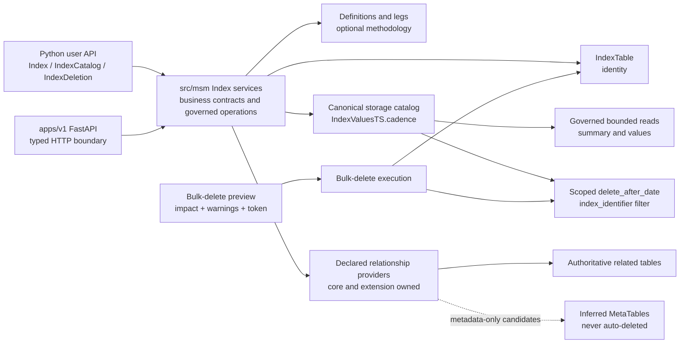
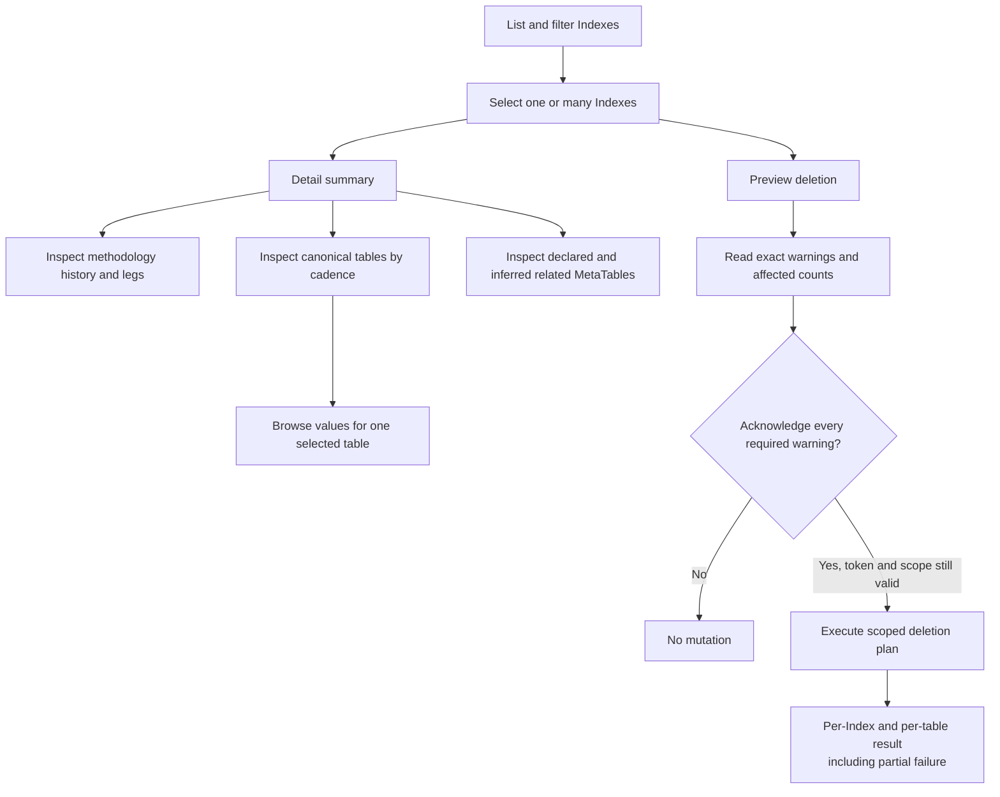

# 0038. Index User API, FastAPI Exploration, And Safe Bulk Deletion

## Status

Accepted - repository implementation complete; platform migration and release
verification pending

## Date

2026-07-19

## Related Decisions

- [ADR 0037](0037-core-derived-index-definition-and-calculation-framework.md)
  defines Index identity, optional calculation methodology, cadence-specific
  canonical value storage, and extension-owned Index observations.
- [FastAPI v1 ADR 0004](fast_api/v1/0004-delete-impact-contract.md)
  defines the reusable single-resource delete-impact response. This ADR
  supersedes only its Index-specific bulk-delete non-goal; its reusable
  single-resource contract remains valid.
- [FastAPI v1 ADR 0002](fast_api/v1/0002-command-center-adapter-discovery.md)
  defines how public `apps/v1` operations are exposed through Adapter from API.

## Platform References

- [Create your first FastAPI API](https://mainsequence-sdk.github.io/mainsequence-sdk/tutorial/create_your_first_api/)
  defines the API-as-consumer pattern and `APIDataNode` read boundary.
- [FastAPI request identity context](https://mainsequence-sdk.github.io/mainsequence-sdk/knowledge/fastapi/)
  defines request-bound logged-user resolution.
- [DataNodes](https://mainsequence-sdk.github.io/mainsequence-sdk/knowledge/data_nodes/)
  defines governed time-series reads, identity scoping, and
  `delete_after_date(...)` behavior.
- [Registering SQLAlchemy tables](https://mainsequence-sdk.github.io/mainsequence-sdk/knowledge/meta_tables/sqlalchemy/)
  defines SQLAlchemy/Alembic metadata and physical DDL as the source of truth
  for foreign keys.

## Success Condition

The Index domain has a complete, typed user API and a complete `apps/v1`
FastAPI exploration and lifecycle surface without moving business logic into
HTTP routers or treating arbitrary related tables as safe cascade targets.

The design is successful when it specifies:

1. typed Index identity CRUD, list, detail, summary, methodology, dataset, and
   value-exploration services under `src/msm`;
2. matching FastAPI list, create, update, detail, summary, methodology,
   canonical-dataset, value-frame, related-MetaTable, preview, and bulk-delete
   routes;
3. deterministic discovery of every registered canonical
   `IndexValuesTS.<cadence>` table;
4. an opt-in extension contract for authoritative related Index storage,
   without requiring one concrete DataNode base class;
5. a pre-delete impact report that explains exactly what will and will not be
   deleted before any destructive action;
6. a stateless, short-lived, user-bound confirmation token whose scope is
   invalidated when the reviewed impact changes;
7. scoped value deletion through
   `TimeIndexMetaTable.delete_after_date(None, dimension_filters=...)`, never
   through raw SQL;
8. explicit partial-failure and DataNode-republication semantics;
9. resolved-actor and per-resource edit-access checks;
10. stable OpenAPI and Command Center Adapter from API operation contracts;
11. an implementation sequence and test plan that can be completed without
    guessing about platform capabilities.

The typed Python services, FastAPI routes, Adapter from API operations,
relationship-provider registry, guarded deletion saga, execution-journal model,
tests, documentation, tutorial, example, and Index skill guidance are implemented
in this repository. The SDK-generated migration for the execution-journal model
and deployed-resource verification remain pending because the configured local
Main Sequence migration service was unavailable during implementation. The
destructive routes must not be released until that migration is generated,
reviewed, applied, and verified.

## Context

ADR 0037 established that an Index is a stable observable identity and that a
calculation definition is optional. It also established that frequency is
storage identity:

```text
USD_SWAP_10Y
  -> IndexValuesTS.1m
  -> IndexValuesTS.1d
```

Before this ADR, the Python user API provided:

- `IndexType` create, upsert, update, filter, and lookup behavior;
- `Index` create, upsert, update, filter, UID lookup, unique-identifier lookup,
  and an individual delete inherited from `MarketsMetaTableRow`;
- `DerivedIndex` upsert, effective lookup, definition history, activate,
  retire, and in-memory calculation.

Before this ADR, the FastAPI Index surface provided:

```text
GET    /api/v1/index/
GET    /api/v1/index/{uid}/
GET    /api/v1/index/{uid}/delete-impact/
DELETE /api/v1/index/{uid}/
```

It did not provide:

- Index create or update routes;
- a composed detail or frontend summary;
- methodology history and leg exploration;
- canonical value-dataset discovery by cadence;
- value browsing for a selected Index and selected dataset;
- an authoritative versus inferred related-MetaTable view;
- bulk-delete preview;
- bulk identity deletion;
- optional scoped deletion of Index values before identity deletion;
- an enforced pre-delete confirmation boundary.

The former individual delete-impact route reported curated known
relationships, but it is only a snapshot. It does not bind a later delete to
the reviewed state, does not enumerate all canonical value tables, and does not
support multiple Indexes.

## Decision Summary

Introduce one reusable Index catalog and lifecycle service under `src/msm` and
expose it through both the Python user API and thin `apps/v1` routes.



The target interaction is selection first, exploration second, preview third,
and deletion only after explicit confirmation:



## Ownership And Package Boundaries

### `src/msm`

Reusable domain behavior belongs under `src/msm`, not in FastAPI routers.

Target modules:

```text
src/msm/api/indices.py
src/msm/api/derived_indices.py
src/msm/services/indices/__init__.py
src/msm/services/indices/catalog.py
src/msm/services/indices/exploration.py
src/msm/services/indices/relationships.py
src/msm/services/indices/deletion.py
```

The exact module split may be collapsed while small, but these responsibilities
must remain distinct:

- identity CRUD and typed public models;
- catalog listing and filtering;
- methodology composition;
- dataset discovery and value reads;
- relationship-provider registration;
- delete preview, execution, and execution journaling.

### `apps/v1`

`apps/v1` remains an HTTP resolver layer:

```text
apps/v1/routers/indices.py
apps/v1/schemas/indices.py
apps/v1/services/indices.py
```

- routers parse parameters, call a service, map errors, and return declared
  response models;
- local schemas define HTTP envelopes, composed summaries, previews, and
  action responses that do not map to one core row;
- `apps/v1/services/indices.py` is a thin adapter into `src/msm`;
- no raw SQL, MetaTable discovery algorithm, delete ordering, or confirmation
  logic belongs in the router.

## Complete Python User API

### Identity And Type Management

Retain the current public contracts:

```python
IndexType.create(...)
IndexType.upsert(...)
IndexType.update(...)
IndexType.filter(...)
IndexType.get_by_uid(...)

Index.create(...)
Index.upsert(...)
Index.update(...)
Index.filter(...)
Index.get_by_uid(...)
Index.get_by_unique_identifier(...)
Index.get_many_by_unique_identifier(...)
```

Add typed catalog methods rather than forcing users to compose repository
operations:

```python
Index.list_page(...)
Index.get_detail(uid)
Index.get_summary(uid)
Index.list_methodologies(uid)
Index.list_datasets(uid, ...)
Index.get_dataset_summary(uid, meta_table_uid)
Index.get_values(uid, meta_table_uid, ...)
Index.list_related_meta_tables(uid, ...)
Index.preview_bulk_delete(...)
Index.bulk_delete(...)
```

`DerivedIndex` remains the methodology authoring API. Do not copy its upsert,
activate, retire, or calculate behavior into `Index` or FastAPI.

### Typed User-API Models

Add strict reusable models under `src/msm/api` or a public `src/msm/services`
contract module:

- `IndexListRequest` and `IndexPage`;
- `IndexDetail`;
- `IndexSummary`;
- `IndexMethodologySummary` and `IndexMethodologyDetail`;
- `IndexDatasetDescriptor` and `IndexDatasetSummary`;
- `IndexRelatedMetaTable`;
- `IndexBulkDeletePreviewRequest`;
- `IndexBulkDeletePreview`;
- `IndexBulkDeleteExecuteRequest`;
- `IndexBulkDeleteResult`;
- `IndexDeleteItemResult` and `IndexDatasetDeleteResult`.

User APIs must return these models instead of untyped dictionaries.

### List Semantics

`Index.list_page(...)` supports:

- case-insensitive search;
- exact UID and `unique_identifier` filters;
- `index_type`;
- provider;
- `has_definition`;
- `has_canonical_values`;
- cadence;
- stable ordering;
- limit/offset pagination with an authoritative count.

Filters involving definitions or value datasets may require composed queries.
They belong in the catalog service, not the generic `Index.filter(...)`
implementation.

### Safe Delete Override

The target state overrides the inherited direct `Index.delete(...)` behavior.
Interactive and public deletion must require a valid preview confirmation. A
private repository-level delete primitive may remain for compensation and
migrations, but it must not be presented as the normal user workflow.

`DerivedIndex.upsert(...)` currently uses direct Index deletion as compensating
cleanup when methodology creation fails. Before overriding public
`Index.delete(...)`, move that compensation to the private repository primitive
and test it explicitly. The safety boundary must not break failed-upsert
cleanup or turn internal compensation into an interactive confirmation flow.

## FastAPI v1 Contract

All structured routes declare strict request and response models, explicit
`operation_id` values, parameter descriptions, documented errors, and matching
Adapter from API operations.

### Identity Routes

| Method | Path | Operation ID | Contract |
| --- | --- | --- | --- |
| `GET` | `/api/v1/index/` | `listIndexes` | Enhanced paginated list using the core `Index` row |
| `POST` | `/api/v1/index/` | `createIndex` | Create one plain or externally calculated Index identity |
| `GET` | `/api/v1/index/{uid}/` | `getIndex` | Return one core `Index` row |
| `PATCH` | `/api/v1/index/{uid}/` | `updateIndex` | Update mutable Index identity fields |
| `GET` | `/api/v1/index/{uid}/summary/` | `getIndexSummary` | Return `FrontEndDetailSummary` |

The FastAPI surface also exposes the canonical type registry needed by create,
update, filtering, and interactive Index selection:

| Method | Path | Operation ID | Contract |
| --- | --- | --- | --- |
| `GET` | `/api/v1/index-type/` | `listIndexTypes` | Paginated Index-type choices visible to the caller |
| `GET` | `/api/v1/index-type/{index_type}/` | `getIndexType` | One Index-type definition and description |

Index-type creation and mutation remain in the typed Python user API in this
ADR. A public administrative FastAPI mutation surface for the type registry
requires its own permission and deletion-lifecycle decision.

Creation does not create a calculation definition or a storage table. Derived
methodology creation remains a separate typed workflow and, if exposed later,
uses explicit methodology routes.

### Methodology Routes

| Method | Path | Operation ID | Contract |
| --- | --- | --- | --- |
| `GET` | `/api/v1/index/{uid}/methodologies/` | `listIndexMethodologies` | Ordered definition history summaries |
| `GET` | `/api/v1/index/{uid}/methodologies/{definition_uid}/` | `getIndexMethodology` | Exact definition and ordered legs |

Plain Indexes return an empty methodology list with HTTP 200. They are not
reported as errors and no artificial definition is created.

### Dataset And Value Exploration Routes

| Method | Path | Operation ID | Contract |
| --- | --- | --- | --- |
| `GET` | `/api/v1/index/{uid}/datasets/` | `listIndexDatasets` | Typed dataset descriptors |
| `GET` | `/api/v1/index/{uid}/datasets/{meta_table_uid}/` | `getIndexDatasetSummary` | One dataset summary |
| `GET` | `/api/v1/index/{uid}/datasets/{meta_table_uid}/values/` | `getIndexDatasetValuesFrame` | `TabularFrameResponse` |
| `GET` | `/api/v1/index/{uid}/related-meta-tables/` | `listIndexRelatedMetaTables` | Typed declared and inferred relationships |

The values route requires:

- selected Index UID;
- selected registered MetaTable UID;
- bounded start/end timestamps;
- limit with a strict maximum;
- ascending or descending order;
- optional selected columns limited to the table contract.

It resolves the Index UID to `Index.unique_identifier` and always applies the
`index_identifier` dimension filter. It must not expose an unscoped table scan.
It returns `TabularFrameResponse` because the result is directly consumable by
generic Command Center table and chart flows.

The implementation first resolves the selected visible `TimeIndexMetaTable`,
re-verifies its canonical contract and actual foreign key, and then binds the
cadence-specific SQLAlchemy storage model to that registered table. It executes
a governed compiled `SELECT` with the selected `index_identifier`, inclusive
time bounds, deterministic order, and a server-side `LIMIT`. The installed SDK's
`APIDataNode` read helper does not expose a server-side row-limit parameter, so
using it here would not satisfy this route's bounded-read guarantee. The route
must never read the whole history and truncate it in application memory.

### Delete Routes

| Method | Path | Operation ID | Contract |
| --- | --- | --- | --- |
| `GET` | `/api/v1/index/{uid}/delete-impact/` | `getIndexDeleteImpact` | Compatibility single-item impact view |
| `POST` | `/api/v1/index/bulk-delete/preview/` | `previewBulkDeleteIndexes` | Non-mutating preview, warnings, and confirmation token |
| `POST` | `/api/v1/index/bulk-delete/` | `bulkDeleteIndexes` | Execute one reviewed deletion plan |
| `DELETE` | `/api/v1/index/{uid}/` | `deleteIndex` | Deprecated compatibility route delegating to the reviewed single-item plan |

Use `POST` for bulk execution because request bodies on `DELETE` are not
reliably supported by every client and adapter. Define bulk routes before the
dynamic `/{uid}/` route so FastAPI does not interpret `bulk-delete` as an Index
UID.

The compatibility `DELETE` route must move through this transition:

1. one release in which it remains available but emits deprecation metadata
   and documentation points clients to preview plus bulk execution;
2. target state in which it requires the same confirmation token as a
   single-item bulk plan and returns HTTP 428 when confirmation is missing;
3. no hidden unsafe bypass in the public Python API.

## Detail Summary

`GET /api/v1/index/{uid}/summary/` uses the existing reusable
`FrontEndDetailSummary` envelope.

It includes:

- entity identity and display name;
- badges for `index_type`, provider, and plain versus core-derived ownership;
- UID and unique identifier;
- latest active definition and version when present;
- counts of definition versions and legs;
- count of canonical datasets;
- available cadences;
- earliest/latest observation timestamps by dataset when accessible;
- latest value, unit, status, and source-as-of by cadence when accessible;
- related-MetaTable counts separated into authoritative and inferred;
- links to methodology, datasets, related tables, delete preview, and update;
- warnings for inaccessible datasets, incomplete discovery, or stale metadata.

Summary is a bounded composed read. It must not fetch full histories.

## Canonical Dataset Discovery

### Authoritative Core Discovery

A table is a canonical Index value dataset only after resolving a registered
`TimeIndexMetaTable` and verifying all of these conditions:

1. logical identifier matches `IndexValuesTS.<cadence>`;
2. cadence is present and matches the identifier;
3. storage identity includes `storage_name="index_values"` and the same
   cadence when exposed by the table contract;
4. grain contains `time_index` and `index_identifier`;
5. columns include `value` and `unit`;
6. the authoritative SQLAlchemy/Alembic table definition contains an actual
   foreign key from `index_identifier` to
   `IndexTable.unique_identifier`;
7. the current caller can view the registered table.

The foreign key is mandatory. A column named `index_identifier`, even with the
correct type and grain, does not establish an Index relationship and can never
make a table canonical.

Main Sequence foreign keys are SQLAlchemy/Alembic-owned DDL and are not
guaranteed to be serialized in the normal MetaTable registration contract.
Therefore the core resolver proves the foreign key through the authoritative
core storage-model registry and maps that model to its registered MetaTable
UID. An extension relationship provider must supply the same authoritative
storage-model proof. When catalog or database introspection exposes foreign-key
metadata, the resolver cross-checks it and reports drift as a catalog error; it
does not fall back to matching a column name.

Conceptually, the proof is equivalent to:

```python
any(
    foreign_key.parent.name == "index_identifier"
    and foreign_key.column.table.fullname == IndexTable.__table__.fullname
    and foreign_key.column.name == "unique_identifier"
    for foreign_key in storage_model.__table__.foreign_keys
)
```

Never treat a physical-name prefix alone as authority. Physical names shown in
responses come from the registered MetaTable resource. The API does not
hardcode a table name into SQL.

The descriptor contains:

```text
meta_table_uid
identifier
namespace
cadence
physical_table_name
time_index_name
index_names
columns
foreign_keys
description
storage_kind
discovery_source
access
producer_identifiers
```

`storage_kind` is one of:

- `canonical_index_values`;
- `resolved_index_legs`;
- `declared_extension_values`;
- `related_reference_table`;
- `inferred_candidate`.

### Dataset Summary

For a selected Index and selected dataset, return:

- row count with `count_accuracy=exact`, `estimated`, or `unavailable`;
- earliest and latest time index;
- latest value/unit/status/source-as-of where the schema supports them;
- table cadence and grain;
- producer/DataNode identifiers when discoverable;
- view/edit access state;
- whether scoped deletion is supported;
- any error or access limitation without failing the entire Index summary.

Use governed, bounded aggregate reads. Do not load the full table into pandas
to calculate counts or time bounds.

## Related MetaTable Feasibility And Contract

### What Is Reliably Possible

The API can reliably expose:

- `IndexTable` and `IndexTypeTable`;
- `IndexCalculationDefinitionTable`;
- `IndexCalculationLegTable`;
- `IndexResolvedLegsStorage`;
- registered canonical `IndexValuesTS.<cadence>` tables;
- relationships explicitly declared by core or an installed extension.

Registered MetaTable metadata exposes the neutral table contract, while catalog
or database introspection may additionally expose physical foreign keys and
indexes. This makes best-effort relationship discovery possible, but it does
not replace the authoritative storage-model or provider proof required for a
canonical Index dataset.

### What Is Not Reliably Possible

The API cannot infer every semantic relationship safely because:

- some references are strings or polymorphic selector keys rather than FKs;
- extension tables may be registered under another namespace or package;
- the caller may not have view access to a related table;
- table metadata may be stale or incomplete;
- a column named `index_identifier` does not prove canonical semantics;
- a discovered FK does not define the product-level delete policy;
- a relation may be indirect through a definition, Portfolio, or application
  selector.

Therefore automatic schema-wide cascade traversal is rejected.

### Relationship Provider Registry

Introduce an in-process registry whose providers opt into authoritative Index
relationships. This is a Python contract, not a new mandatory base DataNode and
not a new universal observation table.

Each provider declares:

```text
key
label
owning_package
storage_kind
MetaTable resolver
Index join kind: uid or unique_identifier
Index join column
authoritative SQLAlchemy storage model
foreign-key source column
foreign-key target table and column
relationship type
on-delete behavior
exploration capability
count/summary capability
delete capability
delete implementation
```

Rules:

- core registers canonical values, resolved legs, definitions, and legs;
- an extension may register its own richer Index storage without inheriting
  `IndexTimestampedDataNode`;
- every authoritative Index-indexed storage provider proves an actual foreign
  key to `IndexTable.uid` or `IndexTable.unique_identifier` through its
  SQLAlchemy/Alembic storage model;
- declared providers are authoritative for exploration;
- deletion is opt-in separately from exploration;
- a time-indexed delete provider must use `delete_after_date(...)`;
- a provider may declare `manual_cleanup_required` or `blocks_delete`;
- inferred candidates are never promoted to delete targets automatically.

### Inferred Candidates

The related-MetaTable endpoint may include best-effort candidates found through
registered foreign-key metadata and column/description discovery.

Every inferred result must include:

```text
discovery_source = inferred
authoritative = false
delete_capability = none
confidence_reason
```

Inferred results are informational. They never participate in automatic bulk
deletion until an owning provider explicitly registers the relationship.

## Bulk Delete Request

The preview request is strict:

```json
{
  "index_uids": ["..."],
  "mode": "identity_and_values",
  "canonical_dataset_uids": null,
  "declared_extension_dataset_uids": [],
  "failure_policy": "stop_on_error"
}
```

Rules:

- `index_uids` contains 1 to 100 unique UIDs;
- selection by query text or `select_all=true` is rejected for destructive
  operations; the request must contain resolved explicit UIDs;
- `mode` is one of `values_only`, `identity_only`, or
  `identity_and_values`;
- `canonical_dataset_uids=null` means all authoritative canonical datasets;
- selecting specific datasets is allowed for `values_only`;
- `identity_and_values` must cover every authoritative canonical dataset that
  contains selected Index rows, otherwise identity deletion remains blocked;
- extension values default to excluded and may be included only by explicitly
  listing authoritative declared providers with delete capability in
  `declared_extension_dataset_uids`;
- inferred candidate tables can never be selected;
- initial `failure_policy` is `stop_on_error`; a future `continue_on_error`
  mode requires separate explicit semantics and tests.

### Delete Modes

`values_only`:

- deletes selected Index streams from selected authoritative value datasets;
- optionally deletes declared extension streams when explicitly requested;
- keeps `IndexTable`, definitions, and legs;
- does not reset DataNode update state.

`identity_only`:

- does not delete time-series values;
- is executable only when no restrictive values or relationships exist;
- deletes the Index identity and database-owned cascades only after preview.

`identity_and_values`:

- deletes canonical Index value streams;
- deletes resolved-leg streams required to release definition FKs;
- optionally deletes explicitly selected declared extension streams;
- deletes the Index identity after all restrictive value streams are gone;
- lets database-declared cascades remove definitions and legs;
- remains blocked by component-Index legs, references, or undeletable declared
  storage.

## Mandatory Pre-Delete Impact Report

Preview is read-only and performs no mutation.

The response includes:

```text
plan_id
requested_mode
created_at
expires_at
created_by_user_uid
scope_hash
confirmation_token
executable
indexes[]
datasets[]
relationships[]
warnings[]
required_acknowledgement_codes[]
confirmation_phrase
```

For every selected Index, report:

- UID, unique identifier, display name, and type;
- whether it exists and is visible to the caller;
- whether it has core methodology;
- definition and leg counts;
- whether other definitions use it as a component Index;
- every authoritative canonical cadence table;
- every declared extension table;
- every inferred related-table candidate;
- exact, estimated, or unavailable affected-row counts;
- earliest/latest affected timestamps where available;
- current table view/edit access;
- blocking and non-blocking relational effects;
- whether the final Index identity can be deleted.

### Required Warning Content

The preview must generate explicit warnings for all applicable consequences.
At minimum, use stable warning codes for:

- `permanent_identity_deletion`: the Index identity, definitions, and legs
  cannot be recovered automatically;
- `permanent_value_deletion`: selected historical values will be removed from
  the listed cadence tables;
- `all_timestamps_in_scope`: `after_date=None` deletes every timestamp for the
  selected `index_identifier` streams, not only recent rows;
- `data_node_state_not_reset`: value deletion does not reset producer update
  statistics, checkpoints, schedules, or hashes;
- `data_may_be_republished`: an active or scheduled producer may recreate
  deleted values;
- `producer_quiescence_unknown`: the API cannot prove that all producers are
  stopped;
- `cross_table_non_atomic`: deletion across separate MetaTables and identity
  tables is not one database transaction and may partially complete;
- `extension_values_excluded`: extension-owned tables are not touched unless
  explicitly declared and selected;
- `inferred_tables_not_deleted`: inferred related tables are informational and
  will not be modified;
- `set_null_side_effect`: known dependent rows will remain but lose their
  Index link;
- `cascade_side_effect`: known dependent rows will be removed by a database
  cascade;
- `manual_cleanup_required`: a relationship must be repointed or removed
  outside this operation;
- `insufficient_edit_access`: the caller lacks edit access to at least one
  required resource;
- `counts_unavailable`: the preview could not calculate an authoritative row
  count for one or more tables;
- `definition_dependency_blocks_delete`: another methodology uses the selected
  Index as a component.

Each warning contains:

```text
code
severity
title
message
affected_index_uids
affected_meta_table_uids
requires_acknowledgement
```

The response also returns a human-readable confirmation phrase such as:

```text
DELETE 2 INDEXES AND ALL SELECTED INDEX VALUES
```

Clients must show the warnings and require the exact phrase for destructive
identity modes. A checkbox without the impact details is insufficient.

## Confirmation Token And Stale-Preview Protection

Preview returns a short-lived, opaque token signed by an API deployment
`Secret`, not a `Constant`.

The signed payload contains:

- plan ID;
- resolved actor user UID;
- normalized delete request;
- scope hash over selected Indexes, datasets, affected counts, relationship
  effects, and access state;
- issued-at and expiration timestamps;
- token version.

Execution requires:

```json
{
  "confirmation_token": "...",
  "confirmation_phrase": "DELETE 2 INDEXES AND ALL SELECTED INDEX VALUES",
  "acknowledged_warning_codes": ["..."],
  "idempotency_key": "caller-generated-key"
}
```

Execution must:

1. resolve the actor for the calling surface;
2. verify signature, version, actor, and expiration;
3. rebuild the impact report from current platform state;
4. compare the current scope hash with the reviewed scope hash;
5. return HTTP 409 with a fresh preview when anything material changed;
6. reject missing required acknowledgements or a mismatched phrase;
7. re-check edit access immediately before mutation.

The confirmation token proves reviewed scope, not authorization. Platform
access checks remain authoritative.

Tokens expire after at most five minutes. They are single-scope tokens: a
token for two Indexes cannot delete a third Index or an additional dataset.

## Access Control

Read endpoints require view access to each returned resource. Results must not
leak the existence or schema of inaccessible tables.

Preview may return an executable=false result to a view-only caller, but it
must not expose inaccessible row samples or hidden table details.

Execution requires edit access to:

- the Index identity table;
- every canonical or declared extension storage table being mutated;
- every other explicitly mutated resource.

The FastAPI app uses request-bound user context only because confirmation
tokens and access checks are user-bound. The platform remains responsible for
authenticating and forwarding trusted identity headers; actor resolution is not
itself authentication policy.

### Actor Resolution By Surface

The two public surfaces resolve the actor differently and then pass the same
explicit actor context into the reusable service:

- FastAPI's actor dependency temporarily binds the incoming request headers to
  `_CURRENT_AUTH_HEADERS`, calls `User.get_logged_user()`, converts the result
  to an explicit `IndexActor`, and resets the request context before returning;
- standalone Python user-API calls use
  `User.get_authenticated_user_details()` because they run in a plain
  authenticated SDK session;
- reusable `src/msm` services receive the resolved actor and do not assume that
  FastAPI request headers or context variables exist.

This is a request-bound identity distinction, not a CLI-versus-non-CLI rule.

## Deletion Execution Algorithm

Deletion is a bounded, auditable saga because one atomic transaction cannot
span independent governed MetaTable delete operations.

Execution order:

1. validate actor, token, expiry, phrase, acknowledgements, scope hash,
   access, and producer state;
2. sort target Indexes and tables deterministically;
3. for every selected canonical or declared time-indexed dataset, call:

   ```python
   storage.delete_after_date(
       None,
       dimension_filters={"index_identifier": selected_identifiers},
   )
   ```

4. for identity deletion, delete resolved-leg streams with the same explicit
   Index scope;
5. verify authoritative post-delete counts/stats returned by the SDK;
6. delete Index identities through governed core repository operations;
7. let declared database cascades remove definitions and legs;
8. return a per-table and per-Index result including any partial completion;
9. emit structured audit logs without value samples or secrets.

Never call `delete_after_date(None)` without `dimension_filters` or
`index_coordinates`. Never use raw SQL, table truncation, a direct database
client, or a compiled SQL delete against DataNode storage.

### Partial Failure

The response never claims all-or-nothing behavior.

`IndexBulkDeleteResult` includes:

```text
status = completed | partial | failed
plan_id
idempotency_key
requested_index_count
deleted_index_count
deleted_value_count
deleted_resolved_leg_count
index_results[]
dataset_results[]
warnings[]
```

With `stop_on_error`, execution stops after the first failed step and returns
everything already completed. Retrying with the same idempotency key must not
expand scope and must treat already-absent rows as previously completed rather
than deleting unrelated data.

### Execution Journal

Persist a small governed operational `IndexDeletionExecutionTable` so
idempotency and partial completion do not depend on process memory. One row per
plan records:

```text
plan_id
actor_user_uid
idempotency_key
scope_hash
requested_mode
status
started_at
completed_at
step_results_json
```

The journal stores no confirmation token, secret, or observation values. A
unique constraint on `(actor_user_uid, idempotency_key)` prevents the same key
from being reused for another scope. Execution records each completed step
before advancing, allowing an exact retry result after a process restart. The
journal itself is operational audit state and is not an Index-related table to
be cascaded when an Index identity is deleted.

## DataNode Consequences

Deleting persisted values does not delete or reset:

- DataNode configuration;
- update hash;
- update statistics or checkpoints;
- schedules or jobs;
- producer code;
- storage registration.

Therefore deleted rows may not be backfilled automatically, or they may be
republished by an active producer, depending on producer logic and update
state. The preview must show producer identifiers and active-run state when the
platform exposes them. If producer state cannot be resolved, it must emit
`producer_quiescence_unknown` and require acknowledgement.

Operational guidance must tell maintainers to pause or disable producers before
destructive cleanup and to use the producer's supported repair/backfill path
afterward. This API does not silently modify schedules, jobs, or update state.

## `USD_SWAP_10Y` Exploration Example

Assume one Index identity has two registered canonical datasets:

```text
Index uid: 2f... / USD_SWAP_10Y

IndexValuesTS.1m
  MetaTable uid: a1...
  physical table: ms_markets__index_values__t_1m
  rows for USD_SWAP_10Y: 525,600

IndexValuesTS.1d
  MetaTable uid: b2...
  physical table: ms_markets__index_values__t_1d
  rows for USD_SWAP_10Y: 1,825
```

The exploration flow is:

```text
GET /api/v1/index/?search=USD_SWAP_10Y
GET /api/v1/index/2f.../summary/
GET /api/v1/index/2f.../datasets/
GET /api/v1/index/2f.../datasets/a1.../values/?start=...&end=...
GET /api/v1/index/2f.../datasets/b2.../values/?start=...&end=...
```

A values-only preview for the daily table reports only the 1d rows. An
identity-and-values preview must report both 1m and 1d tables and must warn that
all timestamps for `USD_SWAP_10Y` in both tables will be removed before the
Index row can be deleted.

For that identity-and-values request, the pre-delete screen must make the
planned consequences concrete before enabling execution:

| Target | Planned effect shown before deletion |
| --- | --- |
| `USD_SWAP_10Y` identity | Permanently delete the Index row after blocking storage is cleared |
| Definitions and legs | Delete database-cascade-owned methodology rows |
| `IndexValuesTS.1m` | Permanently delete 525,600 rows across all timestamps for this Index only |
| `IndexValuesTS.1d` | Permanently delete 1,825 rows across all timestamps for this Index only |
| Declared extension tables | Excluded unless explicitly selected and delete-capable |
| Inferred related tables | Informational only; never modified |
| DataNode state | Checkpoints, hashes, schedules, jobs, and producer configuration remain unchanged |
| Recovery behavior | Values may be republished, may require an explicit repair/backfill, and are not automatically recoverable |
| Transaction boundary | Later steps can fail after earlier tables were already changed |

The client then displays every required warning, the executable/blocking
status, and the exact phrase:

```text
DELETE 1 INDEX AND ALL SELECTED INDEX VALUES
```

No mutation occurs while generating or displaying this preview.

The Index is not turned into an Asset, a Portfolio, a spread, or an instrument
position by this API.

## Command Center Adapter Contract

All public routes are included in
`/.well-known/command-center/connection-contract`.

Classify operations as follows:

- Index-type list/detail, Index list/detail/summary, methodologies, datasets,
  related MetaTables, values, single delete impact, and bulk-delete preview are
  query operations;
- create, update, bulk-delete execution, and compatibility delete are mutation
  operations.

The preview remains a query even though it uses POST, because it is
non-mutating and has a structured request body.

`getIndexDatasetValuesFrame` returns `core.tabular_frame@v1` through the SDK
`TabularFrameResponse`. Other composed business responses remain strict
provider-native JSON. A response mapping does not convert provider-native JSON
into a tabular frame.

Operation IDs are stable. Mutation operations are never advertised as query
capable. Delete previews use disabled or very short cache settings.

## Errors

Use explicit errors:

| Status | Meaning |
| --- | --- |
| `400` | Invalid filter, malformed confirmation phrase, or incompatible options |
| `401` | Request has no authenticated platform identity |
| `403` | Caller lacks view or edit access |
| `404` | Index or selected MetaTable is not visible/found |
| `409` | Preview scope changed, dependencies appeared, producer state changed, or partial execution occurred |
| `410` | Confirmation token expired |
| `422` | Strict request-model validation failed |
| `428` | Destructive route called without required preview confirmation |
| `503` | Required catalog, storage, or access service is temporarily unavailable |

Do not convert platform permission failures, missing tables, or partial
deletions into successful empty responses.

## Implementation Record

### Phase 0 - Platform Capability Spike

Status: locally verified against the installed SDK and contract tests. Live
namespaced migration and platform verification remain pending.

The capability spike verifies:

1. list registered `TimeIndexMetaTable` resources by identifier/namespace;
2. confirm access to cadence, columns, table contract, physical table, and
   time-indexed profile;
3. prove the core and extension `index_identifier` foreign keys from
   authoritative SQLAlchemy/Alembic storage models, then cross-check catalog or
   database introspection when it is available;
4. confirm a bounded aggregate count/min/max query by
   `index_identifier` without a full table scan;
5. confirm a governed compiled read can bind the selected registered dataset
   and enforce the required dimension, time-window, and server-side row bounds;
6. confirm scoped full-stream deletion through
   `delete_after_date(None, dimension_filters=...)`;
7. capture exact permission-error behavior;
8. confirm authoritative post-delete stats;
9. confirm how producer identifiers and active runs can be discovered, or mark
   producer state unavailable in the target contract.

Do not implement relationship inference or deletion on an assumed SDK field.

### Phase 1 - Core Catalog And Public Models

Status: implemented.

1. Add strict public list/detail/summary/methodology/dataset/relationship models.
2. Implement list/count/filter services under `src/msm`.
3. Compose plain and derived Index detail without requiring a definition.
4. Add public `Index` methods that delegate to those services.
5. Preserve `DerivedIndex` as the methodology authoring owner.

### Phase 2 - Dataset And Relationship Exploration

Status: implemented.

1. Implement canonical dataset verification from registered MetaTable
   contracts.
2. Implement bounded dataset summaries and value reads.
3. Add the relationship-provider protocol and core providers.
4. Add best-effort inferred candidates with explicit non-authoritative flags.
5. Add extension registration tests proving no concrete DataNode inheritance is
   required.

### Phase 3 - Delete Preview And Confirmation

Status: implemented in code. The execution-journal SQLAlchemy model is present;
its SDK-generated migration remains pending.

1. Add strict preview request/response/warning models.
2. Generalize the current single Index impact resolver into the core service.
3. Add canonical and resolved-leg row impact resolvers.
4. Add access and producer-state impact.
5. Implement deterministic scope hashing.
6. Require a platform `Secret` for token signing through
   `MSM_INDEX_DELETE_CONFIRMATION_SECRET`.
7. Implement user-bound short-lived tokens and fresh-scope comparison.
8. Map the existing single delete-impact route to the new service without
   breaking its shared top-level contract.
9. Add the execution-journal MetaTable through the migration-first workflow.

### Phase 4 - Delete Execution

Status: implemented and covered by contract tests. Live namespaced destructive
validation is intentionally pending until the journal migration exists.

1. Implement `values_only`, `identity_only`, and `identity_and_values`.
2. Use scoped `delete_after_date(...)` for every time-indexed delete.
3. Implement deterministic execution order and stop-on-error semantics.
4. Add idempotency behavior and per-step results.
5. Persist and resume execution state through the execution journal.
6. Override the public `Index.delete(...)` workflow.
7. Move `DerivedIndex.upsert(...)` rollback cleanup to the private repository
   primitive and verify failed-upsert compensation.
8. Deprecate and then guard the compatibility FastAPI DELETE route.

### Phase 5 - FastAPI And Adapter From API

Status: implemented and OpenAPI/Adapter contract tested.

1. Add Index-type read, Index create/update/summary, methodology, dataset,
   related-table, preview, and execution routes.
2. Keep routers thin and define every response model.
3. Use `TabularFrameResponse` for values.
4. Register every operation ID as query or mutation.
5. Validate OpenAPI and the well-known Command Center contract.
6. Document all parameters, examples, errors, and destructive consequences.

### Phase 6 - Documentation, Examples, And Release

Status: documentation, tutorial, example, changelog, and Index skill guidance
are implemented. Migration, platform Secret provisioning, resource build, and
deployed-release verification remain pending.

On 2026-07-19, the required SDK migration command
`mainsequence migrations revision --provider migrations:migration -m
index_deletion_execution_journal` could not complete because the configured
local service at `127.0.0.1:8000` reset connections. The `tsorm_web_local`
service log showed an upstream import failure for
`StaticSiteTenancyPlacement`. No migration was hand-authored: restore the local
Main Sequence service, rerun the SDK command, review the generated revision,
then upgrade and verify the registered journal MetaTable before release.

1. Update Index concept documentation and the Index workflow skill.
2. Update `docs/fast_api/v1/indexes.md`.
3. Add a tutorial sequence for list -> detail -> dataset -> values -> preview.
4. Add a non-destructive example that builds preview fixtures without deleting
   shared data.
5. Add a namespaced integration test for scoped value deletion.
6. Update changelog and public API exports.
7. Build and verify the FastAPI project resource/release before claiming the
   Command Center-facing API is usable.

## Test Plan

### Python User API

- list pagination and every filter;
- create/upsert/update validation;
- standalone actor resolution uses authenticated SDK-session identity;
- plain Index detail with no methodology;
- derived Index methodology history and ordered legs;
- multiple cadence datasets for one Index;
- extension-provider registration without core DataNode inheritance;
- inaccessible table redaction;
- typed models contain no loose success dictionaries.

### Exploration

- canonical tables require matching identifier, cadence, grain, columns, and
  an actual foreign key to `IndexTable.unique_identifier`;
- a table with only an `index_identifier` column is not automatically
  canonical;
- a table with the expected identifier and columns but no authoritative foreign
  key is rejected;
- an extension provider without authoritative SQLAlchemy/Alembic foreign-key
  proof is rejected;
- physical-name matching alone is rejected;
- summaries use bounded aggregates;
- value reads always apply the selected Index dimension filter;
- values use `TabularFrameResponse`;
- inferred relationships are marked non-authoritative and non-deletable.

### Delete Preview

- zero, one, and many selected Indexes;
- duplicate UIDs are normalized;
- missing/inaccessible Indexes are reported safely;
- every canonical cadence appears;
- exact/estimated/unavailable counts are distinguished;
- every required warning code is generated under its condition;
- extension-excluded and inferred-not-deleted warnings are present;
- component-Index references block identity deletion;
- preview performs no mutation;
- token is bound to user, scope, version, and expiry;
- stale scope returns 409 and a fresh preview.

### Delete Execution

- `values_only` preserves identity and methodology;
- `identity_only` is blocked by values;
- `identity_and_values` deletes every selected canonical stream before identity;
- `delete_after_date(None)` is never called without explicit scope;
- no raw or compiled SQL storage delete exists;
- extension deletes require an authoritative provider and explicit selection;
- inferred candidates are never deleted;
- insufficient edit access blocks before mutation;
- phrase and acknowledgement mismatches fail;
- expired token returns 410;
- missing token returns 428;
- partial failure returns completed steps and does not claim rollback;
- idempotent retry does not expand scope;
- process-restart retry resumes from the persisted execution journal;
- one actor cannot reuse an idempotency key for another scope;
- post-delete stats are returned.

### FastAPI And Command Center

- every route is present in OpenAPI with a stable operation ID;
- every public operation is present in the Adapter from API contract;
- preview is a query and execution is a mutation;
- all structured routes declare response models;
- values return canonical tabular frames;
- provider-native responses are not mislabeled as tabular;
- route ordering protects `/bulk-delete/...` from `/{uid}/` capture;
- interactive delete documentation requires preview and warning display;
- request-bound actor resolution is passed explicitly to reusable services;

## Alternatives Rejected

### Keep individual delete only

Rejected because it cannot safely support multi-select administration or
optional cleanup across multiple cadence tables.

### Add a boolean `cascade=true` to the current DELETE route

Rejected because a boolean does not expose table-by-table consequences, does
not bind execution to a reviewed preview, and is too easy to call accidentally.

### Automatically scan and delete every FK-related MetaTable

Rejected because FK metadata is incomplete for semantic relationships, access
may differ per table, and an FK does not define product-level delete policy.

### Delete Index values with compiled SQL

Rejected because DataNode-owned time-indexed storage deletion must use
`TimeIndexMetaTable.delete_after_date(...)`.

### Force extensions to inherit the core Index DataNode base

Rejected because ADR 0037 explicitly permits extension-owned producers and
storage. Opt-in relationship providers give exploration and deletion semantics
without forcing implementation inheritance.

### Return all Index history in the detail route

Rejected because detail must remain bounded. History belongs to a selected,
paginated dataset values route.

### Trust a stale preflight response

Rejected because rows, relationships, access, or producer state can change
between preview and execution.

### Promise transactionality across all tables

Rejected because independent governed MetaTable operations cannot be wrapped in
one database transaction by this API.

## Consequences

Positive:

- users can manage and explore Indexes without knowing physical storage details;
- plain and derived Indexes share one coherent API;
- frequency-specific tables remain visible and explicit;
- destructive actions explain their complete known impact first;
- canonical and extension-owned tables retain correct ownership;
- Command Center can consume list, summary, values, preview, and execution
  through stable operations;
- unknown relationships are surfaced without being treated as deletion authority.

Tradeoffs:

- composed summaries require several bounded reads;
- extension packages must register authoritative relationships for full
  exploration or deletion support;
- cross-table deletion can partially complete;
- signing confirmation tokens requires a managed Secret and rotation policy;
- producer discovery may remain incomplete until the platform exposes a stable
  association from storage to active producers;
- the compatibility single-delete route requires a deprecation transition.

## Non-Goals

This ADR does not:

- create an Index frontend or Command Center workspace;
- add valuation or instrument-position behavior;
- turn an Index into an Asset or Portfolio;
- create one universal Index observation table for extensions;
- allow deletion from inferred related tables;
- reset DataNode update statistics, schedules, jobs, or hashes;
- stop or pause producer jobs automatically;
- provide arbitrary SQL or schema-browsing endpoints;
- delete whole storage tables or MetaTable registrations;
- promise recovery or rollback after confirmed deletion;
- claim the API is deployed before a FastAPI resource and release are verified.
