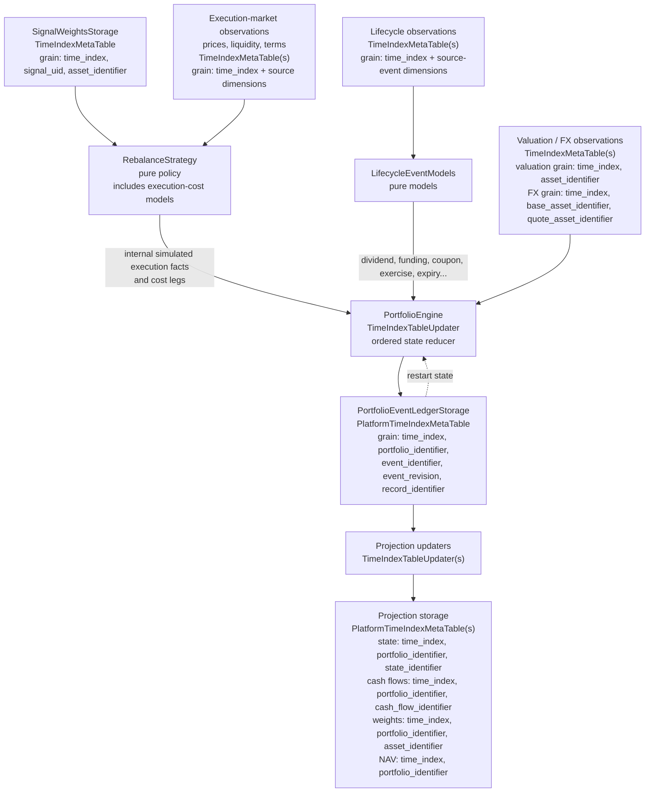

# 0042. Position Cash Flows In Portfolio Accounting

## Status

Accepted - foundational implementation in progress entirely within
`msm_portfolios`. There is no `mainsequence-sdk` blocker and this design requires
no new SDK transaction, checkpoint, or publication capability. Amended on
2026-09-12 following the event-ledger, rebalance-ownership, vectorization,
user-extension, backward-compatibility, and portfolio/account boundary reviews.

This decision extends [ADR 0040](0040-portfolio-temporal-ownership.md) and
preserves the pricing boundary in
[ADR 0033](0033-pricing-valuation-position-boundary.md). It preserves ownership
of signal, execution, valuation, analytics, and job timestamps, but amends the
position-aware execution graph: the configured rebalance strategy is the sole
producer of simulated portfolio executions, and accounting consumes those
internal execution facts.

The public lifecycle contracts, columnar event batches, reference reducer,
dividend model, explicit price/FX valuation, canonical ledger schema, strict
ledger-to-state restart, initial read projections, migration `0017`, and issue
#11's coordinated execution-simulation path are implemented. The erroneous
externally supplied execution-fact ingress released in `1.0.15` has been removed,
with no portfolio replay mode, compatibility alias, or fallback. The configured
signal and `RebalanceStrategy` now produce explicit simulated quantities,
settlement legs, costs, and restartable execution progress inside one engine run.

Optimized-reducer conformance, correction-tail publication, state/weight
projection updaters, and option/bond acceptance fixtures remain
`msm_portfolios` implementation work; none depends on an SDK change. This status
does not claim those later phases are complete.

## Context And Success Condition

The current `msm_portfolios` workflow persists target signal weights,
rebalance state, executed weights, and portfolio values. `PortfoliosDataNode`
calculates weighted asset returns and subtracts turnover commission. It does
not maintain quantities, settlement balances, outstanding obligations, or an
accounting event ledger.

Held positions can produce funding, borrow fees, margin interest, dividends,
coupons, carrying costs, and staking or lending income without a rebalance.
Cash receipts and payments alone are nevertheless insufficient: redemption,
option exercise, assignment, expiry, and corporate actions can also change or
extinguish instruments and create deliverables or future settlement obligations.

Success means one provider-neutral engine can express these transitions through
extension models, preserve NAV and cash-accounting invariants, and produce the
same committed state after a full run, incremental restart, or correction replay.
Small option and bond fixtures must prove extensibility before release; this ADR
does not require production pricing or execution support for every instrument.

The existing concepts retain their boundaries:

- `PortfolioTable` is stable portfolio identity and output linkage.
- A Portfolio is a backtest model. It has no Account, owns no custody state, and
  never ingests broker orders, trades, fills, or account holdings.
- `PortfolioWeightsStorage` is an executed-exposure projection, not a fill ledger.
- `PortfolioRebalanceStateStorage` owns execution intent and progress for the
  existing weight-only path; position-aware execution records the corresponding
  facts in the canonical ledger.
- `PositionSetTable` contains account allocation intent.
- `AccountHoldingsStorage` contains account custody observations.
- `msm_pricing.ValuationPosition` is a transient pricing basket.

None becomes the durable portfolio accounting ledger. Account orders, trades,
holdings, cash, custody reconciliation, external contributions and withdrawals,
tax-lot accounting, live order routing, and a full account margin engine are
outside `msm_portfolios`. The simulated state contract may distinguish collateral
and obligations without claiming that the Portfolio owns an Account.

## Decision

Add one position-aware `PortfolioEngine` `TimeIndexTableUpdater` in
`msm_portfolios`. It coordinates a pure `PortfolioAccounting` reducer with a
pure rebalance policy, execution-cost models, and independent lifecycle-event
models. Its only authoritative output is one long-format, versioned
`PortfolioEventLedgerStorage` `PlatformTimeIndexMetaTable`.

A **position cash flow** is a cash-leg projection of a portfolio event. It is
not the only transition an instrument extension may produce. An event may also
change or close a position, create or settle an obligation, reset contract
state, or deliver several Assets.



The diagram intentionally shows only ownership and data flow. Source tables keep
their source-specific full grain; every grain remains time-first. The engine
declares all source updaters or `TimeIndexTableRef`s as deterministic
dependencies. It performs no hidden network reads or persistence.

`PortfolioAccounting` is neither a `TimeIndexMetaTable` nor another updater. It
is the deterministic in-memory reducer called by `PortfolioEngine`.
`PortfolioEventLedgerStorage` is the canonical persisted `TimeIndexMetaTable`.
Positions, completed cash flows, executed weights, NAV, returns, and analytics
are rebuildable read projections and never independent accounting authorities.

This design requires no cross-table transaction or new `mainsequence-sdk`
capability. One updater publishes one authoritative table. Projection failures
can leave a read model stale, but cannot partially apply or duplicate an
economic event; rerunning the projection rebuilds it from the ledger.

### No Main Sequence SDK Blocker

The platform capability decision is closed: the existing
`TimeIndexTableUpdater` and `PlatformTimeIndexMetaTable` contracts are sufficient.
`PortfolioEngine` calculates and returns one complete canonical ledger output.
Stable event coordinates, revisions, record counts, and digests provide restart
replay and idempotency inside `msm_portfolios`; they do not require an SDK-owned
accounting transaction or checkpoint API.

The SDK-managed migration provider is only the established mechanism for
installing the additive ledger and projection tables. Migration `0017` is already
generated. Applying that migration is a normal deployment step, not missing SDK
functionality. Projection updaters publish rebuildable read models independently;
they are intentionally outside the authoritative commit and therefore require no
cross-table atomic write.

All remaining work named by this ADR belongs to `msm_portfolios`: reducer
optimization, broader source alignment and causal ordering, correction-tail
replay, projection updaters, compatibility fixtures, and additional instrument
acceptance fixtures. An implementation task must not be reported as blocked on
`mainsequence-sdk` unless a new concrete SDK defect is independently reproduced
and recorded; no such defect is known or required by this decision.

The weight-return engine remains the default without accounting configuration.
Position-aware accounting is an explicit mode with distinct configuration
identity. Missing inputs in that mode are errors, never an automatic downgrade
to weight-only returns. A portfolio must not mix both modes in one output history.

## Backward Compatibility: Mandatory Release Contract

Previously supported weight-only portfolios must continue to load, resolve to
the same identity, read their existing history, and resume calculation without
being rebuilt or converted to position accounting. This is a release requirement,
not a claim that the unimplemented extension has already passed compatibility
tests. It covers the supported pre-ADR-0042 contracts; it does not restore retired
APIs or the rejected `unique_identifier` asset-mapping fallback.

### Disabled Accounting Preserves Configuration And Identity

The new build field is optional:

```text
PortfolioBuildConfiguration.accounting_configuration
  PortfolioAccountingConfiguration | None = None
```

Both an omitted field and explicit `None` select the existing weight-only path.
An empty or invalid accounting object is a validation error, not a disabled-mode
alias. Existing saved configuration payloads and supported constructors remain
valid without new arguments.

When accounting is disabled, omit **only this new field** from serialized legacy
configuration and every canonical hash payload before SDK serialization/hashing.
Do not inject a new mode flag, model-version marker, dependency, wrapper type, or
default that changes the existing identity. Do not globally drop other `None`
values or change the treatment of existing defaults to achieve this.

The current hasher distinguishes a missing key from
`accounting_configuration: None`; adding the optional Pydantic field alone is
therefore insufficient. The implementation must preserve, for identical existing
inputs and dependency identities:

- canonical serialized portfolio configuration and configuration hash;
- portfolio and affected updater identity hashes, dependency graph, and namespace;
- the resolved `PortfolioTable.uid` and `PortfolioTable.unique_identifier`; and
- existing signal, weights, rebalance, and portfolio-value output references.

Both omitted and explicit-`None` construction must resolve the existing portfolio,
not create a duplicate or repoint it to another output history. Enabled accounting
configuration remains fully hash-bearing and must not be removed by these rules.

### Existing Runtime, Storage, And Reads Remain Valid

Without accounting configuration, preserve the existing strategies, execution
timing, valuation/alignment policies, commission calculation, price overrides,
zero-weight handling, output columns, index grains, and numerical results.
The new internal simulated-execution contract, initial NAV, quantity units,
lifecycle coverage, obligations, and canonical event ledger are requirements of
the opt-in path only. Do not eagerly construct or query accounting dependencies
for weight-only portfolios.

Existing stored weights, rebalance progress, portfolio values, and metadata must
remain readable and usable as incremental seeds. A restart must continue from
the existing portfolio-scoped progress, including partially completed execution;
it must not reset returns, regenerate identity, or require a new opening book.
Reads and analytics for weight-only portfolios retain their existing public
contracts and must not require the position-aware ledger or its projections.

Schema evolution is additive for existing portfolio contracts. Any new shared
linkage fields must allow legacy rows/writes to remain valid while enforcing the
stricter requirements only for position-aware records. Do not rename/drop old
columns, change their meanings or keys, fabricate quantities or ledger state for
old rows, rewrite historical values, or require users to backfill accounting data.
Ordinary SDK-managed schema upgrades may install new tables; they do not authorize
conversion of existing portfolios or data-destructive repair.

### Opt-In Creates A Separate Accounting History

Enabling accounting produces a distinct configuration identity and portfolio
output history. Never append position-aware results to a weight-only history or
silently retarget an existing portfolio's identifiers, pointers, or downstream
account allocations. Reject an attempt to force the new mode onto an existing
weight-only identity. Any future in-place conversion requires a separate explicit
migration contract and user authorization; it is not part of this ADR.

### Compatibility Acceptance Before Release

Capture golden fixtures from the supported release immediately preceding this
feature, including serialized configurations, exact identity hashes, resolved
portfolio/output identifiers, historical frames, and restart state. Expected
results must not be regenerated by the new implementation or obtained by dropping
the new key only inside a test helper.

The compatibility acceptance must exercise public construction, existing SDK
serialization and saved configuration reconstruction, portfolio resolution,
migrations, reads, and an incremental run. Compare the old configuration, new
configuration with the field omitted, and new configuration with explicit
`None`: identities and coordinates must match exactly; numerical results must
meet fixed pre-existing tolerances.
Test completed and partial rebalances, costs, custom valuation columns, price
overrides, zero-weight entry/exit, no-new-input reruns, and shared-table isolation.
Prove that enabled accounting gets a distinct identity, preserves the old
portfolio/history, and still rejects missing required accounting inputs.

## Configuration And Extension Contracts

When explicitly enabled, `PortfolioBuildConfiguration.accounting_configuration`
contains a serializable accounting configuration:

```text
PortfolioBuildConfiguration
  backtesting_weights_configuration
    signal_weights_instance
    rebalance_strategy_instance
  accounting_configuration
    valuation_asset_identifier
    initial_nav
    initial_state_time_index
    position_valuation_model_instance
    lifecycle_event_model_instances = ()
    historical_information_policy
    rounding_and_balance_policy
```

The existing `BacktestingWeightsConfig` owns the signal and rebalance strategy
for both weight-only and position-aware backtests. Accounting configuration must
not add an alternative execution source, a second strategy, or broker/account
identity. When accounting is enabled, `PortfolioEngine` invokes that configured
strategy in-process with the accounting state described below.

`valuation_asset_identifier` references the currency Asset used for NAV.
The initial state is `initial_nav` units of settled valuation-currency cash at
the explicit initial timestamp. NAV must be finite and strictly positive;
there is no implicit NAV of one, wall-clock start, or inferred initial holding.
Supporting a supplied opening book later requires a reconciled, explicit opening
state contract. Restart state is reconstructed from the ledger or an explicitly
verified ledger-derived snapshot; it is not a new initial contribution.

Model types, serialized configuration, economic ordering, quantity conventions,
source identities, valuation policies, and historical-information policy enter
portfolio and updater hashes. Runtime handles, credentials, descriptions, and
output MetaTable UIDs do not. Dependency identity remains hash-bearing.
Unordered model sets hash identically regardless of caller list order.

`lifecycle_event_model_instances` uses direct instance injection, matching the
existing rebalance-strategy pattern. It does not accept a string model name,
perform a global-registry lookup, or fall back to a built-in model. A custom
model must be a module-level, importable `LifecycleEventModel` subclass available
in the executing CodeRepository environment. Its canonical configuration
contains the concrete class import path, stable model identifier and version,
configuration schema version, serialized model fields, and declared dependency
identities. Changing any value that can change events or state must change that
canonical configuration or the model version.

The same canonical configuration must reconstruct the same model for restart,
backfill, and corrected replay. A missing class, unsupported model or state
schema version, ambiguous model identifier, unserializable field, or unresolved
dependency fails before calculation. The engine never substitutes another model
or silently drops the custom model. Lambdas, nested/local classes, live clients,
open connections, credentials, and other runtime handles are not valid model
configuration.

Every model declares named `TimeIndexTableUpdater` or `TimeIndexTableRef`
dependencies and typed input contracts. Keys are namespaced by stable model
identifier; collisions and overlapping ownership of the same economic event
are rejected rather than silently producing two payments.

A `TimeIndexMetaTable` referenced by this configuration contains timestamped
observations or resolved source events, not configuration. Model selection,
source selection, fee policy, trigger policy, ordering, and valuation conventions
remain serializable hash-bearing configuration. For example,
`DividendDeclarationTS` may contain ex-time, pay-time, amount per unit,
settlement Asset, source event identity, and source revision; the configured
dividend lifecycle model defines how those observations become portfolio events.

### Instrument Economics And Position Valuation

Reusable instrument models own contract terms, units, multipliers, deliverables,
and lifecycle rules. A deliverable is a collection of Assets and quantities,
not a single settlement-currency field. Generic portfolio accounting contains
no exchange, vendor, ticker, or instrument-family switches.

`PositionValuationModel` values signed instrument positions and outstanding
obligations under explicit observations and versioned terms. It reports value
separately from notional and risk exposure, and normalizes portfolio quantities
into `msm_pricing.ValuationLine.units` when using a pricing adapter. It does not
decide target quantities or execute trades. FX conversion is a shared explicit
valuation dependency, not a separate hidden lookup in each lifecycle model.

The valuation contract declares quote units, price currency, clean/dirty or
cum-/ex-entitlement treatment, and whether accruals or unsettled P&L are already
included. Each value component appears in either the instrument mark or a
separate balance, never both. Dividend-adjusted total-return prices cannot be
combined with separately credited dividends as if they were unadjusted marks.

### Simulated Execution Facts

Every portfolio execution is simulated by the configured `RebalanceStrategy`.
The strategy emits canonical execution facts as an internal typed boundary to
`PortfolioAccounting`; execution facts are not a user-configured
`TimeIndexTableUpdater`, connector feed, broker fill, or account observation.
Accounting never reconstructs them from `PortfolioWeights`, whose projection
omits executed quantities and notionals and collapses same-time transitions.

An internal execution record identifies the simulated execution, source
revisions used by the decision, instrument,
signed **quantity delta**, quantity unit, execution price and currency, contract
terms version, settlement instructions, and costs. An explicitly empty cost
result differs from missing required cost coverage. Preserve individual fill
identity or use a declared aggregation that preserves consideration and fees.
An executed notional without its unit, sign convention, and sizing semantics
does not substitute for an executed quantity.

There is one execution path. A configured strategy/sizing model produces
executions from signal targets, market observations, and the pre-execution
accounting state. The configured `RebalanceStrategy` aggregate owns:

- rebalance triggers and execution timing;
- target-to-simulated-quantity sizing;
- partial-fill and completion policy; and
- composable execution-cost models for commissions, exchange fees, slippage,
  and other fill-time costs.

Holding-period economics are not execution costs. Funding, borrow charges,
margin interest, dividends, coupons, collateral movements, exercise, assignment,
expiry, and settlement remain lifecycle events. A rebalance trigger policy may
choose to run after selected lifecycle events, for example to reinvest a paid
dividend, but the event exists and updates state whether or not it triggers a
rebalance.

Targets declare their measure: quantity, market-value weight, notional exposure,
or another explicitly supported measure such as delta exposure. These are not
interchangeable. Zero-market-value derivatives cannot be sized by dividing a
target NAV weight by their market value. Units, contract rounding, and residual
cash are explicit; no multiplier or inverse-contract behavior is inferred from
a ticker.

`PortfolioEngine` invokes the separate strategy and accounting components
sequentially. The strategy receives current NAV, positions,
obligations, and available balances after preceding lifecycle events; accounting
validates and applies its proposed execution events and cost legs. Related basket
legs use one declared sizing snapshot. Execution progress is represented in the
same canonical ledger as the resulting fills. This is an in-process state
transition, not a cyclic updater dependency or a second independently advancing
execution history.

`PortfolioRebalance` and `PortfolioRebalanceStateStorage` retain their existing
intent, timing, and completion semantics for the weight-only path. The
position-aware engine calls the same configured rebalance policy in-process; it
does not depend on a separately advancing `PortfolioRebalance` output. It records
the strategy's simulated execution facts in the ledger and derives
`PortfolioWeights` from them. Weights are a reporting projection, never the
source from which lost execution economics are reconstructed.

### Lifecycle Event Models

`LifecycleEventModel` is the public user-extension boundary. It is a serializable
abstract base model, not a `TimeIndexTableUpdater`, `TimeIndexMetaTable`, ledger
writer, or accounting reducer. Users add unusual cash flows or other instrument
lifecycle behavior by injecting a subclass in
`PortfolioAccountingConfiguration.lifecycle_event_model_instances`; they do not
modify or subclass `PortfolioEngine` or `PortfolioAccounting`.

The intended public override surface is:

```text
LifecycleEventModel
  model_identifier
  model_version
  configuration_schema_version
  declared_dependencies() -> mapping[str, TimeIndexTableUpdater | TimeIndexTableRef]
  required_input_contracts() -> mapping[str, LifecycleInputContract]
  dependency_window(dependency_name, start, end) -> SourceWindow
  alignment_contracts() -> mapping[str, LifecycleAlignmentContract]
  lifecycle_state_contract() -> LifecycleStateContract | None
  select_event_candidates(inputs: LifecycleInputBatch) -> EventCandidateBatch
  vectorization_keys(candidates: EventCandidateBatch) -> ModelVectorizationKeys
  build_event_batch(context: LifecycleBatchContext) -> EventBatch
```

`select_event_candidates` and `build_event_batch` are the required economic
hooks. The dependency, window, alignment, lifecycle-state, and model-specific
vectorization hooks may have strict empty/default implementations for models
that do not need them. These named methods are the complete supported override
surface for this decision. Internal helpers, configuration serialization,
engine orchestration, ledger publication, and reducer methods are not extension
points.

The contracts have the following responsibilities:

- `declared_dependencies` exposes every observation source as a deterministic,
  named dependency. `required_input_contracts` declares its truthful time-first
  grain, required columns, units, and source-revision fields.
- `dependency_window` may request the bounded source history needed to evaluate
  the calculation interval. It cannot manufacture an economic timestamp.
- `alignment_contracts` returns declarative exact-time, bounded as-of, interval,
  or event-to-position rules. The engine performs and validates the joins; a
  model cannot hide look-ahead, an unbounded Cartesian product, or an undeclared
  forward fill inside custom alignment code.
- `lifecycle_state_contract` declares a typed, schema-versioned state namespace
  owned by the model. A model may read the engine-provided portfolio snapshot
  and its own namespace, but cannot mutate another model's state directly.
- `select_event_candidates` produces a columnar batch containing effective time,
  source identity and revision, event type, phase/causal requirements, qualifying
  position or entitlement identity, and model-specific inputs. It must not emit
  ledger records or write storage.
- `vectorization_keys` returns only the additional model-specific keys that
  change its calculation kernel. The engine combines them with mandatory core
  signature fields such as model/version, event and record kind, units,
  currencies, phase, economics schema, and policy version. Assigning the same
  key to multiple candidates asserts that the model can process those rows in
  one vectorized invocation.
- `build_event_batch` receives exactly one engine-aligned compatible partition
  plus immutable state, terms, and valuation views. It returns flat typed event
  and record arrays, including segment offsets for variable-length multi-leg
  events. There is deliberately no public `calculate_one` or per-row callback.

A custom model may emit cash deltas, position deltas, obligation deltas,
lifecycle-state changes, event markers, or any valid combination. This supports
stateful and multi-leg behavior rather than assuming every extension is one cash
amount. The model supplies source-level economic facts and typed records; the
engine derives canonical event/revision/record identities and validates the
complete result.

`PositionCashFlowModel` is an optional convenience subclass for the narrower
case whose only economic postings are cash and, when needed, a corresponding
receivable or payable. It may provide a vectorized
`calculate_cash_deltas(context) -> CashDeltaBatch` hook that the base class wraps
into an `EventBatch`. A cash flow that closes or changes a position, carries
custom state, has multiple deliverables, or requires non-cash settlement must
implement the full `LifecycleEventModel` hooks instead. Execution fees do not
use either lifecycle specialization; they are emitted by the rebalance
strategy's execution-cost models.

All hooks are pure, deterministic batch transformations. They may use only
configuration, declared dependency batches, immutable accounting-state views,
versioned terms, and the supplied valuation context. They may not query hidden
data, use wall-clock time, mutate global or engine state, call persistence APIs,
or write directly to any cash-flow, position, projection, or ledger table.

The engine exclusively owns dependency loading, declared alignment execution,
cross-model collision checks, vector partitioning, causal sequencing, canonical
identity and revision derivation, completeness and unit validation, accounting
state application, NAV reconciliation, ledger publication, correction replay,
and projection rebuilding. A custom model cannot override these operations.
Invalid output fails the whole event group before ledger publication.

A transition may adjust positions, recognize or settle obligations, move cash,
reset a valuation basis, or close an instrument without any cash movement.
It receives the qualifying position or entitlement snapshot, not just the
holding at payment time. Contract-specific state is typed and schema-versioned,
not an opaque live object or an untraceable side cache.

No lifecycle model has a separate direct-to-cash-table write path,
compatibility alias, or fallback.

#### Custom Lifecycle Model Example

The following is a contract sketch, not a claim that these classes already
exist. A customer could model a capped usage royalty whose observations have
grain `(time_index, contract_identifier, source_revision)`, whose eligible
quantity comes from portfolio state, and whose payment settles in EUR while NAV
is reported in USD:

```python
class CappedUsageRoyalty(LifecycleEventModel):
    model_identifier = "customer.capped_usage_royalty"
    model_version = "1"
    configuration_schema_version = 1

    usage_source: TimeIndexTableUpdater | TimeIndexTableRef
    rate_per_unit: Decimal
    annual_cap: Decimal

    def declared_dependencies(self): ...
    def required_input_contracts(self): ...
    def alignment_contracts(self): ...
    def lifecycle_state_contract(self): ...
    def select_event_candidates(self, inputs): ...
    def vectorization_keys(self, candidates): ...
    def build_event_batch(self, context): ...


accounting = PortfolioAccountingConfiguration(
    valuation_asset_identifier="USD",
    initial_nav=1_000_000,
    initial_state_time_index=initial_time,
    lifecycle_event_model_instances=(
        CappedUsageRoyalty(
            usage_source=usage_source,
            rate_per_unit=Decimal("0.03"),
            annual_cap=Decimal("50000"),
        ),
    ),
)
```

The model would return vectorized EUR cash/obligation records and a namespaced
cap-consumption state transition. The shared valuation context supplies the
declared EUR/USD observation. Adding this model requires no branch, enum member,
or source change in `msm_portfolios`; the injected importable instance is the
dispatch mechanism. Core validation rejects it if its batches, units, source
coverage, state transition, or reconciliation are invalid.

## Accounting Event Contract

An `AccountingEvent` is one indivisible economic state transition with an
envelope and one or more typed records. A record may be an event marker,
position delta, cash delta, obligation delta, lifecycle-state change, execution
progress fact, cost, or valuation fact. An event with no economic posting still
has an event-marker or state-change record, for example for a fixing or reset.

| Envelope field | Contract |
| --- | --- |
| `portfolio_identifier` | FK to `PortfolioTable.unique_identifier` |
| `event_identifier` | Stable economic identity; not a timestamp or row ordinal |
| `event_revision` | Version of the calculated event for its exact input/state revision |
| `event_type` | Execution, entitlement, accrual, settlement, exercise, assignment, expiry, reset, valuation, or another declared semantic type |
| `time_index` | UTC economic effective time of this transition |
| `observed_at` | Time the source revision became available; never substituted for economic time |
| `source_identifier`, `source_revision` | Source event and immutable revision lineage |
| `model_identifier`, `model_version` | Producer identity and reproducible semantics |
| `causal_event_identifiers` | Predecessors, including recognition before settlement |
| `input_state_identifier`, `terms_version`, `valuation_references` | Exact state, terms, and observations consumed |

Each record has a stable `record_identifier` and `record_kind`. Economic legs
carry a `position_identifier`, `asset_identifier`, balance role, signed quantity
delta, and quantity unit. Execution consideration and settlement instructions
retain price/currency and the relevant obligation identifier. Lifecycle records
preserve eligible quantity, remaining deliverables, reset/accrual state, and
closure reason when applicable. A single summary record owns NAV before/after
and recognized P&L; these values are not repeated as independent P&L per leg.

The persisted ledger uses typed columns for common numeric and identity fields.
It must not put quantities, amounts, prices, currency, record kind, or ordering
inside generic JSON. A schema-versioned optional extension payload is allowed
only for cold-path instrument state that does not participate in generic
accounting or vectorized calculations.

`event_identifier` is derived from portfolio, producer identity, source event,
and affected position/contract identity. Distinct entitlement and settlement
events have distinct identities joined by an obligation and causal link.
Corrections retain economic identity with a new revision; deletion/cancellation
of an economic event must also be representable. Record identity distinguishes
multiple transfers of the same Asset or several settlement currencies.
The event revision is reproducible from model version, input revisions, and
input-state identity; retry order or database insertion order must not change it.

All records in one event are validated and applied together. No reader, subsequent model, or
strategy may observe a half-exercised option or the cash debit without the
corresponding acquisition. Transfers conserve value at consistent event marks
except explicitly reconciled P&L, costs, or rounding effects; the core does not
require all events, including income recognition, to leave NAV unchanged.

## Entitlement, Recognition, And Settlement

These are separate concepts even when they share a timestamp:

- **Eligibility:** the contract selects the quantity entitled or obligated to
  a future delivery, using an explicit historical snapshot or accrual interval.
- **Recognition:** value enters a separately tracked receivable/payable or is
  already included in the instrument mark under the valuation convention.
- **Settlement:** cash or securities move and the linked obligation is reduced
  or extinguished. Settlement is not income recognition a second time.

A receivable survives a sale of its originating position. Holding zero units
on payment day does not remove a dividend entitlement, unpaid coupon, or
exercise deliverable. A buyer after the entitlement cutoff must not inherit the
seller's entitlement. Accruing fees may require position history over an interval
rather than one endpoint quantity.

Contractual schedules are legitimate economic inputs: coupon, expiry, fixing,
and settlement dates may be expanded deterministically from versioned terms
and declared calendars. They are not generic portfolio resampling grids.
Scheduled obligations and completed settlements are distinct; actual-settlement
replay requires observations, while modeled settlement uses an explicit policy.
Exercise decisions and short-option assignment must likewise be observed or
produced by a declared simulation policy, never assumed from moneyness alone.

Different economic and payment dates produce linked events at their own actual
timestamps. Partial settlement reduces the remaining obligation and preserves
its identity. Multiple deliverable Assets or dates do not require a new engine.

## Economic Ordering And Historical Information

The timeline is built from signal and strategy observations, lifecycle
observations, contractual schedules, and eligible valuation observations. It never uses job
start time, wall-clock `now`, or an arbitrary generated frequency grid.

At a shared timestamp, the coordinator:

1. Reconstructs the last committed state and selects policy-valid observations.
2. Establishes explicit pre-event marks and qualifying entitlement snapshots.
3. Applies lifecycle events declared to precede execution.
4. Runs the configured rebalance strategy and applies its simulated execution
   legs and costs.
5. Applies lifecycle events declared to follow execution, including any causally
   subsequent settlement, and values the final state.

`pre_execution` and `post_execution` remain useful anchors, not a complete
economic ordering model. Recognition, reset, exercise, and settlement events
also declare causal dependencies and mark conventions. A dependency contradicting
its phase or timestamp, a cycle, or an ambiguous order is a blocking error.

Independent same-time events may use stable identifiers as tie-breakers only
when their outcomes commute. Events that depend on one another's balances or
NAV need an explicit order; events intended to be simultaneous use a shared
pre-event snapshot and atomic group. Alphabetical model names must not decide
financial outcomes. `event_sequence` records the resolved order without shifting
timestamps and is not the economic idempotency key.

The historical-information policy distinguishes an as-known-at-the-time
simulation from a corrected/restated history. Decisions in an as-known simulation
cannot see observations before `observed_at`, even if their economic effective
time is earlier. Corrected history may restate prior valuations and simulated
decisions only under its declared policy. The event ledger pins source,
valuation, and contract-term revisions for both policies.
The availability cutoff applies to reconstructed decision state as well as
market data: a late revision cannot enter an earlier sizing snapshot through
restated cash or positions. Preserve decision snapshots separately from any
later restated performance view.

Historical instrument resolution must be as-of/versioned. The current
`load_instruments_from_assets(...)` loader resolves current pricing details and
is not, by itself, a historical-terms contract. Fixings, FX, and contract terms
must remain reproducible across restarts; current detail rows are not a replay
seed. Missing required quantities, terms, valuations, FX, eligibility, or source
coverage fail explicitly instead of becoming zero payments or stale values.

## Vectorized Calculation Model

Portfolio evolution is path-dependent: the state after one event determines
available cash, eligible quantity, execution size, fees, and the next state.
The engine therefore must not claim full vectorization across time. It uses a
deterministic sequential scan over ordered economic timestamps and vectorizes
the independent work inside each timestamp.

Vectorization is the default implementation strategy at every calculation
stage. The engine must group all rows that share a compatible calculation
contract and invoke the relevant model once for the whole vector. A Python
row-by-row loop, `DataFrame.apply(axis=1)`, or one model call per Asset/event is
not an acceptable primary implementation when two or more rows can use the same
kernel. Sequential processing is reserved for genuine state or causal
dependencies, not for mismatched source-table shapes.

### Vectorization Across Different Grains

Source grains remain truthful and are never rewritten merely to look uniform.
For example, prices may have grain `(time_index, asset_identifier)`, FX may have
grain `(time_index, base_asset_identifier, quote_asset_identifier)`, dividend
observations may have grain `(time_index, source_event_identifier,
source_revision)`, and portfolio state has grain `(time_index,
portfolio_identifier, state_identifier)`.

`PortfolioEngine` resolves these different grains through each model's explicit
alignment contract, such as exact-time selection, bounded as-of selection,
interval eligibility, or event-to-position mapping. It then builds integer
index/mapping arrays into the original source vectors. It must not manufacture
an unbounded Cartesian product, forward-fill outside the declared policy, or
discard source identity to force a common DataFrame index.

After alignment, rows are partitioned by a stable **vectorization signature**.
The signature contains every property that changes the calculation kernel,
including model identifier/version, event or record kind, quantity and quote
units, settlement/valuation currency convention, instrument-economics schema,
phase, and applicable policy version. Source table and original grain do not
prevent rows from sharing a batch once their mapped inputs satisfy the same
signature.

Each compatible partition is processed as a vector. Variable-length events,
including option exercise with several deliverables, use flat record arrays plus
event/segment identifiers and offset arrays; they must not fall back to nested
Python objects merely because events have different record counts. Sparse inputs
remain long and use gather/scatter or sorted segmented reductions. Dense
`time x portfolio x asset` arrays are allowed only when their density justifies
the memory cost.

At the calculation boundary, validated DataFrames are normalized once into a
columnar `EventBatch`. The hot path uses contiguous arrays and integer codes for
portfolio, Asset, position, currency, phase, event type, and record kind.
Pydantic objects, row dictionaries, per-event DataFrame construction, and
string dispatch remain outside the inner loop. Persistent output converts the
codes back to canonical identifiers and typed ledger columns.

The implementation must apply this grouping-and-vector strategy to:

- source alignment and event/position eligibility selection;
- dividend amounts across eligible positions;
- funding, borrow, and interest amounts across homogeneous position batches;
- target sizing and execution-cost calculations across Assets using one shared
  pre-execution state snapshot;
- position, cash, and obligation deltas using sorted segmented reductions;
- valuation, FX conversion, executed-weight projection, and analytics; and
- independent portfolios across a portfolio batch or worker partition.

The implementation must remain sequential across timestamps and across
causally dependent same-time event groups. Independent same-time events that
commute may be applied as one vectorized batch. A pure readable reference
reducer and an optimized array/Numba reducer must consume the same `EventBatch`
contract and produce identical ledger records and final state for the acceptance
fixtures. The scalar reference reducer is an oracle for correctness and small
debug fixtures, not the normal production path. Optimization must not create a
second economic implementation.

## NAV, Cash Accounting, And Attribution

At every committed valuation point:

```text
NAV = settled cash + restricted cash/collateral value
    + signed instrument market value
    + recognized receivables - recognized payables
```

All components are disjoint and valued in `valuation_asset_identifier`, each
exactly once. A pledged security is not also counted as a second collateral asset.
Cash is its ending balance, not starting cash plus a subset of receipts.
Within each settlement currency:

```text
ending cash = beginning cash
            + settled trade consideration
            + settled lifecycle receipts/payments
            + settled costs and internal balance transfers
```

All terms in the cash equation are signed. Recognition of an unpaid obligation
does not change settled cash. Moving cash to collateral changes availability,
not NAV. Futures variation settlement moves already marked P&L into cash and
resets the corresponding unsettled value; it must not count both amounts.

Without external contributions or withdrawals, interval return is
`ending_nav / beginning_nav - 1` for a strictly positive beginning NAV. Income,
expenses, mark changes, FX, and execution slippage/rounding are a reconciled
decomposition of that NAV change. Atomic transfers at unchanged marks do not
create return. A zero/negative NAV is retained as an explicit insolvency state;
undefined return is not divided through or replaced with zero, and new simulated
sizing must stop unless a separately specified policy supports that state.

Cash-flow amount divided by NAV is **not** a generic return-contribution formula.
Premium payment, principal redemption, and settlement of an accrued receivable
are cash movements, not necessarily new income. Recognized event P&L and its
return contribution are stored once at event level and reconciled with valuation
changes; cash rows link to that attribution rather than repeating it per leg.

`PortfoliosStorage.close` retains its existing normalized-value convention,
derived from `NAV / initial_nav` in this mode. Absolute NAV is retained in the
accounting state/event output. `PortfoliosStorage.return` is the linked total
modeled result, not a sum of cash-flow ratios. Publish one final value per
portfolio/economic timestamp while preserving intratimestamp events in the
ledger. Analytical bucketing remains in `PortfolioAnalytics`.

Position-aware mode rejects a price override that would replace accounting NAV
or return with another Asset's series. A benchmark may be reported separately.
`calculated_close` and `close` both reflect the accounting-derived value here.

## Durable Storage And Publication

The following logical contracts belong to `msm_portfolios`. Physical schemas,
indexes, foreign keys, and typed columns use the existing SDK-managed migration
workflow before runtime attachment; no SDK change is required.

### Canonical Event Ledger

`PortfolioEventLedgerStorage` (`PortfolioEventLedgerTS`) is the only authoritative
position-aware output. It is a `PlatformTimeIndexMetaTable` with grain:

```text
(time_index, portfolio_identifier, event_identifier,
 event_revision, record_identifier)
```

One row means one typed record within one exact revision of one economic event.
The event envelope is repeated on its records so a single table contains the
complete replay contract without a header/posting join. `record_kind` identifies
event markers, position deltas, cash deltas, obligation deltas, lifecycle-state
changes, execution progress, costs, and valuation summaries. Common fields use
typed nullable columns selected by `record_kind`; applicable-field validation is
strict.

The table requires:

- `portfolio_identifier` as an FK to `PortfolioTable.unique_identifier`;
- `asset_identifier` and settlement/valuation Asset identifiers as nullable FKs
  to `AssetTable.unique_identifier` when applicable;
- stable source, model, terms, causal-event, and valuation lineage;
- signed quantities and amounts with explicit units and currencies;
- `event_sequence`, `event_record_count`, and a deterministic `event_digest`;
  and
- a database uniqueness constraint on `(portfolio_identifier,
  event_identifier, event_revision, record_identifier)` independent of
  `time_index`, preventing a corrected timestamp from duplicating one revision.

Every calculated event is validated as a complete group before the updater
returns it. Readers accept a group only when its record count and digest match.
Corrections append a new revision linked through `supersedes_event_revision`;
cancellation is an explicit terminal revision. Resolving active history follows
one unbranched, acyclic supersession chain per economic event. Competing terminal
revisions are an error, not a last-write-wins decision.

Deterministic coordinates make a retry idempotent. A rerun either observes that
the exact revision already exists or publishes the same records; it cannot apply
the cash or position delta twice. No separate accounting checkpoint, event-header
table, posting table, revision-selection table, or multi-table publisher is part
of the authoritative path.

### Rebuildable Projection Storage

Projection updaters consume only the canonical ledger plus their declared
valuation dependencies. They may publish these `PlatformTimeIndexMetaTable`
read models:

```text
PortfolioStateStorage
  grain: (time_index, portfolio_identifier, state_identifier)

PortfolioCashFlowsStorage
  grain: (time_index, portfolio_identifier, cash_flow_identifier)

PortfolioWeightsStorage
  grain: (time_index, portfolio_identifier, asset_identifier)

PortfoliosStorage
  grain: (time_index, portfolio_identifier)
```

`state_identifier` distinguishes instrument positions, settled or restricted
cash balances, receivables, payables, collateral, and other obligations. Each
state row retains its Asset, balance role, quantity, direction, unit, valuation,
originating event, and typed lifecycle state. An Asset identifier alone is not
a sufficient state key. Explicit zero/closed rows preserve termination.

Cash-flow rows contain only completed cash movements. Future payments remain
obligations in state and event records. Cash-flow type distinguishes trade
consideration, premium, principal, income, expense, collateral transfer, and
obligation settlement. Non-cash delivery remains an event/state transition and
is never disguised as cash.

Every projection row carries the deterministic `ledger_state_identifier` of the
active event revision set it represents. A consumer combining projection tables
must require matching identifiers; missing or mismatched projections are stale
or incomplete read models, not alternative portfolio truth. The ledger itself
also contains valuation-summary records, so canonical NAV and state remain
recoverable without trusting projection progress.

Projection updates do not require a transaction spanning outputs. Each is a
normal deterministic updater over the ledger. A failed projection can be rerun
or rebuilt using a portfolio-scoped tail replacement without crediting an event
again. Projection storage is a performance and compatibility surface, never the
restart authority for position-aware accounting.

## Incremental Updates And Corrections

An incremental run reconstructs one portfolio from the active ledger history or
from an optional snapshot whose `ledger_state_identifier` has been verified
against that history. The reconstructed state includes:

- positions, all cash buckets, and outstanding obligations;
- reset/accrual/entitlement state and pending contractual events;
- execution intent/progress for the single portfolio simulation path;
- canonical NAV and the active event/input revisions; and
- policy-required historical valuations, fixings, FX, and terms.

Inclusive source windows reconstruct same-time ordering. Stable event identity,
revision lineage, record identity, and the event digest distinguish already
published events from new revisions; timestamps or output-key suppression alone
do not do so.

A correction to an execution, lifecycle observation, valuation, fixing, FX rate,
or term can affect the entire downstream state. Determine the earliest affected
economic event under the historical-information policy, seed strictly before
that point, and replay the portfolio tail. Replay starts at entitlement or
recognition when that is what changed, not merely the eventual payment date.
Restated state-dependent simulation also recomputes affected execution decisions.

Compute and validate corrected event revisions and the replacement projected
tail before writing. Retain old ledger revisions and append the superseding
revision; never patch an old event in place. Projection updaters may replace only
the affected portfolio tail and must stamp the new `ledger_state_identifier`.
A failed projection replay leaves the canonical ledger intact and is reported as
an unavailable or stale read model. It must never delete another portfolio's
rows or cause an event to be applied twice.

## Reference Economic Cases

These are deterministic contract fixtures, not trading recommendations or claims
that an instrument implementation exists. Prices are held constant during each
transfer, and costs are zero unless stated.

| Case | Required transition and invariant |
| --- | --- |
| Purchase and sale | From $1,000 cash, buy $100 stock: $900 cash + $100 stock = $1,000 NAV. Selling at the same price restores $1,000 cash. Delayed settlement uses matching payables/receivables. |
| Dividend after sale | Recognize an eligible $100 receivable; sell the originating shares after entitlement; later exchange the receivable for $100 cash. Payment does not create another $100 profit. A buyer after cutoff receives no entitlement. |
| Bond coupon and redemption | Settle recognized coupon value once under the declared clean/dirty convention; exchange redeemed principal value for cash and close the redeemed quantity. Redemption proceeds are not all investment return. |
| Physical call exercise | At expiry, one call worth $1,000 with strike $100 and a declared 100-share deliverable at $110 becomes 100 shares worth $11,000 and a $10,000 payment: `-1,000 + 11,000 - 10,000 = 0` NAV change. Delayed delivery first creates the corresponding obligations. |
| Cash-settled option | Exchange the $1,000 marked option claim for a $1,000 receivable, then cash, and close the option. The payoff must not be added while retaining the option value. |
| Worthless expiry and assignment | Expiry closes zero-valued contracts with no cash leg. Assignment applies the short holder's obligation, including any resulting underlying position, from an explicit observation or simulation decision. |
| Futures variation settlement | $1,000 cash plus $50 unsettled marked P&L becomes $1,050 cash plus zero unsettled P&L. NAV remains $1,050 through settlement; the position's reset basis advances. |
| Funding and collateral | Funding can recognize positive or negative P&L using the eligible quantity. Moving settled cash to restricted collateral changes spendable cash, not total NAV. |

The multiplier in the option fixture is contract data, never a hard-coded core
constant. A second fixture must use a different multiplier or several deliverable
Assets to prove that distinction. Long/short, partial exercise/settlement, and
multiple settlement currencies use the same event primitives.

## Ownership Boundaries

- **`msm_portfolios`:** accounting event/model interfaces, state machine,
  `PortfolioEngine`, the canonical ledger, rebalance/execution coordination,
  simulated execution-cost models, projections, deterministic backtest restart,
  and read services. It owns no Account, broker execution, or custody state.
- **Reusable instrument-domain models:** units, contract economics, deliverables,
  entitlement and lifecycle rules. Built-in or contributed implementations use
  the same interface; standard option or bond economics are not duplicated per
  exchange connector. This ADR does not create another instrument identity registry.
- **`msm_pricing`:** valuation of instrument terms under explicit market data;
  transient valuation baskets remain transient. Pricing adapters consume the
  same versioned economics used by lifecycle models, not a conflicting payoff
  definition.
- **Connectors:** historical market observations used by a backtest, including
  terms, rates, calendars, exercises, assignments, settlements, liquidity, and
  source revisions. Connector credentials and actual broker/account ingestion
  remain outside `PortfolioEngine`.
- **Core `msm`:** Asset and Portfolio identity. Account-domain orders, trades,
  holdings, custody, and actual cash remain separate and are never Portfolio
  accounting inputs.

Asset dimensions use `asset_identifier` with an FK to
`AssetTable.unique_identifier`; there is no `unique_identifier` mapping fallback.
Portfolio dimensions use `portfolio_identifier` with an FK to
`PortfolioTable.unique_identifier`. No Universe resource or vendor endpoint is
introduced by this decision.

## `msm_portfolios` Implementation Plan And Acceptance Criteria

1. Specify the typed event-record, obligation, valuation, execution, lifecycle,
   custom-model override, canonical model-serialization, and columnar
   `EventBatch` contracts.
   Add the reference economic fixtures and invariant tests before public APIs.
   Freeze pre-feature compatibility fixtures and require the compatibility
   acceptance above before changing configuration serialization, hashing, or
   shared storage.
2. Define and migrate `PortfolioEventLedgerStorage` and additive projection
   schemas using the SDK-managed migration provider. Add the independent
   economic-identity uniqueness constraint and strict record-kind validation.
   Runtime startup attaches only already-migrated tables.
3. Implement the pure accounting state machine and readable reference reducer,
   plus small lifecycle fixtures including physical/cash option settlement,
   expiry, and a test-only stateful custom model defined outside portfolio core.
4. Implement the optimized columnar reducer and require exact conformance with
   the reference reducer before performance claims. Include explicit grain
   alignment, vectorization-signature partitioning, and segmented ragged-event
   kernels in this step.
5. **Implemented by issue #11.** The erroneous public external-execution ingress
   is removed. One coordinated simulation path uses the configured signal and
   `RebalanceStrategy`; the strategy receives post-lifecycle, pre-execution state
   and NAV and emits internal typed execution facts. Position-aware commissions
   and other fill-time costs are composable strategy-owned execution-cost models.
   There is no replay alias, and the legacy weight-only fee path is unchanged.
6. Add ledger-derived position, cash-flow, weights, NAV/return, and analytics
   projections, `ledger_state_identifier` validation, correction replay, and
   portfolio-scoped rebuild behavior.
7. Update implemented concept docs, examples, tutorials, and relevant skills;
   release a tagged version only after both the lifecycle and backward-compatibility
   criteria pass, and before connectors consume these new contracts.

Every item in this plan is library implementation or validation work owned by
`msm_portfolios`. The plan contains no `mainsequence-sdk` deliverable.

Completion requires tests proving:

- every reference economic case reconciles positions, cash, obligations, and NAV;
- income, principal, premium, fees, collateral, and settlement are attributed
  without double counting marks or repeating event P&L on each posting;
- entitlement survives a zero-close, and post-cutoff entry does not gain it;
- pre/post execution, reset/settlement, and causal ordering are deterministic,
  with equivalent independent-model permutations producing identical economics;
- declared schedules create legitimate events without a job-time or resampling grid;
- internal simulated execution facts are deterministic, complete, and derived
  from current accounting state, including the effects of prior funding and
  obligations;
- quantity/notional/risk units, quote conventions, rounding residuals, zero/negative
  NAV, long/short positions, partial events, and multi-Asset delivery are explicit;
- no missing required input silently produces zero cash flow or a weight fallback;
- source/terms/valuation revisions and information cutoffs prevent look-ahead;
- duplicate deliveries, corrected timestamps, cancellation, concurrency, and
  repeated/uncertain retries cannot publish duplicate or incomplete economic events;
- incremental and corrected replay match the equivalent full replay in every
  projection, with failed replay and cross-portfolio isolation verified;
- the readable and optimized reducers emit identical ledger records and final
  state, including same-time ordering and multi-leg events;
- homogeneous cash-flow, cost, valuation, and multi-portfolio batches use the
  columnar path without changing financial results;
- deliberately different price, FX, lifecycle-event, and portfolio-state grains
  are aligned by declared policy and grouped into compatible vector batches
  without a Cartesian expansion or per-row model dispatch;
- instrumentation proves one kernel invocation per vectorization signature and
  causal group rather than one invocation per Asset or event whenever batching
  is possible;
- a module-level custom `LifecycleEventModel` defined outside `msm_portfolios`
  is directly injectable, canonically serialized, hash-stable, reconstructable
  for replay, and executable without a core registration or instrument-family
  branch;
- changing a custom model's economic configuration, dependency identity, or
  model version changes portfolio identity, while a missing class or unsupported
  schema fails without a built-in fallback;
- a custom stateful, multi-currency, differently grained lifecycle fixture uses
  declared alignment, namespaced state, vector batching, and shared FX, and its
  emitted events pass the same unit, completeness, idempotency, and NAV checks
  as built-in models;
- only the documented lifecycle hooks are invoked as customization points;
  custom code cannot replace canonical identity, validation, state application,
  persistence, replay, or projection behavior;
- a new reference lifecycle model requires no instrument-family branch in core;
- the backward-compatibility golden fixtures pass for omitted and explicit-`None`
  accounting configuration, preserving exact hashes, resolved identities, output
  references, stored history, public reads, and incremental/partial-execution state;
- additive migrations and weight-only runtime paths do not require accounting
  data, a ledger, new inputs, or history reconstruction;
- enabled accounting has distinct identity/history, cannot overwrite or repoint
  an existing weight-only portfolio, and cannot fall back to weight-only output.

## Rejected Alternatives

- **A cash-only extension interface:** cannot close expired instruments, deliver
  securities, or settle recognized claims without instrument-specific engine code.
- **Subclassing `PortfolioEngine` or `PortfolioAccounting`:** lets custom code
  bypass ordering, identity, validation, replay, and reconciliation invariants;
  customization belongs in injected lifecycle models with typed batch outputs.
- **String lookup, implicit global registration, or arbitrary callbacks:** is not
  reliably serializable or replayable and can silently change behavior between
  processes; direct importable model instances and canonical configuration are
  explicit and hash-bearing.
- **Cash amount divided by NAV as generic return:** confuses transfers with P&L
  and counts accrued income or derivative settlement twice.
- **Accounting reconstructed from executed weights:** loses fill economics and
  conflates market value, notional, and risk exposure.
- **Externally supplied broker executions in `PortfolioEngine`:** confuses a
  backtest Portfolio with Account-owned orders, trades, holdings, and custody.
  Portfolio executions are always simulated by its configured rebalance strategy.
- **All lifecycle behavior inside rebalance strategies:** held positions have
  economic events independent of a strategy's execution decisions.
- **Holding-period costs modeled as execution fees:** funding, borrow, interest,
  and coupons can occur without a fill and must remain lifecycle events.
- **Current holdings/current terms as the replay seed:** loses historical
  entitlement, unsettled obligations, and reset/contract revisions.
- **Several authoritative journal, posting, state, cash, value, and checkpoint
  tables:** creates a cross-table commit problem that is unnecessary when one
  complete ledger is authoritative and every other table is rebuildable.
- **A fully vectorized calculation across time:** ignores path dependence between
  balances, lifecycle events, execution sizing, costs, and subsequent state.
- **Cash columns on PortfolioTable or reuse of custody tables:** overloads stable
  identity or actual account observations with modeled accounting state.
- **Provider switches or duplicated standard economics in connectors:** couples
  accounting to vendors and makes adding instruments require core changes.

## Consequences And Implementation Status

The lifecycle-event boundary supports cash-flow positions and future instruments
without requiring a full accounting ERP, a new custody system, or a production
options suite in the first release. Cash history remains useful but is derived
from a richer auditable ledger.

The costs are explicit obligations and event provenance, one additional
authoritative ledger, derived projection storage, coordinated execution
simulation, explicit grain-alignment maps, vectorization-signature partitioning,
the long-term compatibility burden of a public lifecycle-model override
contract, and a reference-plus-optimized reducer test surface. In return,
customer-defined economics can be injected without changing portfolio core, and
all homogeneous work is batchable even when its source tables have different
grains. Existing weight-only portfolios remain lightweight. The architecture
uses the existing one-updater/one-output-table contract. It introduces no
`mainsequence-sdk` transaction requirement and has no outstanding SDK dependency.

The implementation now provides the public lifecycle-model override surface,
flat `EventBatch`, deterministic reference reducer, coordinated signal-to-strategy
execution simulation, composable fill-time costs, explicit instrument sizing and
settlement terms, dividend entitlement and settlement, strict price/FX valuation,
canonical ledger, restartable execution progress, initial cash-flow and
portfolio-value projections, additive storage schemas, migration `0017`, and
offline examples. The external execution source has been removed and is not
retained as a second Portfolio mode. The dividend fixture proves that an
entitlement survives a subsequent sale and payment does not recognize income
twice. The linear-perpetual fixture proves that variation-margin execution does
not deduct full notional and that same-time funding changes NAV before sizing.
The custom-model fixture proves direct module-level injection and vector
calculation without a core model registry.

This remains an implementation-in-progress ADR rather than a release-complete
claim. The optimized reducer, full correction/supersession tail publication,
state/weight projection updaters, option and bond fixtures, and the complete
frozen-version compatibility matrix remain the `msm_portfolios` acceptance work
listed above. Issue #11's external-ingress removal and coordinated simulation are
complete. None of the remaining work is blocked on or assigned to
`mainsequence-sdk`.

## References

- [ADR 0040: Portfolio Temporal Ownership](0040-portfolio-temporal-ownership.md)
  establishes the existing execution and valuation boundaries amended here.
- [ADR 0033: Pricing Valuation Position Boundary](0033-pricing-valuation-position-boundary.md)
  separates transient pricing inputs from durable portfolio state.
- [FINOS CDM event model](https://cdm.finos.org/docs/event-model/) provides a
  precedent for composing lifecycle transitions and cash/security transfers;
  this ADR does not adopt the entire CDM schema or its trade-level scope.
- [QuantConnect LEAN Algorithm Framework](https://www.quantconnect.com/docs/v2/writing-algorithms/algorithm-framework/overview)
  separates signal, portfolio construction, and execution, while its engine
  applies dividends to portfolio state independently of execution.
- [Zipline ledger](https://github.com/quantopian/zipline/blob/master/zipline/finance/ledger.py)
  processes transactions, commissions, splits, dividend entitlement, and
  dividend payment through a common portfolio ledger.
- [VectorBT portfolio simulation](https://vectorbt.dev/api/portfolio/base/)
  demonstrates the relevant performance pattern: broadcast columnar inputs,
  compiled sequential state evolution, and event records.
- [OCC: Equity vs. Index Options](https://prd-web.optionseducation.org/advancedconcepts/equity-vs-index-options)
  explains physical versus cash settlement.
- [SEC: Ex-Dividend Dates](https://www.investor.gov/introduction-investing/investing-basics/glossary/ex-dividend-dates-when-are-you-entitled-stock-and)
  distinguishes dividend entitlement from payment timing.
- [CME: Money Calculations for Futures and Options](https://www.cmegroup.com/education/articles-and-reports/money-calculations-for-futures-and-options)
  describes futures cash mark-to-market.
