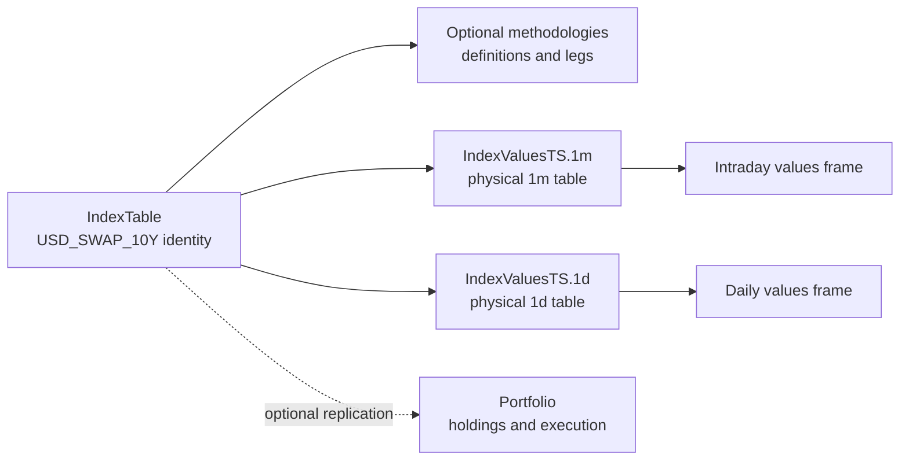
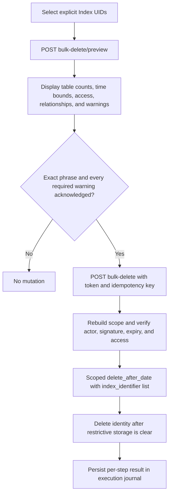

# Indexes

The Index API exposes identity management, methodology exploration,
cadence-specific canonical history, declared related MetaTables, and a
preview-first deletion workflow. Business behavior lives under
`msm.services.indices`; `apps/v1` is a typed HTTP adapter.

An Index is a reusable observable. It is not automatically an Asset, pricing
instrument, or Portfolio. `USD_SWAP_10Y`, for example, is one Index identity
whose one-minute and daily observations live in two different canonical
datasets.



## Routes

| Method | Path | Operation ID | Result |
| --- | --- | --- | --- |
| `GET` | `/api/v1/index-type/` | `listIndexTypes` | Paginated type registry |
| `GET` | `/api/v1/index-type/{index_type}/` | `getIndexType` | One type |
| `GET` | `/api/v1/index/` | `listIndexes` | Counted Index page |
| `POST` | `/api/v1/index/` | `createIndex` | New plain or externally calculated identity |
| `GET` | `/api/v1/index/{uid}/` | `getIndex` | One Index |
| `PATCH` | `/api/v1/index/{uid}/` | `updateIndex` | Updated mutable identity fields |
| `GET` | `/api/v1/index/{uid}/summary/` | `getIndexSummary` | `FrontEndDetailSummary` |
| `GET` | `/api/v1/index/{uid}/methodologies/` | `listIndexMethodologies` | Definition history |
| `GET` | `/api/v1/index/{uid}/methodologies/{definition_uid}/` | `getIndexMethodology` | Exact definition and ordered legs |
| `GET` | `/api/v1/index/{uid}/datasets/` | `listIndexDatasets` | Canonical cadence descriptors |
| `GET` | `/api/v1/index/{uid}/datasets/{meta_table_uid}/` | `getIndexDatasetSummary` | Bounded aggregate summary |
| `GET` | `/api/v1/index/{uid}/datasets/{meta_table_uid}/values/` | `getIndexDatasetValuesFrame` | `core.tabular_frame@v1` |
| `GET` | `/api/v1/index/{uid}/related-meta-tables/` | `listIndexRelatedMetaTables` | Core and extension declarations |
| `GET` | `/api/v1/index/{uid}/delete-impact/` | `getIndexDeleteImpact` | Compatibility impact only |
| `POST` | `/api/v1/index/bulk-delete/preview/` | `previewBulkDeleteIndexes` | Read-only reviewed plan |
| `POST` | `/api/v1/index/bulk-delete/` | `bulkDeleteIndexes` | Reviewed saga execution |
| `DELETE` | `/api/v1/index/{uid}/` | `deleteIndex` | Deprecated reviewed single-item execution |

Every operation is included in the Adapter from API connection contract.
`previewBulkDeleteIndexes` is classified as a query even though it uses POST;
create, update, and deletion execution are mutations.

## Listing And Selection

`GET /api/v1/index/` supports `search`, `index_type`, `provider`,
`has_definition`, `has_canonical_values`, `cadence`, `limit`, and `offset`.
The response count is authoritative for the complete filter, and ordering is
stable.

Creating an Index does not create methodology or storage. Use
`DerivedIndex.upsert(...)` when core owns a reproducible methodology. Register
cadence storage through the migration workflow before a producer writes
values.

## What `listIndexDatasets` Returns

`GET /api/v1/index/{uid}/datasets/` is not a value query. It returns a typed
catalog of tables that can be selected for summary, browsing, or reviewed
cleanup. A descriptor includes:

```text
meta_table_uid
identifier and namespace
cadence and physical_table_name
time_index_name and index_names
columns
verified foreign_keys
storage_kind and discovery_source
view/edit access state
producer identifiers
scoped-delete capability
```

A table qualifies as canonical only when the registered cadence contract maps
to the authoritative `configured_index_values_storage(cadence=...)` model and
that SQLAlchemy/Alembic model contains the real foreign key:

```text
index_identifier -> IndexTable.unique_identifier
```

The resolver also verifies identifier, cadence, physical table, grain, and the
required `value` and `unit` columns. A matching column name or physical-name
prefix is never enough.

The 1m and 1d descriptors for `USD_SWAP_10Y` therefore identify different
MetaTable UIDs and physical tables even though both are filtered with the same
Index business identifier.

## Bounded Values

The values route requires timezone-aware `start` and `end`, an `asc` or `desc`
order, and a limit from 1 through 5,000. It resolves the selected Index UID and
always adds this backend filter:

```text
index_identifier = selected Index.unique_identifier
```

The implementation uses a governed compiled SELECT with time bounds and a
server-side `LIMIT`. The SDK `APIDataNode.get_df_between_dates(...)` API does
not expose a row-limit argument in SDK 4.4.32, so it is not used here to read a
full history and truncate in application memory. The response is the SDK
`TabularFrameResponse` and can feed generic Command Center tables and charts.

## Extension-Owned Relationships

Extensions register `IndexRelationshipProvider` objects. Providers must supply
an authoritative SQLAlchemy model with a real FK to `IndexTable.uid` or
`IndexTable.unique_identifier`; they do not have to inherit any core Index
DataNode. Exploration and deletion are separate opt-ins. Inferred candidates
remain informational and can never become delete targets automatically.

## Safe Deletion

Direct unreviewed deletion is disabled. The supported flow is:



Preview modes are `values_only`, `identity_only`, and
`identity_and_values`. Preview is non-mutating and returns:

- every selected Index and canonical cadence table;
- resolved-leg provenance when identity-and-values cleanup must clear dynamic
  component and coefficient audit rows;
- authoritative affected counts and time bounds, or an explicit unavailable
  state;
- declared and inferred relationships;
- an executable/blocking decision;
- stable warning codes and required acknowledgements;
- an exact confirmation phrase;
- a short-lived, signed, actor- and scope-bound token.

Execution rechecks the current scope and platform edit authority. Value
deletion calls `TimeIndexMetaTable.delete_after_date(None,
dimension_filters={"index_identifier": [...]})`; it never truncates a table or
uses a raw/compiled SQL delete against DataNode storage.

Deletion across MetaTables is a saga, not one transaction. The
`IndexDeletionExecutionTable` stores idempotency, state, and completed steps so
retries do not expand scope. It stores no token, signing secret, or observation
values.

Deployment requires the SDK-generated migration for that journal and a managed
Secret injected as `MSM_INDEX_DELETE_CONFIRMATION_SECRET` with at least 32
characters. Do not release the destructive routes until both are present and
the migrated journal binding is verified.

Deleting values does not reset DataNode hashes, checkpoints, update
statistics, jobs, schedules, or producer configuration. Values can be
republished. Pause producers before destructive cleanup and use the producer's
repair/backfill workflow afterward.

The deprecated single-item `DELETE` route requires the same reviewed payload.
Calling it without request-bound identity or preview confirmation returns 401
or 428; it has no unsafe fallback.

## Related Concepts

- [Index values and derived Indexes tutorial](../../tutorial/06-derived-indexes.md)
- [Derived Index workflow](../../knowledge/msm/indices/derived_indexes.md)
- [ADR 0038](../../ADR/0038-index-user-api-fastapi-exploration-and-safe-deletion.md)
