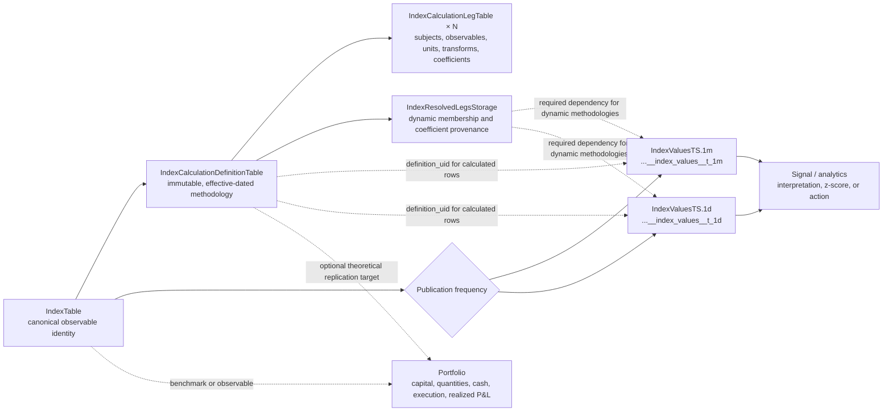

# Derived Index Workflow

Core `msm` owns generic calculated indexes. The canonical value table also
accepts plain Index observations that have no core calculation definition. A
provider, connector, or pricing package may publish source facts, but
applications do not need `msm_pricing` to define, calculate, inspect, or
publish a derived Index.

## Domain Model



The solid path is the derived-index domain. `IndexTable` owns identity;
definitions own versioned meaning; legs own calculation algebra; resolved-leg
rows audit dynamic methodology state; and value rows are the reusable published
observable. Signals interpret those values. A Portfolio may consume or attempt
to replicate the Index, but it does not own the Index definition.

`IndexTable.unique_identifier` represents one stable historical meaning. A
definition version records the operator, classification, output unit,
alignment, missing-data behavior, composition, rebalance policy, effective
interval, and deterministic hash. Legs record exactly one fixed Asset, fixed
component Index, or selector plus the observable, input unit, transform, and
coefficient method.

The definition digest includes the immutable effective start and all ordered
calculation semantics. It excludes the mutable `effective_to` lifecycle closure,
so activating a successor or retiring a definition does not invalidate the
digest already recorded with published history.

Do not put the definition in `Index.metadata_json`. Do not model formula
coefficients as portfolio weights.

## Index Versus Portfolio

Use an **Index** when the result is a reusable theoretical market observable
that every consumer obtains from the same methodology and market inputs. Use a
**Portfolio** when the result depends on a specific capital base, account,
owned quantities, cash, orders, fills, execution constraints, or realized P&L.

| Question | Index | Portfolio |
| --- | --- | --- |
| Is the output a published level, spread, ratio, return series, or benchmark? | Yes | May consume it |
| Are `+1/-1`, beta, delta, DV01, or conversion factors calculation algebra? | Store them as leg coefficients | Do not treat them as holdings |
| Does the workflow require actual notionals, positions, cash, orders, or fills? | No | Yes |
| Are financing and costs deterministic methodology assumptions? | A theoretical `self_financing` Index may model them | Actual financing and realized costs belong here |
| Does performance depend on what a specific account actually executed? | No | Yes |

Use both when a Portfolio tracks or replicates an Index: publish the theoretical
benchmark through the cadence-specific Index-value table, then let the
Portfolio reference it and store actual holdings and execution state
separately. Never use
`PortfolioWeightsStorage` as an Index definition or resolved-leg audit table.

## Public API

Normal imports come from the Index API surface:

```python
from msm.api.indices import (
    DerivedIndex,
    IncompleteObservationsError,
    IndexCalculationDefinition,
    IndexCalculationError,
    IndexCalculationLeg,
    LookAheadError,
    calculate_index,
)
```

`DerivedIndex.upsert(...)` registers the built-in `derived` type, upserts the
canonical Index identity, validates the dependency DAG, writes the next
monotonic definition version and ordered legs, and compensates earlier writes
if a later persistence step fails. Repeating the same semantic hash is
idempotent.

Definitions begin as `draft`. Activation rejects overlapping effective
intervals and closes a prior open active version when the new version begins
later. Activated calculation semantics are immutable; a material change is a
new version. Retirement always closes the effective interval: pass an explicit
`effective_to` for controlled history, or omit it to retire at the current UTC
time. A retired version cannot be reactivated.

Available inspection methods are:

- `DerivedIndex.get_by_identifier(..., at=...)`;
- `DerivedIndex.get_by_index_uid(..., at=...)`;
- `DerivedIndex.definition_history(index_uid)`;
- `derived.activate()` and `derived.retire(...)`;
- `derived.calculate(...)` for pure caller-supplied data.

## Registered Calculation Contracts

| Kind | Meaning |
| --- | --- |
| `linear_combination` | Sum of normalized leg observation times effective coefficient. |
| `ratio` | Two ordered legs with explicit denominator-zero and unit validation. |
| `rebased_basket` | Rebase each leg to a common base before combining. |
| `chained_return` | Compound periodic weighted returns into an index level. |
| `self_financing` | Lagged-position P&L with financing and transaction costs. |

`self_financing` is the historical-performance contract for delta- or
beta-hedged strategies. A same-time expression such as option price minus
delta times spot is a current mark, not self-financing performance.

Transforms are `identity`, `rebase`, `log`, `simple_return`, and `log_return`.
Coefficient methods are `fixed`, `equal_weight`, `price_ols`, `return_ols`,
`beta_neutral`, `dv01_neutral`, and `delta`. Dynamic methods own strict
parameter models for window, minimum observations, effective lag, bounds,
risk-observable code, optional reference-risk observable for neutralization,
and `drop` or `fail` fallback behavior.

Selectors are:

- `nearest_tenor`, with deterministic component-key tie breaking;
- `most_liquid_near_tenor`, with an explicit liquidity column;
- `futures_rank`, with an explicit positive rank.

Built-in rebalance codes are `daily`, `weekly`, `monthly`, `quarterly`, and
`event`. A fixed definition has no rebalance policy; rule-selected or
rebalanced definitions require one. Scheduled policies select components and
effective coefficients only at the first calculation timestamp in each period,
in the declared timezone, and carry that resolution until the next rebalance.
`event` requires explicit timezone-aware `event_times` and applies each event at
the first calculation timestamp at or after that event.

## Units, Alignment, And Missing Data

Every input and output has a registered unit. Built-in conversions cover:

- `decimal`, `percent`, and `basis_points` rates;
- `ratio` and `index_points` output dimensions;
- `usd`, `mxn`, `eur`, `gbp`, and `jpy` currency dimensions;
- `usd_per_gallon` and `usd_per_barrel`, using 42 gallons per barrel.

Conversions require matching dimensions and an explicit registered factor.
An incompatible pair fails before calculation.

Alignment happens before the operator:

- `inner`: exact timestamps common to every leg;
- `asof`: last observation at or before each calculation time within
  `max_staleness_seconds`;
- `calendar_aligned`: exact observations on caller-declared calculation times.

Missing-data policies are `drop`, `fail`, and `forward_fill`. Forward fill is
available only when the definition declares `max_age_seconds`; there is no
implicit fill. As-of or filled observations publish
`observation_status="stale"`.

## Pure Calculation

The engine accepts pandas Series or DataFrames and does not require platform
access:

```python
result = calculate_index(
    definition,
    legs,
    {"long": long_yield, "short": short_yield},
    index_identifier="MX_MBONOS_2S5S_YIELD_SPREAD",
)

values = result.values
```

The output is indexed by `(time_index, index_identifier)`, with UTC nanosecond
timestamps and `value`, `unit`, `definition_uid`, `observation_status`,
`source_as_of`, and bounded `metadata_json` columns.

Dynamic resolved coefficients supplied to the pure engine must include source
timestamp Series. A future source timestamp raises `LookAheadError`. Built-in
OLS methods require a positive lag; delta and DV01 methods preserve their
risk-observation time. Equal timestamps are resolved deterministically.

## Storage And Provenance

Every cadence-configured Index-value table has canonical grain:

```text
(time_index, index_identifier)
```

Every row requires `value` and `unit`. `definition_uid` is nullable in the
general storage contract: a plain observation such as `USD_SWAP_10Y` has no
core definition, while `DerivedIndexDataNode` rejects a calculated row without
the exact immutable `definition_uid` and an `observation_status`.

`IndexValuesStorage` is the reusable SQLAlchemy schema anchor. Call
`configured_index_values_storage(cadence="1m")`, `(... cadence="1d")`, or the
appropriate canonical interval to construct a production table. Frequency is
part of the MetaTable identifier, `__cadence__`, storage hash, and physical
table suffix. It is not a column, schedule-only setting, DataNode runtime
option, or `hash_namespace`. Therefore one-minute and daily histories for the
same Index require separate storage classes and separate DataNode producers.

`IndexValuesDataNode` is the convenience producer/normalizer for plain or
otherwise caller-supplied canonical values. Extension libraries may own richer
Index-indexed tables and their own DataNode implementations; they are not
required to inherit `IndexTimestampedDataNode` or write all source-native
fields into the canonical table. Their own stable-frequency tables must also
encode cadence in dataset and physical-table identity. They may map a selected
value into the matching cadence-configured canonical table for generic
downstream consumption.

`IndexResolvedLegsStorage` is required whenever component identity or a
coefficient varies. Its grain is:

```text
(time_index, index_identifier, leg_key, resolved_component_key)
```

Rows retain component kind, effective coefficient, method, observable, source
observation time, status, and selector/estimator diagnostics. These are audit
facts, not positions or holdings.

## DataNode Publication

`DerivedIndexDataNodeConfiguration` names the Index identities and explicit
source storage classes. Source bindings are part of hashed configuration and
dependencies are built deterministically before update execution.

For fixed definitions, construct `DerivedIndexDataNode` with an explicit
cadence-configured output such as
`configured_index_values_storage(cadence="1d")`. The cadence-less schema
anchor is rejected. For a selector or dynamic coefficient, set
`requires_resolved_legs=True` and bind `IndexResolvedLegsStorage`; the value
node declares `DerivedIndexResolvedLegsDataNode` as a dependency and refuses to
publish a value without the required provenance.

Updates advance from per-index update statistics. A controlled repair uses:

```python
node.repair_after(
    "2025-01-01T00:00:00Z",
    index_identifiers=["MX_MBONOS_2S5S_YIELD_SPREAD"],
)
```

This deletes only the selected canonical tails. Use an explicit
`hash_namespace` for the first shared-backend run.

## Historical Meaning And Boundaries

A rolling benchmark that resolves constituents at each rebalance and a chart
that applies today's constituents to old history are different indexes. Give
them different identifiers.

An Index is a theoretical observable or methodology. A Portfolio adds capital,
quantities, cash, execution, financing, and realized state. A Signal interprets
an observation into an action. A Portfolio or Signal may consume a derived
Index; neither is required to define it.

## Examples And Compatibility

Executable examples live under `examples/msm/indices/`:

- `plain_index_values.py` for `USD_SWAP_10Y` at one-minute and daily frequency;
- `index_api_exploration_preview.py` for typed catalog exploration and a
  non-mutating deletion preview;
- `index_values_frequency_migration.py` for including both configured storage
  models in an SDK migration provider;
- `extension_owned_index_storage.py` for a separately owned bid/ask/mid table
  and optional canonical normalization;
- `m_bond_2s5s_yield_spread.py`;
- `commodity_calendar_spread.py`;
- `weighted_multi_leg_spreads.py`;
- `equity_beta_spread.py`;
- `delta_hedged_option_index.py`.

Generic pair construction, z-scores, OLS hedge ratios, pair metrics, and
forecast cones now live in `msm.analytics.indices.spreads` and are re-exported
from `msm.analytics.indices`. Existing
`msm_pricing.analytics.spreads` imports delegate to those same implementations
for compatibility. Pricing-only fixed-income interpretation remains in
`msm_pricing`.

See [Index Values And Derived Indexes tutorial](../../../tutorial/06-derived-indexes.md) for the
ordered migration, registration, source-binding, backfill, and consumption
workflow.
