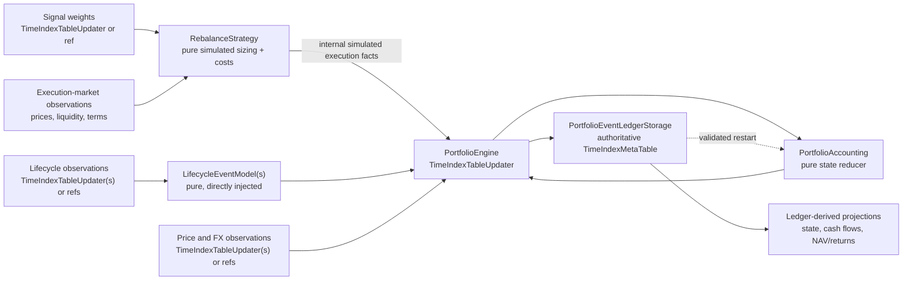

# Position-Aware Portfolio Accounting

Position-aware accounting is the opt-in `msm_portfolios` workflow for portfolios
that must track instrument quantities, currency balances, receivables, payables,
and position-driven cash flows. It is appropriate for dividends, funding,
coupons, exercise, expiry, settlement, and user-defined lifecycle economics that
cannot be represented truthfully as weighted asset returns.

The existing `PortfoliosDataNode` remains the default weight-only engine. Enabling
accounting creates a separate configuration identity and output history; it never
converts or appends to a legacy weight-only portfolio.

!!! note "Current implementation status"

    The canonical ledger, reference reducer, coordinated signal-to-strategy
    execution simulation, explicit instrument sizing and settlement terms,
    strategy-owned execution costs, dividend recognition and settlement,
    explicit price/FX valuation, ledger restart, read projections, storage
    schemas, and migration `0017` are implemented. Issue #11 removed the
    erroneous external execution ingress; there is no replay lane or fallback.
    Correction-tail publication, optimized reducer parity, projection publishers,
    and option/bond acceptance fixtures remain implementation work inside
    `msm_portfolios`. There is no `mainsequence-sdk` blocker.

The architectural contract is recorded in
[ADR 0042](../../../ADR/0042-position-cash-flow-portfolio-accounting.md).

## Architecture And Ownership



The responsibilities are strict:

- `PortfolioEngine` owns dependencies, source loading, orchestration, canonical
  validation, and publication of one authoritative table.
- A Portfolio is a backtest model with no Account, custody, broker orders,
  trades, fills, or actual account holdings.
- `PortfolioAccounting` is an in-memory deterministic reducer. It is not a
  `TimeIndexMetaTable`, updater, or extension point.
- `LifecycleEventModel` implementations turn declared observations into typed,
  columnar event records. They do not write storage or mutate the reducer.
- `PositionValuationModel` values the complete position/cash/obligation state at
  an economic timestamp using explicit observations.
- `PortfolioEventLedgerStorage` is restart authority. State, cash-flow, weight,
  and value tables are rebuildable projections.
- All simulated accounting and deterministic restart behavior belongs to
  `msm_portfolios`. The existing SDK updater, MetaTable, and migration contracts
  are sufficient.

## Selecting The Correct Portfolio Path

| Requirement | Engine |
| --- | --- |
| Weighted asset-return portfolio with turnover commission | Existing `PortfoliosDataNode` |
| Existing saved portfolio with no accounting configuration | Existing `PortfoliosDataNode` |
| Quantities, currency cash, receivables, payables, or lifecycle cash flows | `PortfolioEngine` |
| Signal targets converted into simulated quantities and costs | `PortfolioEngine` coordinated `RebalanceStrategy` path |
| User-defined position-dependent economics | Inject a `LifecycleEventModel` into `PortfolioEngine` |

Broker executions, account trades, custody holdings, and actual cash are not a
Portfolio path. They belong to the account domain even when an Account uses a
Portfolio as allocation intent.

An omitted `PortfolioBuildConfiguration.accounting_configuration` and an
explicit `None` both preserve the legacy serialized configuration and hash. An
enabled accounting configuration passed to `PortfoliosDataNode` is rejected;
there is no silent downgrade to weight-only valuation.

## Target Configuration

`PortfolioAccountingConfiguration` is hash-bearing. Every value that can change
economic events, state, or valuation belongs in this configuration or in a
versioned model configuration.

```text
PortfolioBuildConfiguration
  backtesting_weights_configuration
    signal_weights_instance
    rebalance_strategy_instance
  accounting_configuration
    valuation_asset_identifier
    initial_nav
    initial_state_time_index
    position_valuation_model_instance
    lifecycle_event_model_instances
```

The signal and `RebalanceStrategy` already owned by
`BacktestingWeightsConfig` are the only execution decision path. Accounting does
not accept an execution source, Account, broker, order, trade, fill, or holdings
dependency. The removed external-execution field is rejected as an unknown
configuration key; it has no alias or compatibility fallback.

Configure position sizing, settlement, and execution-time costs on the existing
rebalance strategy:

```python
from msm_portfolios.rebalance_strategy import (
    ImmediateSignal,
    InstrumentExecutionSpec,
    ProportionalExecutionCostModel,
    TargetWeightExecutionModel,
)

strategy = ImmediateSignal(
    execution_model_instance=TargetWeightExecutionModel(
        instrument_specs=(
            InstrumentExecutionSpec(
                asset_identifier="STOCK-EUR",
                quantity_unit="shares",
                target_measure="market_value_weight",
                contract_multiplier=1.0,
                quantity_step=1.0,
                price_asset_identifier="EUR",
                settlement_style="cash",
                terms_version="stock-v1",
            ),
        )
    ),
    execution_cost_model_instances=(
        ProportionalExecutionCostModel(rate=0.001),
    ),
)
```

`TargetWeightExecutionModel` sizes every compatible Asset in one vectorized
timestamp batch from the immutable post-lifecycle state and NAV. Every Asset
with nonzero desired exposure or a position to close requires an
`InstrumentExecutionSpec`; an unchanged zero target is not economically
required. The engine never guesses its unit,
multiplier, lot step, quote Asset, target measure, or settlement style.
For each rebalance timestamp the strategy receives the signal targets, desired
and current exposures, immutable positions, free settled balances by currency,
post-lifecycle NAV, price/FX observations, canonical valuation references, and
the prior execution-progress state. Assets are partitioned by a stable
vectorization signature—target measure, unit, quote Asset, multiplier, lot step,
terms version, and settlement style—then each compatible partition is sized and
costed as one vector.
`settlement_style="cash"` posts trade consideration. For a linear perpetual
whose position has zero fair value between variation-margin events,
`settlement_style="variation_margin"` changes contract quantity without
deducting full notional cash. Funding remains a lifecycle event.

Before publishing, the referenced `PortfolioTable` row and every Asset used by
positions, cash, prices, or FX must already exist. Persisted Asset dimensions use
canonical `asset_identifier` values that reference
`AssetTable.unique_identifier`; there is no `unique_identifier` input fallback.

### Initial State

The current opening-state contract is deliberately narrow:

- `initial_nav` must be finite and strictly positive.
- `initial_state_time_index` must be timezone-aware.
- The opening book is exactly `initial_nav` units of settled cash in
  `valuation_asset_identifier`.
- Restart does not create another opening contribution. It reconstructs state
  from the canonical ledger.

Supplying arbitrary opening positions or obligations is not currently a public
contract.

## Required Input Contracts

All timestamps are economic UTC timestamps. Inputs retain their truthful grains;
the engine does not reshape unrelated sources into one artificial index.

### Internal Simulated Execution Facts

The configured `RebalanceStrategy` produces a batch of deterministic simulated
execution facts from signal targets, market observations, and the
post-lifecycle/pre-execution accounting state. This batch is an internal typed
boundary to `PortfolioAccounting`; it is not an upstream table or broker feed.
One row represents one simulated signed execution fact.

| Field | Required | Meaning |
| --- | --- | --- |
| `time_index` | Yes | Economic execution time |
| `execution_identifier` | Yes | Stable simulated execution identity |
| `source_revision` | Yes | Deterministic revision of the signal, observations, terms, strategy, and input state |
| `asset_identifier` | Yes | Executed instrument Asset |
| `quantity_delta` | Yes | Signed executed quantity; buy positive, sell negative |
| `quantity_unit` | Yes | Explicit unit such as `shares` or `contracts` |
| `execution_price` | Yes | Price per declared quantity unit |
| `price_asset_identifier` | Yes | Asset in which the execution price is quoted |
| `position_identifier` | No | Stable position state identity; defaults to the Asset identifier |
| `observed_at` | Yes | Availability time of the selected execution mark |

The economic identity `(execution_identifier, source_revision)` must be unique.
Settlement and cost legs are explicit. The engine must not infer spot cash
consideration, futures settlement, multipliers, or inverse-contract behavior
from an Asset type or ticker.

### Price Observations

`MarketPriceValuationModel` expects grain
`(time_index, asset_identifier)` with:

| Field | Meaning |
| --- | --- |
| `price` | Finite price selected by `price_column` |
| `price_asset_identifier` | Quote Asset of that price |
| `source_revision` | Reproducible observation revision |

The most recent observation at or before the accounting timestamp is selected
only within `maximum_staleness`. Missing or stale marks for held positions fail
the event.

### FX Observations

FX grain is
`(time_index, base_asset_identifier, quote_asset_identifier)` with:

| Field | Meaning |
| --- | --- |
| `rate` | Units of quote Asset per one unit of base Asset |
| `source_revision` | Reproducible observation revision |

For a USD portfolio, `(EUR, USD, 1.10)` means one EUR is worth 1.10 USD. The
rate must be finite and strictly positive. The engine requires the exact
base-to-valuation pair; it does not infer or invert another pair. Valuation-Asset
cash uses a rate of one and needs no FX row.

### Dividend Observations

The built-in `DividendCashFlowModel` accepts grain
`(time_index, source_event_identifier, source_revision)` with:

| Field | Meaning |
| --- | --- |
| `observed_at` | When this source revision became available |
| `asset_identifier` | Instrument whose holders may be entitled |
| `entitlement_time_index` | Economic cutoff used to snapshot eligible quantity |
| `payment_time_index` | Economic settlement time |
| `amount_per_unit` | Signed dividend amount per eligible instrument unit |
| `settlement_asset_identifier` | Asset delivered at payment |

One observation expands into two linked transitions:

1. At entitlement, eligible quantity creates a receivable and recognizes income.
2. At payment, the receivable is reduced and settled cash increases.

The receivable survives sale of the originating shares. A buyer entering after
the entitlement cutoff receives nothing. Payment exchanges one balance for
another and therefore does not recognize the income a second time.

## Small EUR Dividend / USD Valuation Example

Run the complete offline fixture without backend writes:

```bash
uv run --extra portfolios python \
  examples/msm_portfolios/portfolio_cashflows_and_fx_valuation_example.py
```

The fixture produces this economic sequence:

| Time | Event | Result |
| --- | --- | --- |
| 2026-01-01 | Opening state | USD 1,000 settled cash |
| 2026-01-02 | Buy | +10 `STOCK-EUR`, EUR -500 cash |
| 2026-01-03 | Entitlement | EUR +10 receivable; USD +11 recognized P&L at EUR/USD 1.10 |
| 2026-01-04 | Sell | Position closes; receivable remains |
| 2026-01-05 | Settlement | EUR +10 cash and EUR -10 receivable; zero additional P&L |

The example prints event-level USD NAV/P&L, ending positions, obligations and
currency balances, completed cash-flow rows, and normalized USD portfolio
values. It also exposes the frames through `build_example()` for tests.

## Linear Perpetual / Funding Example

Run the variation-margin fixture:

```bash
uv run --extra portfolios python \
  examples/msm_portfolios/portfolio_perpetual_funding_example.py
```

The first signal targets 100% notional exposure at USD 100 and creates ten
contracts without a USD 1,000 trade-consideration debit; its one-percent
commission reduces NAV to USD 990 exactly once. At the next timestamp, a
vectorized `PositionCashFlowModel` applies USD 100 of funding in
`pre_execution`. The same-time signal is sized from the resulting USD 890 NAV,
changes the position to eight contracts, and applies a USD 2 commission once. A
second funding event changes cash and NAV with no rebalance. The fixture uses a
custom `PositionValuationModel` because a variation-margined contract has
different value semantics from a cash-settled share; settlement style and
valuation model must agree.

## Economic Ordering

The reducer scans actual economic timestamps from signal/strategy observations,
lifecycle events, and requested valuation observations. It never creates a
generic frequency grid or uses job time as an economic timestamp.

Within one timestamp, current processing is:

1. lifecycle events in `pre_execution`;
2. the configured rebalance strategy emits and accounting applies internal
   simulated execution facts in `execution`;
3. lifecycle events in `post_execution`; and
4. an optional valuation marker.

Lifecycle models are ordered by explicit `economic_ordering_priority` and then
stable model identifier. Events whose results depend on each other require an
explicit causal ordering contract; the complete causal-DAG/atomic-group engine
is still pending and must not be represented as already implemented.

`historical_information_policy.mode="as_known"` is the implemented mode. A
candidate whose `observed_at` is later than its economic `time_index` is rejected
to prevent look-ahead. Corrected-history calculation is intentionally rejected
until deterministic correction-tail publication exists.

## Canonical Event Ledger

`PortfolioEventLedgerStorage` is a `PlatformTimeIndexMetaTable` with grain:

```text
(time_index, portfolio_identifier, event_identifier,
 event_revision, record_identifier)
```

An event is one indivisible state transition represented by one or more typed
economic records plus exactly one `valuation_summary` record.

Supported record kinds are:

| Record kind | Meaning |
| --- | --- |
| `position_delta` | Signed change to an instrument position |
| `cash_delta` | Signed settled or restricted cash movement |
| `obligation_delta` | Signed receivable, payable, or deliverable change |
| `cost` | Execution-time cost posting |
| `lifecycle_state` | Versioned model-owned state transition |
| `execution_progress` | Execution simulation progress fact |
| `event_marker` | Economic event with no direct balance posting |
| `valuation_summary` | One event-level NAV-before, NAV-after, and recognized-P&L summary |

Important envelope and integrity fields include:

- `event_identifier`: stable economic identity derived from portfolio, producer,
  source, and local event identity;
- `event_revision`: deterministic revision derived from source/model revision and
  input state;
- `event_sequence` and `record_sequence`: resolved processing order;
- `event_record_count` and `event_digest`: proof that the complete event group is
  present and unchanged;
- `input_state_identifier` and `ledger_state_identifier`: state-chain lineage;
- `source_identifier`, `source_revision`, `model_identifier`, and
  `model_version`: reproducibility lineage; and
- `valuation_references`: canonical references to price and FX observations.

`recognized_pnl`, `nav_before`, and `nav_after` belong to the summary record.
A cash movement is not automatically P&L: a trade exchanges cash for an
instrument, and dividend payment exchanges a receivable for cash.

## Retry, Restart, And Corrections

Exact retries are idempotent. Reprocessing the same economic event with the same
source revision produces the same identity and does not apply the balance change
twice. Before publication, existing and calculated event digests are compared.

`PortfolioAccounting.from_ledger(...)` reconstructs positions, cash,
obligations, execution progress, applied revisions, latest NAV, and event
sequence from a complete active ledger. It validates:

- one portfolio identity;
- contiguous event and record sequences;
- record counts and event digests;
- exactly one valuation summary per event;
- the input/output state-identifier chain; and
- the configured opening timestamp, currency, and NAV.

Changed or deleted source revisions currently stop with an explicit tail-replay
error. They are never ignored or applied on top of the old state. Appending
superseding/cancellation revisions and publishing the corrected portfolio tail
remain `msm_portfolios` work; no SDK feature is needed.

## Read Projections

The public pure projections consume only the ledger:

```python
from msm_portfolios.accounting import (
    project_cash_flows,
    project_portfolio_values,
    project_state,
)

state = project_state(ledger)
cash_flows = project_cash_flows(ledger)
values = project_portfolio_values(ledger, initial_nav=1_000_000.0)
```

- `project_state` returns end-of-timestamp position, cash, and obligation
  quantities by stable `state_identifier`. It preserves explicit zero rows with
  `is_closed=True`.
- `project_cash_flows` returns completed `cash_delta` and `cost` records only.
  Future payments remain obligations and do not appear as cash.
- `project_portfolio_values` selects the final summary per economic timestamp and
  derives normalized `close = nav_after / initial_nav` and linked returns.

`PortfolioStateStorage` and `PortfolioCashFlowsStorage` are additive schemas
installed by migration `0017`. Dedicated projection publisher updaters are not
yet implemented; callers must not describe the schemas as independent accounting
authorities.

## User-Defined Cash Flows And Lifecycle Events

Users extend lifecycle economics by directly injecting a module-level,
importable `LifecycleEventModel`. There is no string registry or built-in
fallback.

Use `PositionCashFlowModel` when every candidate produces one settled cash
posting. Override its vectorized `calculate_cash_deltas(...)` method. Use the
full `LifecycleEventModel` when an event also changes positions, obligations,
deliverables, or model-owned state.

The supported full-model hooks are:

```text
declared_dependencies()
required_input_contracts()
dependency_window(...)
alignment_contracts()
lifecycle_state_contract()
select_event_candidates(...)
vectorization_keys(...)
build_event_batch(...)
```

Models receive validated source batches and an immutable accounting-state view.
They return a flat `EventBatch` with NumPy-compatible columns and event offsets.
They must not query hidden data, read wall-clock time, mutate reducer state, or
write any ledger/projection table.

Run the custom vectorized example:

```bash
uv run --extra portfolios python \
  examples/msm_portfolios/portfolio_custom_cashflow_model_example.py
```

It defines a user-owned EUR usage royalty outside `msm_portfolios`, injects it
directly, processes two compatible source events in one vectorized model call,
and values their effect in USD using the shared FX observations.

## Failure Semantics

Accounting mode is strict. Common failures mean:

| Error | Cause |
| --- | --- |
| Missing fresh valuation | A held position has no mark within `maximum_staleness` |
| Missing explicit FX | A non-valuation Asset has no direct FX observation into the valuation Asset |
| Duplicate grain coordinates | A declared source contains more than one row at its stated grain |
| Observation would cause look-ahead | `observed_at` is later than the economic event in `as_known` mode |
| Broken event digest or state chain | Ledger records are incomplete, modified, or incorrectly ordered |
| Corrected source revision requires tail replay | A source changed and correction publication is not yet implemented |
| Enabled accounting rejected by `PortfoliosDataNode` | The accounting configuration was sent to the legacy weight-only engine |

The engine does not convert any of these conditions into a zero cash flow,
stale valuation, inverse FX guess, or weight-only fallback.

## Migration And Validation

Migration `0017` adds the canonical ledger and rebuildable state/cash-flow
schemas. Apply it through the repository's existing SDK-managed migration
deployment workflow before runtime attachment. This is an ordinary deployment
step, not an SDK development dependency.

For changes to this accounting surface, run at least:

```bash
uv run --extra portfolios --extra dev ruff check \
  src/msm_portfolios/accounting \
  src/msm_portfolios/data_nodes/portfolios \
  examples/msm_portfolios \
  tests/msm_portfolios/accounting

uv run --extra portfolios --extra dev pytest \
  tests/msm_portfolios/accounting/test_accounting.py

uv run --extra portfolios --extra dev mkdocs build --strict \
  --site-dir /private/tmp/msmarkets-docs-site
```

Before a release, also run the complete repository test suite and the
backward-compatibility acceptance matrix defined in ADR 0042.
