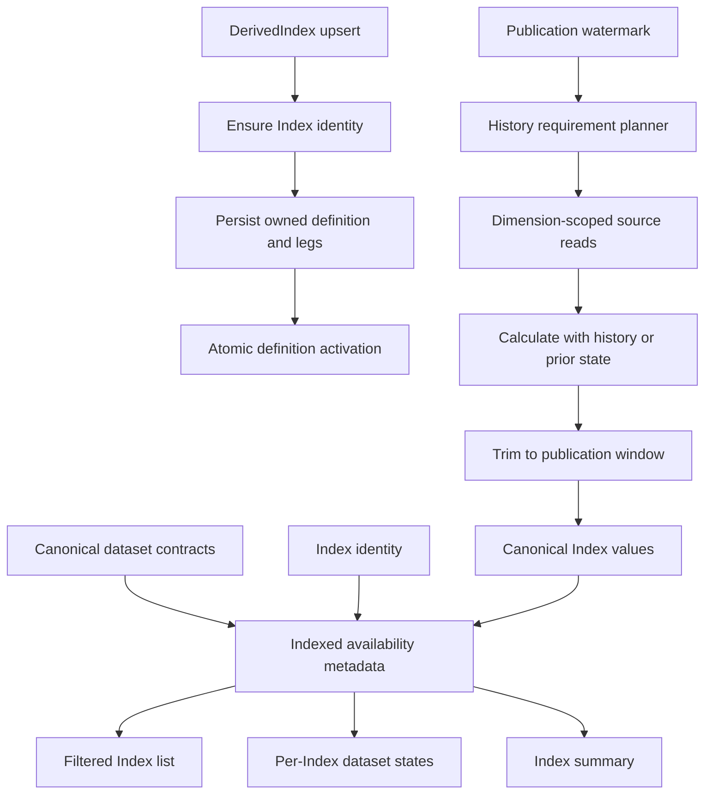

# Index Catalog, Lifecycle, And Publication Hardening Implementation Plan

## Status

Proposed. Implementation has not started.

This document turns the verified Index audit findings into one coordinated
implementation program. It is intentionally specific about target contracts,
schema changes, repository operations, DataNode behavior, tests, documentation,
and rollout order so the work is not spread across unrelated partial fixes.

## Success Condition

The work is complete only when all of the following are true:

- `GET /api/v1/index/{uid}/delete-impact/` returns a valid typed response for
  blocking, cascading, nulling, informational, unknown, and unavailable-count
  relationships, and points to the standard direct delete endpoint;
- Index deletion remains the ordinary `Index.delete(uid)` and
  `DELETE /api/v1/index/{uid}/` row-deletion workflow;
- failed `DerivedIndex.upsert(...)` calls cannot delete a concurrently created
  Index or restore stale Index metadata over another writer;
- activating a methodology version cannot leave the Index without an active
  definition if activation fails or races another activation;
- one-shot and multi-run derived publication produce identical values for every
  registered transform, coefficient method, selector mode, and calculation
  operator;
- `response_format=frontend_list`, `has_canonical_values`, and `cadence` remain
  supported list parameters;
- list filters use indexed availability metadata and never enumerate distinct
  identifiers from every canonical value table;
- the dataset API distinguishes a global canonical dataset contract from that
  contract's population state for one Index;
- Index summary counts and cadence lists describe populated datasets only;
- methodology listing obtains all leg counts in one grouped query;
- Index-type ordering is applied before limit and offset;
- fixed-component and selector source reads are explicitly dimension-scoped;
- canonical Index value storage has a secondary lookup index beginning with
  `index_identifier`;
- the Index skill and documentation describe ordered ratio legs, keep
  `leg_role` optional, and link to the current ADR filename;
- focused tests, the full Index test suite, migration validation, example
  smoke checks, and strict MkDocs validation pass.

## Source Of Truth

Implementation must remain aligned with:

- [ADR 0037](../../ADR/0037-core-derived-index-definition-and-calculation-framework.md);
- [ADR 0038](../../ADR/0038-index-user-api-and-fastapi-exploration.md);
- [Main Sequence DataNode guidance](https://mainsequence-sdk.github.io/mainsequence-sdk/knowledge/data_nodes/),
  especially explicit multidimensional filtering, update statistics, stable
  storage contracts, and migration-owned schema;
- [Main Sequence MetaTable migration guidance](https://mainsequence-sdk.github.io/mainsequence-sdk/knowledge/meta_tables/migrations/);
- [Main Sequence FastAPI guidance](https://mainsequence-sdk.github.io/mainsequence-sdk/knowledge/fastapi/);
- the repository Index workflow skill at
  `.agents/skills/ms_markets/indices/derived_index_workflow/SKILL.md`.

Main Sequence SDK behavior must be rechecked immediately before implementation.
Do not infer transaction, post-persistence hook, or permission behavior from
this plan when the installed SDK exposes a newer contract.

## Confirmed Gaps

| ID | Severity | Current behavior | Required result |
| --- | --- | --- | --- |
| IDX-1 | P1 | Delete-impact emits literals rejected by its own schema and references removed bulk deletion. | Every relationship maps to valid typed literals and the direct endpoint. |
| IDX-2 | P1 | Upsert compensation can delete another writer's Index or restore stale metadata. | Compensation owns only definition and leg UIDs created by the current call. |
| IDX-3 | P1 | Activation retires the old definition before activating the new one. | Retirement and activation occur in one atomic database statement guarded by a uniqueness invariant. |
| IDX-4 | P1 | Incremental runs start after the publication watermark even when calculations need history. | Calculation windows include explicit history or prior state, while output remains incremental. |
| IDX-5 | P1 | Availability filters scan each cadence table and silently cap distinct identifiers at 100,000. | Filters join indexed availability metadata with no table scan or identifier cap. |
| IDX-6 | P2 | `list_datasets(uid)` returns global contracts and summary treats all as populated. | Per-Index population is typed as populated, compatible-empty, or unavailable. |
| IDX-7 | P2 | Methodology listing performs one count query per definition; Index types sort after pagination. | Group counts once and order in the governed query before pagination. |
| IDX-8 | P2 | Fixed source reads load unscoped ranges; canonical lookup indexes begin with time. | Reads carry explicit dimensions and storage has an identifier-first secondary index. |
| IDX-9 | P3 | The skill requires ratio roles although runtime uses order, and it links to a deleted ADR path. | Documentation consistently defines ordered ratio legs and uses the current ADR path. |

## Hard Boundaries

The implementation must not:

- reintroduce a deletion signing secret, confirmation token, execution journal,
  preview token, bulk-delete saga, or custom destructive workflow;
- introduce product-specific concepts such as `Index Studio` into core models,
  services, routes, ADRs, examples, or skills;
- remove `response_format=frontend_list`, `has_canonical_values`, or `cadence`;
- add legacy aliases, dual response models, deprecated compatibility classes,
  or silent fallback behavior for the new dataset-status contract;
- require `numerator` or `denominator` leg roles for ratios; ratio semantics
  remain the deterministic order of exactly two legs;
- remove or discard `leg_role`, selector parameters, transform parameters,
  coefficient parameters, or canonical methodology field names;
- make direct Index deletion delete canonical values or extension-owned data;
- use raw SQL deletes or unscoped DataNode deletion;
- move Index business behavior into `apps/v1`; reusable behavior remains under
  `src/msm`;
- modify pricing curve, projection curve, or discount curve architecture as
  part of this Index-specific program.

## Target Architecture



The global contract catalog and per-Index population catalog are separate
concepts. The first describes compatible tables. The second describes whether
one Index has observations in each compatible table.

## Target Public Contracts

### Dataset Contract Versus Dataset State

Keep `IndexDatasetDescriptor` as the global structural contract. Add a separate
per-Index model instead of overloading the descriptor:

```python
IndexDatasetPopulationState = Literal[
    "populated",
    "compatible_empty",
    "unavailable",
]


class IndexDatasetState(IndexServiceModel):
    dataset: IndexDatasetDescriptor
    index_uid: uuid.UUID
    index_identifier: str
    population_state: IndexDatasetPopulationState
    row_count: int | None = None
    earliest_time_index: dt.datetime | None = None
    latest_time_index: dt.datetime | None = None
    reconciled_at: dt.datetime
    error: str | None = None
```

Contract rules:

- `discover_canonical_datasets()` remains global contract discovery;
- `Index.list_datasets(uid)` returns `tuple[IndexDatasetState, ...]`;
- default listing includes populated states and unavailable states, because an
  unavailable state must not be mistaken for empty;
- callers may explicitly request compatible empty states through a typed query
  parameter such as `include_empty=true`;
- `Index.get_dataset_summary(...)` remains the exact, selected-dataset read and
  may refresh the selected availability row after a successful query;
- `Index.get_values(...)` remains bounded and dimension-scoped;
- no compatibility model preserves the old global-descriptor response shape.

### Availability Filter Semantics

The existing list parameters retain these exact meanings:

- `has_canonical_values=True`: at least one availability row is `populated`;
- `has_canonical_values=False`: no availability row is `populated`;
- `cadence=<value>`: population is evaluated only for that cadence;
- `has_canonical_values=False&cadence=1d`: the Index has no populated daily
  canonical dataset;
- omitted availability parameters do not join availability metadata;
- counts and pages are authoritative for the latest completed availability
  reconciliation represented in the metadata table;
- API documentation exposes `reconciled_at` so snapshot freshness is explicit.

### Standard Delete Impact

Delete impact remains read-only metadata for the direct delete route. It does
not authorize deletion and has no separate execution contract.

Normalization and delete-impact decisions belong in a typed core service under
`src/msm/services/indices`. `apps/v1` only resolves the request and maps the
core result into the shared HTTP response contract.

The core contracts are `IndexDeleteImpact` and
`IndexDeleteImpactRelationship`. They contain no FastAPI imports. The HTTP
adapter validates their fields into `DeleteImpactResponse`.

Normalize relationship values as follows:

| Relationship condition | Effect | Severity | Blocks delete |
| --- | --- | --- | --- |
| `RESTRICT` or `NO ACTION`, known count greater than zero | `blocks_delete` | `blocking` | yes |
| `CASCADE`, known count greater than zero | `cascade_delete` | `destructive` | no |
| `SET NULL`, known count greater than zero | `set_null` | `mutating` | no |
| Known zero rows | `informational` | `info` | no |
| Unknown action or non-authoritative inference | `informational` | `warning` | no |
| Restrictive relationship whose count is unavailable | `blocks_delete` | `warning` | yes, conservatively |

`DeleteImpactRelationship.count` must become nullable or carry an explicit
count-accuracy field. Never convert an unavailable count to zero. The response
must set:

```text
delete_endpoint = /api/v1/index/{uid}/
```

### Ratio Semantics

Ratios retain the current engine contract:

```text
ordered leg 0 = numerator
ordered leg 1 = denominator
```

`leg_role` remains optional descriptive metadata. Validation requires exactly
two ordered legs, compatible input units, ratio output units, and nonzero
denominators. It does not require role values.

## Schema Design

### Index Dataset Availability

Add `IndexDatasetAvailabilityTable` as a normal migration-managed MetaTable.
It is current catalog metadata, not a DataNode observation table.

Required columns:

| Column | Contract |
| --- | --- |
| `uid` | Stable row UUID. |
| `index_uid` | FK to `IndexTable.uid`, `ondelete="CASCADE"`. |
| `meta_table_uid` | Canonical dataset MetaTable UID as a string. |
| `cadence` | Normalized canonical cadence copied from the verified contract. |
| `population_state` | `populated`, `compatible_empty`, or `unavailable`. |
| `row_count` | Exact count when reconciled; nullable when unavailable. |
| `earliest_time_index` | Nullable exact lower bound. |
| `latest_time_index` | Nullable exact upper bound. |
| `reconciled_at` | UTC timestamp of the completed check. |
| `error_code` | Stable nullable code for unavailable states. |
| `error_message` | Bounded nullable diagnostic text. |

Required constraints and indexes:

- unique `(index_uid, meta_table_uid)`;
- index `(index_uid, population_state, cadence)` for per-Index state reads;
- index `(population_state, cadence, index_uid)` for list filters;
- check constraint keeping state, count, and error fields coherent;
- no foreign key from `meta_table_uid` to a platform catalog table owned
  outside this database schema.

Availability metadata is rebuildable. It must never become the canonical value
store or replace an exact selected-dataset query.

### Active Definition Invariant

Add a database-level partial unique index permitting at most one row with
`status='active'` per `index_uid`. Before creating the index, the migration must
fail with a clear diagnostic if existing data violates the invariant; it must
not silently retire or rewrite methodologies.

### Canonical Value Lookup Index

Keep the generated unique grain index:

```text
(time_index, index_identifier)
```

Add a nonunique secondary index:

```text
(index_identifier, time_index)
```

The secondary index must be declared by the SQLAlchemy storage factory so every
cadence-configured `IndexValuesTS.<cadence>` table receives the same lookup
contract through the SDK migration workflow. Do not duplicate the unique grain
index in `__table_args__`.

## Lifecycle Write Design

### Safe Upsert Ownership

`DerivedIndex.upsert(...)` must stop treating a pre-upsert absence check as
proof that it owns the resulting Index row.

Required sequence:

1. Ensure or resolve the Index identity by its unique constraint.
2. Never register the shared Index UID for compensating deletion.
3. Generate the definition UID and all leg UIDs before persistence.
4. Persist the draft definition and legs.
5. On failure, delete only those generated definition and leg UIDs.
6. Never restore an Index snapshot captured before the operation.
7. Apply mutable Index display metadata independently; do not claim the
   identity, definition, and legs were committed in one database transaction.
8. If a concurrent definition insert wins with the same semantic hash, re-read
   and return it idempotently.
9. If a concurrent insert wins with a different hash or version, return an
   explicit conflict and leave the shared Index unchanged.

An Index identity left without a methodology after a failed first definition
is valid plain identity state and is safer than deleting a row another writer
may already reference.

### Atomic Activation

Replace sequential retirement and activation with one governed SQLAlchemy
`UPDATE` statement using conditional values for both the previous active row
and the target draft row. The statement must:

- scope every updated row to the same `index_uid`;
- require the target UID to be a draft;
- retire the previous active row at the target's `effective_from`;
- activate the target row;
- return affected rows for validation;
- rely on the partial unique active-definition index to reject concurrent
  winners;
- leave the previous active row unchanged if the statement fails.

Do not emulate this with two repository calls and compensation. A failed
multirow statement is rolled back by the database as one statement.

## Incremental Calculation Design

Separate three time concepts:

```text
publication_start = first timestamp allowed in returned output
calculation_start = earliest source timestamp required for correct calculation
definition_window = [effective_from, effective_to)
```

`calculation_start` may precede `publication_start`. The DataNode calculates
with required context and trims output to `publication_start` only after the
engine result is complete.

### History Requirement Registry

Extend the existing registries with typed history metadata. Do not infer
history needs from string names inside `DerivedIndexDataNode.update()`.

Required history modes:

| Capability | Minimum history contract |
| --- | --- |
| Identity transforms, fixed/equal coefficients, linear combinations, ratios | No prior observation beyond alignment requirements. |
| `simple_return`, `log_return` | One prior source observation per leg. |
| As-of alignment and forward fill | Time lookback equal to configured maximum age. |
| Rolling OLS, beta, delta, and DV01 coefficients | Configured window plus lag and one prior observation where returns are calculated. |
| Selector and rebalance rules | Explicit selector/rebalance lookback declared by the registry parameters. |
| Rebase transforms and rebased baskets | Effective-start anchor observation. |
| Chained return | Prior published level plus the new return window. |
| Self-financing | Prior published level, prior prices, prior coefficients/positions, and configured lag. |

For chained and self-financing operators, extend the engine with typed seed
state instead of recalculating full history on every run. For anchored rebasing,
load the anchor separately from the current incremental range. This preserves
correctness without violating the Main Sequence requirement to avoid routine
full-history fetches.

### Definition Window Rules

Before any source query:

- skip a retired definition when `effective_to <= publication_start`;
- clamp `calculation_start` to the history requirement and effective window;
- reject or skip any resolved range where start is not earlier than end;
- process adjacent versions without duplicate timestamps at the exclusive
  effective boundary.

### Scoped Source Bindings

Replace bare source storage classes in `source_bindings` with a typed binding:

```python
class DerivedIndexSourceBinding(BaseModel):
    storage_table: type[PlatformTimeIndexMetaTable]
    component_dimension: str
    static_dimension_filters: dict[str, tuple[str, ...]] = {}
```

Every fixed asset or component-Index read must add the resolved component value
to `dimension_filters`. Selector bindings must provide an explicit bounded
universe through selector parameters or static filters. Unbounded selector
source reads are rejected rather than silently loading a complete source table.

The new typed binding replaces the bare-class contract directly. Do not add a
legacy union accepting both forms.

## Availability Maintenance

Implement one reusable reconciliation service under `src/msm/services/indices`
that:

1. discovers verified canonical contracts;
2. accepts an explicit bounded set of Index UIDs or identifiers;
3. executes one aggregate per selected contract with Index predicates;
4. writes one availability row per selected Index and compatible contract;
5. records `unavailable` rather than treating access/query failure as empty;
6. commits metadata only after the aggregate for that row succeeds;
7. returns typed reconciliation results for tests and operational callers.

Backfill and ongoing maintenance are distinct:

- migration deployment creates the empty availability table;
- an explicit backfill command reconciles all current Indexes in bounded
  batches and records progress outside the canonical values tables;
- normal canonical Index producers reconcile only identifiers written by a
  successful run;
- any supported canonical value-removal workflow reconciles affected
  identifiers after removal;
- catalog reads never trigger a global backfill or scan all cadence tables.

Before implementing producer integration, verify the installed SDK's
post-persistence lifecycle. If it exposes no post-persistence hook, call the
reconciliation service from an explicit orchestration step after successful
publication. Never mark availability `populated` before value persistence has
succeeded.

## Catalog And API Query Design

### Index Listing

Build one base Index statement and add availability `EXISTS` or `NOT EXISTS`
conditions only when `has_canonical_values` or `cadence` is present. Remove
`_identifiers_with_canonical_values(...)` entirely. There must be no Python
identifier set and no 100,000-row cap.

The count statement and page statement must derive from the same filtered base
query. Preserve deterministic ordering and the current FastAPI parameters.

### Per-Index Dataset Listing And Summary

- global discovery returns verified contracts;
- one availability query loads all states for the selected Index;
- missing state after a completed backfill is a contract error, not implicit
  empty state;
- dataset list defaults to populated plus unavailable states;
- `include_empty=true` adds compatible-empty states;
- Index summary uses availability metadata and performs no exact value-table
  queries across every contract;
- exact count/latest/range reads remain under the selected dataset-summary
  endpoint.

### Methodology Listing

Load definitions once, then execute one grouped query:

```text
SELECT definition_uid, COUNT(*)
FROM IndexCalculationLeg
WHERE definition_uid IN (...)
GROUP BY definition_uid
```

Definitions with zero legs receive count zero. Do not issue `count_model(...)`
inside the summary loop.

### Index-Type Pagination

Replace page-then-sort behavior with one governed ordered query. Apply:

```text
ORDER BY lower(index_type), uid
LIMIT ... OFFSET ...
```

Use a separate count statement derived from the same unpaginated base query.

## Delete-Impact Implementation Tasks

- add core typed normalizers for relationship type, `on_delete`, effect,
  severity, and unknown count behavior under `src/msm/services/indices`;
- build core `IndexDeleteImpactRelationship` instances directly instead of
  intermediate untyped dictionaries;
- use stable uppercase `OnDeleteAction` literals;
- remove every bulk-delete warning, description, and endpoint reference;
- keep the direct DELETE route unchanged;
- map only expected domain exceptions at the route boundary;
- add service tests for every row in the normalization table;
- add a FastAPI test proving a nonblocking relationship returns HTTP 200;
- add OpenAPI assertions for the direct delete endpoint and impact schema.

## File-Level Work Plan

### Core Models And Migrations

| File | Required change |
| --- | --- |
| `src/msm/models/index_calculations.py` | Add the one-active-definition partial unique index. |
| `src/msm/models/index_dataset_availability.py` | Add the availability MetaTable and constraints. |
| `src/msm/models/__init__.py` | Export and register the availability model in dependency order. |
| `src/msm/data_nodes/indices/storage.py` | Add `(index_identifier, time_index)` to generated canonical tables. |
| `src/migrations/versions/mainsequence_markets/<next_revision>.py` | SDK-generated migration for the availability table, active-definition invariant, and static schema changes. |
| project migration provider inputs | Include every cadence-configured storage model requiring the new secondary index before generating the revision. |

Do not hand-edit an applied revision. Generate the next provider-scoped
revision with the installed Main Sequence migration workflow, inspect it, then
run upgrade/current validation.

### Repositories And Public API

| File | Required change |
| --- | --- |
| `src/msm/repositories/indices.py` | Add atomic activation, grouped leg counts if repository-owned, and availability reads/writes. |
| `src/msm/api/derived_indices.py` | Remove unsafe Index compensation and adopt owned-UID cleanup. |
| `src/msm/api/indices.py` | Return per-Index dataset states and expose explicit empty-state selection. |
| `src/msm/services/indices/contracts.py` | Add dataset state and availability reconciliation contracts. |
| `src/msm/services/indices/catalog.py` | Join availability metadata, remove global distinct scans, batch counts, order Index types before pagination, and stop summary-wide value queries. |
| `src/msm/services/indices/availability.py` | Implement bounded reconciliation and typed results. |
| `src/msm/services/indices/delete_impact.py` | Normalize relationships and build a typed core Index delete-impact result. |
| `src/msm/services/indices/__init__.py` | Export only stable public availability services and contracts. |

### DataNode And Engine

| File | Required change |
| --- | --- |
| `src/msm/analytics/indices/registry.py` or current registry owner | Add typed history requirement metadata. |
| `src/msm/analytics/indices/contracts.py` | Add typed seed/history contracts without changing methodology field fidelity. |
| `src/msm/analytics/indices/engine.py` | Accept chained/self-financing seed state and preserve ordered ratio behavior. |
| `src/msm/data_nodes/indices/derived.py` | Plan calculation windows, scope dependency reads, skip completed definitions, seed stateful operators, and trim output. |
| `src/msm/data_nodes/indices/values.py` | Integrate successful-publication availability reconciliation through the verified SDK lifecycle. |

### FastAPI

| File | Required change |
| --- | --- |
| `apps/v1/schemas/delete_impact.py` | Represent unavailable counts and keep literals aligned with service output. |
| `apps/v1/services/indices.py` | Delegate to core delete-impact, ordered Index-type, and dataset-state services, then map HTTP response contracts. |
| `apps/v1/routers/indices.py` | Update dataset query parameters and remove stale bulk-delete text while retaining standard direct deletion and list filters. |
| `apps/v1/services/command_center_adapter.py` | Keep operation IDs aligned if response contracts change; do not add product-specific behavior. |

### Documentation And Examples

| File | Required change |
| --- | --- |
| `docs/ADR/0038-index-user-api-and-fastapi-exploration.md` | Record the final availability and direct-delete contracts and mark completion only after evidence passes. |
| `docs/ADR/0037-core-derived-index-definition-and-calculation-framework.md` | Document calculation versus publication windows and stateful seeds. |
| `docs/fast_api/v1/indexes.md` | Document population states, filter freshness, direct impact semantics, and exact dataset summary. |
| `docs/knowledge/msm/indices/index.md` | Explain global contracts versus per-Index population. |
| `docs/knowledge/msm/indices/derived_indexes.md` | Explain history requirements and two-run equivalence. |
| `docs/tutorial/06-derived-indexes.md` | Demonstrate incremental continuation and populated/empty dataset inspection. |
| `.agents/skills/ms_markets/indices/derived_index_workflow/SKILL.md` | Use ordered ratio semantics and the current ADR 0038 path. |
| `examples/msm/indices/plain_index_values.py` | Enhance the existing example with availability reconciliation and state inspection. |
| one existing stateful derived example | Demonstrate two incremental runs continuing one chained or self-financing history. |
| `CHANGELOG.md` | Add one implementation entry after behavior is complete. |

## Test Plan

### Delete Impact

- nonblocking zero-count relationship validates;
- cascade maps to destructive but nonblocking;
- set-null maps to mutating but nonblocking;
- restrictive known count blocks;
- restrictive unavailable count blocks conservatively;
- inferred unknown relationship returns warning/informational;
- direct endpoint path is returned;
- no response or OpenAPI text mentions bulk deletion, tokens, journals, or
  secrets.

### Lifecycle Concurrency And Failure

- failure after Index identity resolution never calls Index deletion;
- failure never restores an old Index snapshot;
- only generated leg and definition UIDs are cleaned up;
- same-hash concurrent winner is returned idempotently;
- different-hash version conflict preserves both valid writers' state;
- activation statement updates old and new rows together;
- forced activation failure preserves the previous active definition;
- two concurrent activations leave exactly one active row;
- migration fails clearly when preexisting active duplicates exist.

### Incremental Equivalence

For each supported operator, transform, coefficient method, selector, alignment,
missing-data policy, and rebalance mode:

1. calculate the full fixture in one run;
2. split the same fixture across two publication runs;
3. concatenate incremental outputs;
4. assert exact index, value, unit, definition UID, status, and provenance
   equivalence with the one-shot result.

Include explicit cases for:

- simple and log returns across the split boundary;
- rolling OLS windows and coefficient lag;
- rebasing with an anchor before the second-run watermark;
- chained return continuation from the prior level;
- self-financing continuation with prior positions, prices, and costs;
- selector lookback and rebalance boundaries;
- retired definitions wholly before the watermark;
- adjacent definition versions with an exclusive boundary;
- source dependency spies proving required `dimension_filters` are supplied;
- rejection of unbounded selector source reads.

### Availability And Catalog

- backfill creates populated, compatible-empty, and unavailable rows;
- list datasets never confuses unavailable with empty;
- default dataset list excludes compatible-empty and includes unavailable;
- `include_empty=true` includes compatible-empty;
- summary counts and cadence list include populated states only;
- `has_canonical_values` and `cadence` compile availability `EXISTS` queries;
- no catalog test observes a canonical table distinct-identifier query;
- filters have no 100,000 identifier cap;
- filter count and page use identical predicates;
- exact selected-dataset summary remains Index-scoped;
- values remain bounded and Index-scoped;
- model/migration tests prove `(index_identifier, time_index)` exists on every
  configured cadence table.

### Query Shape

- methodology listing executes one definition query and one grouped count
  query regardless of definition count;
- zero-leg definitions receive zero;
- Index-type pages are globally ordered before slicing;
- adjacent pages do not overlap or omit rows;
- query-count assertions protect summary and list paths from N+1 regressions.

### Documentation And Examples

- skill contract test asserts ordered ratio wording;
- skill contract test resolves the current ADR 0038 path;
- OpenAPI retains all three standard list parameters;
- the enhanced plain and stateful examples run or pass their existing example
  tests;
- MkDocs strict build resolves every new link.

## Performance Gates

Use deterministic query-count tests plus an integration fixture large enough to
exercise realistic pagination.

- unfiltered Index list: one count query and one page query;
- availability-filtered Index list: one count query and one page query with
  indexed `EXISTS`, with no canonical value-table read;
- per-Index dataset list: global contract discovery plus one availability query;
- Index summary: no exact aggregate query per canonical contract;
- methodology list: one definition query plus one grouped leg-count query;
- fixed source read: one bounded time and component query per binding;
- query plans for availability filters and canonical values use the intended
  identifier-first indexes.

Record `EXPLAIN` evidence for the availability filter and selected Index value
range query before declaring the performance work complete.

## Implementation Phases

### Phase 0: Contract Freeze And Regression Tests

- [ ] Add failing tests for IDX-1 through IDX-9 before behavior changes.
- [ ] Freeze the dataset-state, availability, delete-impact, ratio, and direct
      deletion contracts in ADR 0038.
- [ ] Verify the installed Main Sequence SDK transaction and DataNode
      post-persistence capabilities.
- [ ] Confirm migration provider inputs for every configured cadence table.

Exit gate: every audit finding has a failing regression test or a schema
assertion, and no runtime implementation has been changed speculatively.

### Phase 1: Delete Impact

- [ ] Implement typed normalization and unavailable-count semantics.
- [ ] Remove stale bulk-delete endpoint and text.
- [ ] Keep direct deletion unchanged.
- [ ] Pass service, FastAPI, OpenAPI, and Adapter tests.

Exit gate: all valid relationship variants return HTTP 200 and schema-valid
responses.

### Phase 2: Lifecycle Safety

- [ ] Remove shared Index compensation from `DerivedIndex.upsert(...)`.
- [ ] Make draft definition and leg cleanup UID-owned.
- [ ] Implement same-hash concurrency recovery and explicit conflicts.
- [ ] Add the active-definition uniqueness invariant.
- [ ] Implement one-statement activation.
- [ ] Pass failure-injection and concurrency tests.

Exit gate: no tested interleaving deletes or overwrites another writer, and
failed activation preserves the previous active definition.

### Phase 3: Availability Schema And Reconciliation

- [ ] Add the availability MetaTable and migration.
- [ ] Add the identifier-first secondary indexes to configured storage.
- [ ] Implement bounded availability reconciliation.
- [ ] Implement and run the backfill in an explicit namespace/environment.
- [ ] Verify populated, empty, and unavailable states against canonical data.

Exit gate: availability metadata is complete for the verified test scope and
query plans use its indexes.

### Phase 4: Catalog And API Refactor

- [ ] Replace global distinct scans with availability joins.
- [ ] Return typed per-Index dataset states.
- [ ] Make summary population-aware without per-contract exact queries.
- [ ] Group methodology leg counts.
- [ ] Order Index types before pagination.
- [ ] Keep list parameter and Adapter contracts aligned.

Exit gate: catalog correctness, query-count, OpenAPI, and pagination tests pass.

### Phase 5: Incremental Publication Correctness

- [ ] Add history requirement metadata to registries.
- [ ] Add typed source bindings and dimension filters.
- [ ] Add state seeds for chained and self-financing operators.
- [ ] Load rebase anchors and finite rolling windows explicitly.
- [ ] Skip completed definitions and reject reversed source ranges.
- [ ] Trim only after calculation.
- [ ] Reconcile availability only after successful persistence.
- [ ] Pass the complete two-run equivalence matrix.

Exit gate: one-shot and split-run output is equivalent across the supported
capability matrix, and source reads are bounded.

### Phase 6: Documentation, Examples, And Release Evidence

- [ ] Update ADRs, API docs, knowledge docs, tutorial, and skill.
- [ ] Enhance the plain Index and one stateful derived example.
- [ ] Add the changelog entry.
- [ ] Run focused and full Index tests.
- [ ] Run migration current/upgrade checks in the intended environment.
- [ ] Run strict MkDocs validation.
- [ ] Record any platform blocker without marking the plan implemented.

Exit gate: implementation, docs, examples, migrations, and verified evidence
describe the same behavior.

## Rollout Order

1. Deploy the additive schema revision and identifier-first indexes.
2. Verify the partial active-definition index against existing rows.
3. Run the bounded availability backfill and validate a representative sample.
4. Deploy catalog/API code that reads availability metadata.
5. Deploy lifecycle and DataNode behavior with the same release.
6. Run post-deploy list, dataset-state, exact-summary, incremental-publication,
   and delete-impact checks.

This is a coordinated contract change. Do not add runtime compatibility shims
or dual dataset response models. Schema changes are additive and may remain in
place if application code is rolled back; availability metadata is rebuildable.

## Completion Evidence

Do not change this document to `Implemented` until the implementation task
records:

- the migration revision and successful provider `current` output;
- the availability backfill scope and completion evidence;
- focused delete-impact, lifecycle, catalog, DataNode, OpenAPI, and migration
  test results;
- complete `tests/msm/indices` results;
- example smoke results;
- strict MkDocs result;
- query-count and `EXPLAIN` evidence;
- confirmation that no deletion secret, token, journal, bulk workflow,
  product-specific Index consumer, or ratio-role requirement was introduced.
